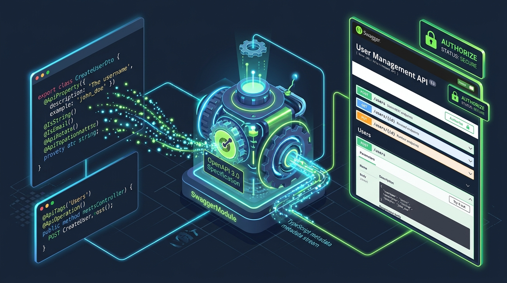
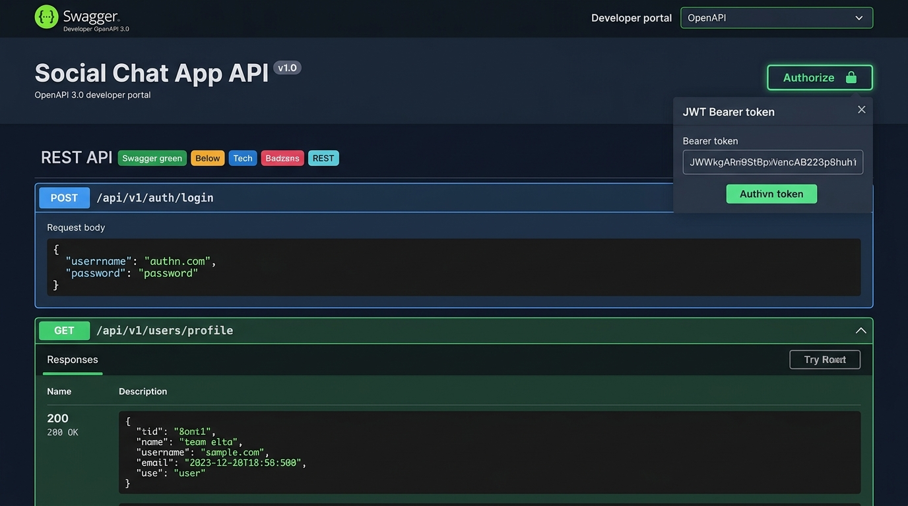
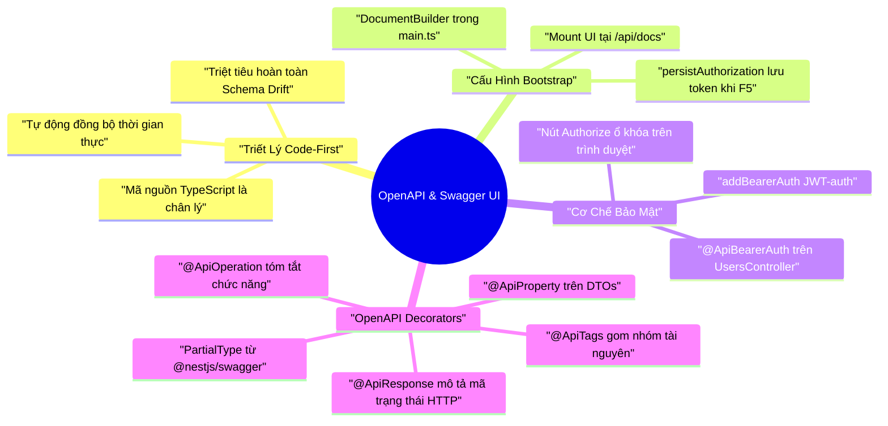

# Lesson 5.1: OpenAPI (Swagger) — Tự Động Hóa Tài Liệu API & Kiểm Thử Tương Tác Với @nestjs/swagger

<p align="center">
  
  
  
  
  
  
</p>

<p align="center">
  
</p>

---

> [!NOTE]
> ⏱️ **Thời lượng dự kiến:** 12 – 15 phút  
> 🎯 **Mục tiêu bài học:** Nắm vững tiêu chuẩn OpenAPI 3.0 (OAS) và giải pháp tự động hóa sinh tài liệu API trong NestJS bằng thư viện chính chủ `@nestjs/swagger`; hiểu rõ sự khác biệt giữa triết lý Code-First vs Schema-First; tự tay cấu hình `DocumentBuilder` trong `src/main.ts`, đồng bộ hoàn hảo với Global Prefix (`/api`) và URI Versioning (`/api/v1`); tích hợp cơ chế bảo mật JWT Bearer Authentication (`addBearerAuth()`) trực tiếp lên giao diện Swagger UI; làm chủ các Decorators cốt lõi: `@ApiTags()`, `@ApiBearerAuth()`, `@ApiOperation()`, `@ApiResponse()`, `@ApiProperty()`, `@ApiPropertyOptional()`, cùng sự khác biệt then chốt giữa `PartialType` của `@nestjs/swagger` so với `@nestjs/mapped-types`; thực hành kịch bản kiểm thử tương tác (Interactive Testing): Đăng ký/Đăng nhập lấy Token, Authorize ổ khóa bảo mật và gọi các API riêng tư ngay trên trình duyệt mà không cần mở Postman.

---

## 1. Đặt Vấn Đề: Bài Toán Lệch Cấu Trúc (Schema Drift) & Giải Pháp OpenAPI (OAS 3.0)

Trong phát triển phần mềm thực chiến, tài liệu API (API Documentation) đóng vai trò là bản giao ước (Contract) cốt lõi giữa đội ngũ Backend với Frontend, Mobile App và QA. Tuy nhiên, việc duy trì tài liệu thủ công thường bộc lộ những hạn chế nghiêm trọng:

- **Tài liệu viết thủ công (Postman JSON, Google Docs, Notion):** Mỗi khi Backend thay đổi mã nguồn (đổi tên trường, thêm validation, cập nhật kiểu dữ liệu), lập trình viên rất dễ quên cập nhật lại tài liệu bên ngoài.
- 🔴 **Hậu quả Schema Drift:** Tài liệu một đằng, code chạy một nẻo (Out-of-date). Đội ngũ Frontend tích hợp theo tài liệu cũ sẽ liên tục gặp lỗi `400 Bad Request`, gây lãng phí thời gian debug giữa các phòng ban.
- 🟢 **Giải Pháp OpenAPI (Swagger) Code-First Trong NestJS:** Thay vì phải duy trì hai công việc song song, bản đặc tả OpenAPI 3.0 và giao diện Swagger UI được **sinh tự động 100% từ chính DTOs và Controllers** thông qua cơ chế **Metadata Reflection**. Bất kỳ thay đổi nào trong mã nguồn TypeScript đều lập tức phản ánh lên tài liệu theo thời gian thực (0 giây trễ)!

<p align="center">
  
</p>

---

### ⚖️ So Sánh Chuyên Sâu: Schema-First vs Code-First

Trong phát triển RESTful API hiện đại, có hai trường phái thiết kế tài liệu chính:

| Tiêu Chí Đánh Giá                   | Schema-First (Thiết Kế Trước Bằng YAML/JSON)                 | Code-First (NestJS + TypeScript Reflection)                       |
| :---------------------------------- | :----------------------------------------------------------- | :---------------------------------------------------------------- |
| **Nguồn Chân Lý (Source of Truth)** | Tệp YAML / JSON riêng biệt nằm ngoài codebase.               | **Chính mã nguồn TypeScript (DTOs & Controller)**.                |
| **Độ Trễ Đồng Bộ**                  | **Chậm**: Sửa code xong phải nhớ cập nhật lại tệp YAML.      | **Tức thì (0 giây)**: Vừa lưu file code là Swagger UI tự làm mới. |
| **Chi Phí Bảo Trì**                 | **Rất cao**: Cần duy trì song song cả code lẫn tệp tài liệu. | **Cực thấp**: Chỉ cần trang trí thêm decorators lên DTOs sẵn có.  |
| **Type-Safety**                     | Phụ thuộc vào công cụ sinh code (Code Generator).            | **Tối đa 100%**: Tận dụng triệt để static type của TypeScript.    |
| **Tính Năng Thử Nghiệm**            | Cần công cụ thứ ba (Postman, Insomnia, Thunder Client).      | **Tích hợp sẵn Swagger UI tương tác (`Try it out`)**.             |

> [!TIP]
> **Xu Hướng Công Nghệ:** Trường phái **Code-First** trong hệ sinh thái NestJS là tiêu chuẩn được lựa chọn hàng đầu tại các công ty công nghệ lớn, vì nó giải phóng lập trình viên khỏi gánh nặng viết tài liệu thủ công mà vẫn đảm bảo tính chính xác tuyệt đối của API contract.

---

## 2. Kiến Trúc Tích Hợp @nestjs/swagger & Swagger UI

Gói `@nestjs/swagger` hoạt động dựa trên cơ chế **TypeScript Decorator Metadata Reflection**. Khi ứng dụng khởi chạy (`bootstrap`), `SwaggerModule` sẽ thực hiện quét toàn bộ cây ứng dụng:

1. **Quét Controller & Routes:** Thu thập thông tin đường dẫn (`/auth/login`, `/users/profile`), HTTP Method (`GET`, `POST`), và các thẻ nhóm `@ApiTags()`.
2. **Quét DTOs & Validation Rules:** Đọc các thuộc tính được đánh dấu bằng `@ApiProperty()`, kiểu dữ liệu TypeScript, và các ràng buộc từ `class-validator` (`@MinLength()`, `@IsEmail()`).
3. **Biên dịch OpenAPI JSON Document:** Xuất ra tài liệu chuẩn OpenAPI 3.0 tại endpoint `/api/docs-json`.
4. **Mount Swagger UI Portal:** Tự động tích hợp giao diện web Swagger UI tương tác tại endpoint `/api/docs`, cung cấp cổng thử nghiệm tương tác hoàn chỉnh.

<p align="center">
  
</p>

---

## 3. Hướng Dẫn Thực Hành Step-by-Step — Triển Khai OpenAPI & Swagger UI

### 📌 Bước 1: Cài Đặt Gói Phụ Thuộc Cần Thiết

Theo tài liệu chính thức từ [NestJS OpenAPI Documentation](https://docs.nestjs.com/openapi/introduction), trên nền tảng Express mặc định, bạn chỉ cần cài đặt duy nhất gói thư viện chính thức:

- `@nestjs/swagger`: Cung cấp `SwaggerModule`, `DocumentBuilder`, toàn bộ các Decorators OpenAPI, đồng thời tích hợp sẵn giao diện Swagger UI

> [!NOTE]
> _(Lưu ý: Chỉ khi ứng dụng của bạn chuyển đổi sang nền tảng Fastify `@nestjs/platform-fastify` thì mới cần cài thêm gói `@fastify/static` theo hướng dẫn của NestJS)._

Chạy lệnh terminal tại thư mục gốc dự án:

```bash
pnpm add @nestjs/swagger
```

---

### 📌 Bước 2: Cấu Hình `DocumentBuilder` Trong `src/main.ts`

Mở tệp `src/main.ts`. Hệ thống của chúng ta đã được thiết lập **Global Prefix `/api`** và **URI Versioning `/api/v1`** bằng `ConfigService` từ các module trước. Chúng ta sẽ gắn Swagger UI tại đường dẫn `/api/docs`:

📄 **`src/main.ts`**

```typescript
import { NestFactory } from '@nestjs/core';
import { AppModule } from './app.module';
import { ConfigService } from '@nestjs/config';
import { Logger, ValidationPipe, VersioningType } from '@nestjs/common';
import { DocumentBuilder, SwaggerModule } from '@nestjs/swagger';

async function bootstrap() {
  const app = await NestFactory.create(AppModule);
  const configService = app.get(ConfigService);

  const port = configService.get<number>('PORT', 3000);
  const globalPrefix = configService.get<string>('GLOBAL_PREFIX', 'api');
  const versionPrefix = configService.get<string>('VERSION_PREFIX', 'v');
  const versionApi = configService.get<string>('VERSION_API', '1');

  // 1. Cấu hình Global Prefix chuẩn RESTful: /api
  app.setGlobalPrefix(globalPrefix);

  // 2. Cấu hình URI Versioning: /api/v1/...
  app.enableVersioning({
    type: VersioningType.URI,
    defaultVersion: versionApi,
    prefix: versionPrefix,
  });

  // 3. ValidationPipe toàn cục
  app.useGlobalPipes(
    new ValidationPipe({
      whitelist: true,
      forbidNonWhitelisted: true,
      transform: true,
      transformOptions: {
        enableImplicitConversion: true,
      },
    }),
  );

  // 4. Thiết lập OpenAPI Specification với DocumentBuilder
  const swaggerConfig = new DocumentBuilder()
    .setTitle('Social Chat App API')
    .setDescription(
      'Hệ thống REST API cho ứng dụng Mạng xã hội & Chat Realtime — Xây dựng với NestJS, PostgreSQL & Prisma ORM',
    )
    .setVersion(versionApi)
    // Cấu hình cơ chế xác thực JWT Bearer Token trên giao diện Swagger UI
    .addBearerAuth(
      {
        type: 'http',
        scheme: 'bearer',
        bearerFormat: 'JWT',
        name: 'JWT',
        description: 'Nhập JWT Access Token của bạn vào đây',
        in: 'header',
      },
      'JWT-auth', // Tên định danh Security Scheme (sẽ tham chiếu trong @ApiBearerAuth)
    )
    .build();

  // Khởi tạo tài liệu OpenAPI Document
  const document = SwaggerModule.createDocument(app, swaggerConfig);

  // 5. Mount giao diện Swagger UI tại đường dẫn: /api/docs
  SwaggerModule.setup(`${globalPrefix}/docs`, app, document, {
    swaggerOptions: {
      persistAuthorization: true, // Giữ nguyên trạng thái Bearer Token khi refresh F5 trang web!
    },
  });

  await app.listen(port);

  Logger.log(
    `🚀 Server đang chạy tại: http://localhost:${port}/${globalPrefix}/${versionPrefix}${versionApi}`,
  );
  Logger.log(
    `📚 Cổng tài liệu Swagger UI: http://localhost:${port}/${globalPrefix}/docs`,
  );
}
bootstrap();
```

> [!IMPORTANT]
> **Tùy chọn `persistAuthorization: true`:**  
> Đây là một tính năng cực kỳ quan trọng trong trải nghiệm nhà phát triển (DX)! Khi bật cờ này, Swagger UI sẽ lưu chuỗi token vào `localStorage` của trình duyệt. Mỗi khi bạn sửa code và server reload (Hot-reload) hoặc bạn bấm F5, bạn **không phải nhập lại token từ đầu**.

---

### 📌 Bước 3: Chuẩn Hóa Schema DTOs Với `@ApiProperty()` & `@ApiPropertyOptional()`

Để Swagger UI hiển thị rõ ràng cấu trúc dữ liệu, các trường bắt buộc, giá trị mẫu (`example`) và mô tả tiếng Việt chi tiết, chúng ta gắn thêm decorators từ `@nestjs/swagger` vào các DTOs:

📄 **`src/auth/dto/register.dto.ts`**

```typescript
import { ApiProperty, ApiPropertyOptional } from '@nestjs/swagger';
import {
  IsEmail,
  IsNotEmpty,
  IsOptional,
  IsString,
  MinLength,
} from 'class-validator';

export class RegisterDto {
  @ApiProperty({
    description: 'Địa chỉ email người dùng (duy nhất trong hệ thống)',
    example: 'alice@example.com',
  })
  @IsEmail({}, { message: 'Email không đúng định dạng!' })
  @IsNotEmpty({ message: 'Email không được để trống!' })
  email: string;

  @ApiProperty({
    description: 'Mật khẩu đăng nhập (tối thiểu 6 ký tự)',
    example: 'Password@123',
    minLength: 6,
  })
  @IsString({ message: 'Mật khẩu phải là chuỗi ký tự!' })
  @IsNotEmpty({ message: 'Mật khẩu không được để trống!' })
  @MinLength(6, { message: 'Mật khẩu phải có ít nhất 6 ký tự!' })
  password: string;

  @ApiPropertyOptional({
    description: 'Họ và tên hiển thị của người dùng',
    example: 'Alice Nguyen',
  })
  @IsOptional()
  @IsString({ message: 'Họ tên phải là chuỗi ký tự!' })
  name?: string;
}
```

📄 **`src/auth/dto/login.dto.ts`**

```typescript
import { ApiProperty } from '@nestjs/swagger';
import { IsEmail, IsNotEmpty, IsString, MinLength } from 'class-validator';

export class LoginDto {
  @ApiProperty({
    description: 'Địa chỉ email đã đăng ký tài khoản',
    example: 'alice@example.com',
  })
  @IsEmail({}, { message: 'Email không đúng định dạng!' })
  @IsNotEmpty({ message: 'Email không được để trống!' })
  email: string;

  @ApiProperty({
    description: 'Mật khẩu bảo mật',
    example: 'Password@123',
    minLength: 6,
  })
  @IsString({ message: 'Mật khẩu phải là chuỗi ký tự!' })
  @IsNotEmpty({ message: 'Mật khẩu không được để trống!' })
  @MinLength(6, { message: 'Mật khẩu phải có ít nhất 6 ký tự!' })
  password: string;
}
```

---

### 💡 Điểm Khác Biệt Then Chốt: `PartialType` Của `@nestjs/swagger` vs `@nestjs/mapped-types`

Khi xây dựng các DTO cập nhật (ví dụ: `UpdateProfileDto` hoặc `UpdatePostDto` ở bài học tiếp theo), ở Module 3 chúng ta từng dùng `PartialType` từ thư viện `@nestjs/mapped-types`.

Hãy chú ý sự khác biệt mang tính quyết định này:

```typescript
// ❌ CÁCH CŨ (Mất Schema Metadata trên Swagger UI):
// import { PartialType } from '@nestjs/mapped-types';

// ✅ CÁCH CHUẨN KHI TÍCH HỢP SWAGGER:
import { PartialType } from '@nestjs/swagger';
import { RegisterDto } from './register.dto';

export class UpdateProfileDto extends PartialType(RegisterDto) {}
```

> [!CAUTION]
> **Cảnh Báo Lỗi Schema Rỗng:**  
> Nếu bạn import `PartialType` từ `@nestjs/mapped-types`, NestJS runtime và `class-validator` vẫn hoạt động bình thường, nhưng **giao diện Swagger UI sẽ hiển thị một Schema rỗng `{}`**, vì `@nestjs/mapped-types` không hỗ trợ metadata của Swagger!  
> **Quy tắc bắt buộc:** Luôn import `PartialType`, `OmitType`, `PickType`, `IntersectionType` từ thư viện **`@nestjs/swagger`**!

---

### 📌 Bước 4: Trang Trí OpenAPI Decorators Cho Controllers

Chúng ta tiến hành gắn các decorators tài liệu vào `AuthController` và `UsersController`:

- `@ApiTags('tên_nhóm')`: Gom các endpoint có liên quan vào cùng một thư mục trực quan trên giao diện Swagger.
- `@ApiBearerAuth('JWT-auth')`: Báo hiệu cho Swagger UI biết endpoint/controller này yêu cầu Bearer Token và hiển thị biểu tượng ổ khóa 🔓.
- `@ApiOperation({ summary: '...' })`: Tóm tắt ngắn gọn chức năng của API.
- `@ApiResponse({ status: ..., description: '...' })`: Mô tả chi tiết các trường hợp phản hồi thành công và thất bại.

#### 1. Cập Nhật `AuthController`:

📄 **`src/auth/auth.controller.ts`**

```typescript
import {
  Body,
  Controller,
  Get,
  HttpCode,
  HttpStatus,
  Post,
  UseGuards,
} from '@nestjs/common';
import { ApiOperation, ApiResponse, ApiTags } from '@nestjs/swagger';
import { ResponseMessage } from '@/shared/decorators/response-message.decorator';
import { AuthService } from './auth.service';
import { LoginDto } from './dto/login.dto';
import { RegisterDto } from './dto/register.dto';
import { GoogleAuthGuard } from './guards/google-auth.guard';
import { type GoogleUser } from './interfaces/google-user.interface';
import { Public } from '@/shared/decorators/public.decorator';
import { CurrentUser } from '@/shared/decorators/current-user.decorator';
import { SkipThrottle, Throttle } from '@nestjs/throttler';

@ApiTags('auth') // Gom nhóm toàn bộ endpoints xác thực vào tag "auth"
@Public() // Toàn bộ routes trong AuthController là công khai
@Controller('auth')
export class AuthController {
  constructor(private readonly authService: AuthService) {}

  @Post('register')
  @ApiOperation({
    summary: 'Đăng ký tài khoản người dùng mới',
    description:
      'Tạo tài khoản mới với email, password và name. Không yêu cầu Bearer Token.',
  })
  @ApiResponse({
    status: 201,
    description: 'Đăng ký tài khoản thành công',
  })
  @ApiResponse({
    status: 409,
    description: 'Email này đã được sử dụng trong hệ thống',
  })
  @ResponseMessage('Đăng ký tài khoản thành công!')
  async register(@Body() registerDto: RegisterDto) {
    return this.authService.register(registerDto);
  }

  @Throttle({
    short: { limit: 1, ttl: 1000 },
    long: { limit: 5, ttl: 60000 },
  })
  @Post('login')
  @HttpCode(HttpStatus.OK)
  @ApiOperation({
    summary: 'Đăng nhập hệ thống & lấy JWT Access Token',
    description:
      'Xác thực tài khoản bằng email/mật khẩu và nhận về Access Token có thời hạn.',
  })
  @ApiResponse({
    status: 200,
    description: 'Đăng nhập thành công, trả về JWT Access Token',
  })
  @ApiResponse({
    status: 401,
    description: 'Email hoặc mật khẩu không chính xác',
  })
  @ResponseMessage('Đăng nhập thành công!')
  async login(@Body() loginDto: LoginDto) {
    return this.authService.login(loginDto);
  }

  @Get('google')
  @UseGuards(GoogleAuthGuard)
  @ApiOperation({
    summary: 'Kích hoạt luồng đăng nhập bằng Google OAuth2',
    description:
      'Tự động chuyển hướng trình duyệt sang trang đăng nhập của Google.',
  })
  async googleAuth() {}

  @Get('google/callback')
  @UseGuards(GoogleAuthGuard)
  @ApiOperation({
    summary: 'Tiếp nhận mã ủy quyền callback từ Google',
    description:
      'Google chuyển hướng về kèm mã code. Hệ thống tạo tài khoản và phát hành Token.',
  })
  async googleAuthCallback(@CurrentUser() userData: GoogleUser) {
    return this.authService.socialLogin(userData);
  }

  @SkipThrottle({
    short: true,
    medium: true,
    long: true,
  })
  @Get('health')
  @ApiOperation({
    summary: 'Kiểm tra trạng thái sức khỏe (Healthcheck) của Auth Module',
  })
  healthCheck() {
    return { status: 'healthy', timestamp: new Date().toISOString() };
  }
}
```

---

#### 2. Cập Nhật `UsersController`:

📄 **`src/users/users.controller.ts`**

```typescript
import { Body, Controller, Get, Post } from '@nestjs/common';
import {
  ApiBearerAuth,
  ApiOperation,
  ApiResponse,
  ApiTags,
} from '@nestjs/swagger';
import { UsersService } from './users.service';
import { CreateUserDto } from './dto/create-user.dto';
import type { UserData } from '@/auth/interfaces/jwt.interface';
import { CurrentUser } from '@/shared/decorators/current-user.decorator';

@ApiTags('users') // Gom nhóm tài nguyên "users"
@ApiBearerAuth('JWT-auth') // 🔒 Đánh dấu toàn bộ Controller yêu cầu Bearer Token
@Controller('users')
export class UsersController {
  constructor(private readonly usersService: UsersService) {}

  @Get()
  @ApiOperation({ summary: 'Lấy danh sách tất cả người dùng trong hệ thống' })
  @ApiResponse({ status: 200, description: 'Lấy danh sách thành công' })
  findAll() {
    return this.usersService.findAll();
  }

  @Post()
  @ApiOperation({ summary: 'Tạo người dùng mới (Dành cho Quản trị viên)' })
  @ApiResponse({ status: 201, description: 'Tạo người dùng thành công' })
  createUser(@Body() body: CreateUserDto) {
    return this.usersService.create(body);
  }

  @Get('profile')
  @ApiOperation({
    summary: 'Xem hồ sơ cá nhân của người dùng hiện tại',
    description:
      'Trích xuất thông tin người dùng từ JWT Access Token trong Header.',
  })
  @ApiResponse({
    status: 200,
    description: 'Lấy thông tin hồ sơ tài khoản thành công',
  })
  @ApiResponse({
    status: 401,
    description: 'Chưa xác thực hoặc Bearer Token không hợp lệ / đã hết hạn',
  })
  getProfile(@CurrentUser() userData: UserData) {
    return {
      message: 'Xác thực tài khoản thành công',
      user: userData,
    };
  }
}
```

---

## 4. Kịch Bản Kiểm Tra & Thử Nghiệm Tương Tác (Hands-on Lab)

### Bước Chuẩn Bị: Khởi Động Server

Mở terminal và khởi chạy máy chủ:

```bash
pnpm start:dev
```

Mở trình duyệt Web tại địa chỉ: **`http://localhost:3000/api/docs`**

Bạn sẽ thấy giao diện Swagger UI hiện lên với tiêu đề **Social Chat App API**, hai nhóm endpoints **`auth`** và **`users`**, cùng nút **Authorize 🔓** nổi bật ở góc phải.

---

### 🟢 Kịch Bản 1: Khám Phá Schema & Thử Nghiệm Đăng Ký / Đăng Nhập Không Cần Postman

1. Nhấp chuột vào endpoint **`POST /api/v1/auth/register`**:
   - Quan sát mục **Request body**: Swagger UI tự động hiển thị mẫu JSON với các trường `email`, `password`, `name` cùng các giá trị mẫu `example` mà bạn đã cấu hình trong `RegisterDto`.
   - Bấm nút **Try it out**.
   - Nhập thông tin đăng ký:
     ```json
     {
       "email": "student_demo@example.com",
       "password": "Password@123",
       "name": "Thanh Nguyen"
     }
     ```
   - Bấm nút **Execute** màu xanh lớn.

📥 **Kết quả phản hồi HTTP nhận được ngay trên trình duyệt (`201 Created`):**

```json
{
  "statusCode": 201,
  "message": "Đăng ký tài khoản thành công!",
  "data": {
    "user": {
      "id": 1,
      "email": "student_demo@example.com",
      "name": "Thanh Nguyen",
      "role": "USER",
      "createdAt": "2026-09-24T15:20:00.000Z",
      "updatedAt": "2026-09-24T15:20:00.000Z"
    },
    "accessToken": "eyJhbGciOiJIUzI1NiIsInR5cCI6IkpXVCJ9..."
  },
  "timestamp": "2026-09-24T15:20:00.123Z",
  "path": "/api/v1/auth/register"
}
```

2. Tiếp tục nhấp vào endpoint **`POST /api/v1/auth/login`**:
   - Bấm **Try it out**, nhập tài khoản vừa tạo và bấm **Execute**.
   - Copy chuỗi `accessToken` từ kết quả phản hồi `200 OK`.

---

### 🟢 Kịch Bản 2: Đăng Nhập Token Lên Swagger UI & Gọi Protected API

1. Cuộn lên đầu trang, bấm vào nút **Authorize 🔓** (ổ khóa màu xanh).
2. Hộp thoại **Available authorizations** xuất hiện:
   - Tại ô nhập liệu **Value**, dán chuỗi token bạn vừa copy: `eyJhbGciOiJIUzI1NiIsInR5cCI6IkpXVCJ9...`
   - Bấm nút **Authorize** ➔ Bấm **Close**.
   - Biểu tượng ổ khóa lập tức chuyển sang trạng thái đã khóa: **Authorize 🔒**!
3. Cuộn xuống nhóm **`users`**, mở endpoint **`GET /api/v1/users/profile`**:
   - Bấm nút **Try it out** ➔ Bấm **Execute**.

📥 **Kết quả phản hồi nhận được (`200 OK`):**

```json
{
  "statusCode": 200,
  "message": "Thao tác thực hiện thành công",
  "data": {
    "message": "Xác thực tài khoản thành công",
    "user": {
      "userId": 1,
      "email": "student_demo@example.com"
    }
  },
  "timestamp": "2026-09-24T15:22:10.000Z",
  "path": "/api/v1/users/profile"
}
```

> [!TIP]
> Quan sát mục **Curl** được Swagger UI tạo tự động, bạn sẽ thấy Swagger đã tự động gắn header:  
> `-H "Authorization: Bearer eyJhbGci..."`. Bạn có thể kiểm thử toàn bộ API một cách mượt mà và trực quan 100% trên trình duyệt!

---

### 🔴 Kịch Bản 3: Kiểm Thử Lỗi Khi Chưa Authorize / Hết Hạn Token (Error Flow)

1. Bấm lại vào nút **Authorize 🔒** ➔ Bấm **Logout** để xóa Token đã lưu.
2. Quay lại endpoint **`GET /api/v1/users/profile`** và bấm **Execute** một lần nữa.

📥 **Kết quả phản hồi nhận được (`401 Unauthorized`):**

```json
{
  "statusCode": 401,
  "message": "Bạn cần đăng nhập (gửi kèm Bearer Token) để truy cập tài nguyên này!",
  "error": "Unauthorized",
  "timestamp": "2026-09-24T15:25:00.000Z",
  "path": "/api/v1/users/profile"
}
```

Swagger UI đã thể hiện chính xác cơ chế bảo vệ của `JwtAuthGuard` toàn cục mà chúng ta đã xây dựng từ Module 4!

---

## 5. Tổng Kết Bài Học & Checklist Ghi Nhớ



### ✅ Checklist Ghi Nhớ Bài Học:

- [x] Hiểu sâu sự vượt trội của phương pháp tiếp cận **Code-First** so với việc viết tài liệu thủ công (Schema-First).
- [x] Cài đặt thành công thư viện `@nestjs/swagger` và kích hoạt Swagger UI tương tác.
- [x] Cấu hình `DocumentBuilder` trong `src/main.ts`, đồng bộ với Global Prefix `/api` và URI Versioning `/api/v1`.
- [x] Thiết lập `addBearerAuth('JWT-auth')` và bật cờ `persistAuthorization: true` để lưu token khi F5.
- [x] Khai báo chi tiết `@ApiProperty()` và `@ApiPropertyOptional()` trên các DTOs của dự án.
- [x] Phân biệt sự khác biệt then chốt giữa `PartialType` của `@nestjs/swagger` và `@nestjs/mapped-types`.
- [x] Sử dụng `@ApiTags()` và `@ApiBearerAuth()` trang trí `AuthController` và `UsersController`.
- [x] Thực hành thành thạo kịch bản kiểm thử tương tác (Interactive Testing): Đăng ký ➔ Đăng nhập ➔ Authorize ➔ Gọi Protected API trực tiếp trên Swagger UI.

---

👉 **Bài tiếp theo:** [Lesson 5.2: Posts API — CRUD Bài Viết & Phân Trang Cursor/Offset](../lesson-5.2/lesson-5.2.md)
