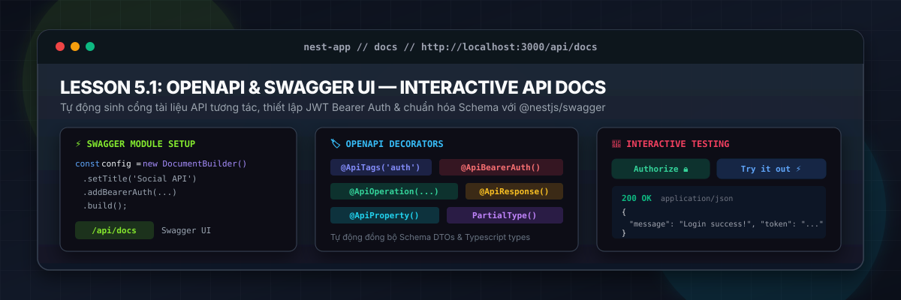
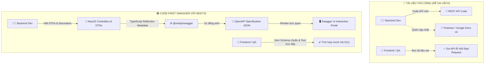
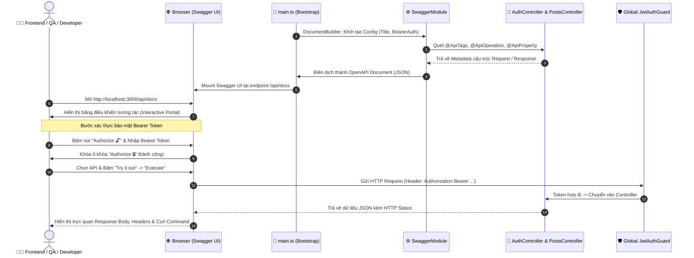
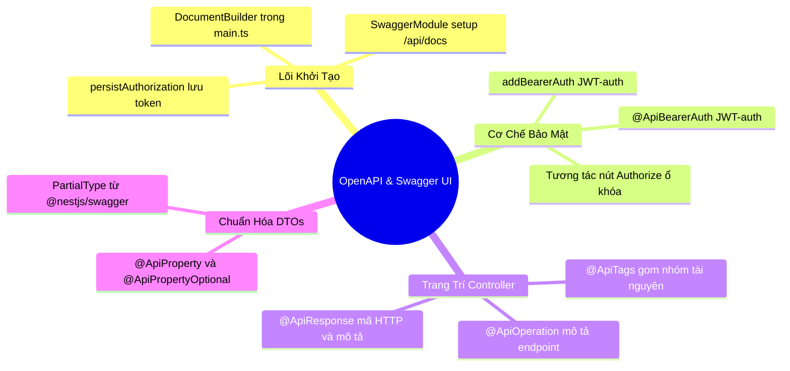

# Lesson 5.1: OpenAPI (Swagger) — Tự Động Sinh Swagger UI Tương Tác (@nestjs/swagger) Trong NestJS

<p align="center">
  
  
  
  
  
  
</p>

<p align="center">
  
</p>

---

> [!NOTE]
> ⏱️ **Thời lượng dự kiến:** 12 – 15 phút  
> 🎯 **Mục tiêu bài học:** Nắm vững tiêu chuẩn OpenAPI 3.0 (OAS) và giải pháp tự động hóa sinh tài liệu API trong NestJS bằng thư viện chính chủ `@nestjs/swagger` & `swagger-ui-express`; hiểu rõ sự khác biệt giữa Code-First vs Schema-First; tự tay cấu hình `DocumentBuilder` trong `main.ts`, đồng bộ với Global Prefix (`/api`) và API Versioning (`/api/v1`); tích hợp cơ chế bảo mật JWT Bearer Authentication (`addBearerAuth()`) trực tiếp lên giao diện Swagger UI; làm chủ các Decorators cốt lõi: `@ApiTags()`, `@ApiOperation()`, `@ApiResponse()`, `@ApiProperty()`, `@ApiPropertyOptional()`, và sự khác biệt then chốt giữa `PartialType` của `@nestjs/swagger` so với `@nestjs/mapped-types`; thực hành kịch bản kiểm thử tương tác (Interactive Testing): Đăng ký/Đăng nhập lấy Token, Authorize ổ khóa và gọi các API được bảo vệ ngay trên trình duyệt mà không cần Postman.

---

## 1. Tổng Quan OpenAPI (OAS 3.0) & Giải Pháp Tự Động Sinh Swagger UI

### 💡 Ẩn Dụ Thực Tế: Bản Đồ Thực Đơn Điện Tử vs Tờ Rơi Giấy Photocopy

Hãy so sánh hai cách cung cấp thực đơn trong nhà hàng:

1. **Tờ rơi giấy photocopy (Tài liệu API viết thủ công / Export Postman JSON):**
   - Khi nhà bếp thay đổi nguyên liệu hoặc thêm món mới, nhân viên quên in lại tờ rơi. Khách gọi món trên giấy nhưng nhà bếp thông báo: _"Món này đổi giá từ tuần trước rồi!"_ hoặc _"Món này không còn làm nữa!"_.
   - 🔴 **Vấn đề thực tế:** Khi viết tài liệu API bằng Google Docs, Notion hoặc file Postman Collection xuất thủ công, code backend vừa cập nhật tham số mới thì tài liệu đã lập tức **lỗi thời (Out-of-date)** và **sai lệch cấu trúc (Schema Drift)**.

2. **Màn hình cảm ứng Tablet tại bàn (OpenAPI & Swagger UI Code-First):**
   - Thực đơn trên máy tính bảng kết nối thẳng vào kho dữ liệu nhà bếp (TypeScript Code). Nhà bếp thêm món, đổi giá hay yêu cầu ghi chú gì, màn hình tại bàn **tự động cập nhật ngay lập tức theo thời gian thực**. Khách hàng còn có thể bấm nút _"Gọi thử món này"_ ngay trên màn hình (Interactive Testing - `Try it out`).
   - 🟢 **Giải pháp OpenAPI trong NestJS:** Bản đặc tả OpenAPI được sinh trực tiếp từ chính DTOs và Controllers của bạn. Code thay đổi đến đâu, tài liệu Swagger UI tự động đồng bộ đến đó, loại bỏ hoàn toàn nguy cơ tài liệu một đằng, code một nẻo!



---

### 🔹 So Sánh Chi Tiết: Schema-First vs Code-First

Trong phát triển API hiện đại, có hai trường phái thiết kế tài liệu chính:

| Tiêu Chí Đánh Giá                          | Schema-First (Thiết Kế Trước Bằng YAML/JSON)                 | Code-First (NestJS + TypeScript Reflection)                       |
| :----------------------------------------- | :----------------------------------------------------------- | :---------------------------------------------------------------- |
| **Nguồn Chân Lý (Single Source of Truth)** | File YAML / JSON riêng biệt bên ngoài.                       | **Mã nguồn TypeScript (DTOs & Controller)**.                      |
| **Độ Trễ Đồng Bộ**                         | **Chậm**: Sửa code xong phải nhớ cập nhật lại file YAML.     | **Tức thì (0 giây)**: Vừa lưu file code là Swagger UI tự làm mới. |
| **Chi Phí Bảo Trì**                        | **Rất cao**: Cần duy trì song song cả code lẫn tệp tài liệu. | **Cực thấp**: Chỉ cần trang trí thêm decorators lên DTOs sẵn có.  |
| **Type-Safety**                            | Phụ thuộc vào công cụ sinh code (Code Generator).            | **Tối đa 100%**: Tận dụng triệt để static type của TypeScript.    |
| **Tính Năng Thử Nghiệm**                   | Cần công cụ thứ ba (Postman, Insomnia).                      | **Tích hợp sẵn Swagger UI tương tác (`Try it out`)**.             |

---

## 2. Kiến Trúc Tích Hợp @nestjs/swagger Trong NestJS Pipeline

Gói `@nestjs/swagger` hoạt động dựa trên cơ chế **Metadata Reflection** của TypeScript. Khi ứng dụng NestJS khởi động (`bootstrap`), `SwaggerModule` sẽ duyệt qua toàn bộ các Module, Controllers và DTOs đã đăng ký trong `AppModule` để tổng hợp thành một cây tài liệu OpenAPI JSON hoàn chỉnh.



---

## 3. Hướng Dẫn Thực Hành Step-by-Step — Triển Khai OpenAPI & Swagger UI

### 📌 Bước 1: Cài Đặt Gói Phụ Thuộc Cần Thiết

Cài đặt thư viện chính hãng:

- `@nestjs/swagger`: Thư viện lõi cung cấp các decorators và `SwaggerModule`.

Mở terminal tại thư mục gốc của dự án và chạy lệnh:

```bash
pnpm add @nestjs/swagger
```

> [!TIP]
> Nếu bạn muốn Swagger tự động phân tích các thuộc tính trong DTO mà không cần khai báo quá nhiều `@ApiProperty()`, bạn có thể kích hoạt Swagger CLI Plugin trong `nest-cli.json`. Tuy nhiên, trong môi trường Enterprise, việc **tự khai báo tường minh `@ApiProperty()`** vẫn là tiêu chuẩn vàng giúp kiểm soát chính xác ví dụ mẫu (`example`), mô tả (`description`) và kiểu dữ liệu hiển thị.

---

### 📌 Bước 2: Cấu Hình `DocumentBuilder` Trong `src/main.ts`

Mở tệp `src/main.ts` và thiết lập `SwaggerModule`. Lưu ý rằng hệ thống của chúng ta đã có **Global Prefix `/api`** và **URI Versioning `/api/v1`** từ Module 3, nên đường dẫn Swagger UI sẽ được mount tại `/api/docs`.

📄 **`src/main.ts`**

```typescript
import { ValidationPipe, VersioningType } from '@nestjs/common';
import { NestFactory } from '@nestjs/core';
import { DocumentBuilder, SwaggerModule } from '@nestjs/swagger';
import { AppModule } from './app.module';

async function bootstrap() {
  const app = await NestFactory.create(AppModule);

  // 1. Cấu hình Global Prefix chuẩn RESTful
  app.setGlobalPrefix('api');

  // 2. Cấu hình URI Versioning (/api/v1/...)
  app.enableVersioning({
    type: VersioningType.URI,
    defaultVersion: '1',
  });

  // 3. Kích hoạt ValidationPipe toàn cục
  app.useGlobalPipes(
    new ValidationPipe({
      whitelist: true,
      forbidNonWhitelisted: true,
      transform: true,
    }),
  );

  // 4. Thiết lập OpenAPI Specification (Swagger)
  const config = new DocumentBuilder()
    .setTitle('Social Chat App API')
    .setDescription(
      'Hệ thống REST API cho ứng dụng Mạng xã hội & Chat Realtime - Xây dựng với NestJS, PostgreSQL & Prisma ORM',
    )
    .setVersion(versionApi || '1.0')
    .addBearerAuth(
      {
        type: 'http',
        scheme: 'bearer',
        bearerFormat: 'JWT',
        name: 'JWT',
        description:
          'Nhập JWT Access Token vào đây theo cú pháp: Bearer <token>',
        in: 'header',
      },
      'JWT-auth',
    )
    .addSecurityRequirements('JWT-auth')
    .build();

  const document = SwaggerModule.createDocument(app, config);

  // 5. Khởi tạo giao diện Swagger UI tại đường dẫn /api/docs
  SwaggerModule.setup('api/docs', app, document, {
    swaggerOptions: {
      persistAuthorization: true, // Giữ nguyên trạng thái Bearer Token khi refresh F5 trang web!
    },
  });

  const port = process.env.PORT ?? 3000;
  await app.listen(port);
  console.log(`🚀 Ứng dụng đang chạy tại: http://localhost:${port}`);
  console.log(`📚 Swagger UI Document: http://localhost:${port}/api/docs`);
}
bootstrap();
```

> [!IMPORTANT]
> Tùy chọn `persistAuthorization: true` trong `swaggerOptions` là một mẹo cực kỳ hữu ích trong thực tế! Nó giúp trình duyệt lưu token vào `localStorage`, tránh việc bạn phải copy/paste lại chuỗi token mỗi khi F5 reload trang trong quá trình dev và kiểm thử.

📄 **`src/shared/decorators/public.decorator.ts`**

```typescript
import { applyDecorators, SetMetadata } from '@nestjs/common';
import { ApiSecurity } from '@nestjs/swagger';
import { IS_PUBLIC_KEY } from '../constants/metadata.constant';
export const Public = () =>
  applyDecorators(SetMetadata(IS_PUBLIC_KEY, true), ApiSecurity({}));
```

---

### 📌 Bước 3: Chuẩn Hóa Schema DTOs Với `@ApiProperty()` & `@ApiPropertyOptional()`

Để Swagger UI hiển thị chính xác kiểu dữ liệu, các trường bắt buộc, giá trị mặc định và dữ liệu JSON mẫu (`example`), chúng ta sử dụng các decorators của `@nestjs/swagger`.

Cập nhật các tệp DTO của Module Auth:

📄 **`src/auth/dto/register.dto.ts`**

```typescript
import { ApiProperty, ApiPropertyOptional } from '@nestjs/swagger';
import {
  IsEmail,
  IsNotEmpty,
  IsOptional,
  IsString,
  MinLength,
} from 'class-validator';

export class RegisterDto {
  @ApiProperty({
    description: 'Địa chỉ email người dùng (duy nhất trong hệ thống)',
    example: 'alice@example.com',
  })
  @IsEmail({}, { message: 'Email không đúng định dạng' })
  @IsNotEmpty({ message: 'Email không được để trống' })
  email: string;

  @ApiProperty({
    description: 'Mật khẩu đăng nhập (tối thiểu 6 ký tự)',
    example: 'Password@123',
    minLength: 6,
  })
  @IsString({ message: 'Mật khẩu phải là chuỗi ký tự' })
  @MinLength(6, { message: 'Mật khẩu phải có ít nhất 6 ký tự' })
  password: string;

  @ApiPropertyOptional({
    description: 'Họ và tên hiển thị của người dùng',
    example: 'Alice Nguyen',
  })
  @IsOptional()
  @IsString({ message: 'Họ tên phải là chuỗi ký tự' })
  name?: string;
}
```

📄 **`src/auth/dto/login.dto.ts`**

```typescript
import { ApiProperty } from '@nestjs/swagger';
import { IsEmail, IsNotEmpty, IsString } from 'class-validator';

export class LoginDto {
  @ApiProperty({
    description: 'Địa chỉ email đã đăng ký',
    example: 'alice@example.com',
  })
  @IsEmail({}, { message: 'Email không đúng định dạng' })
  @IsNotEmpty({ message: 'Email không được để trống' })
  email: string;

  @ApiProperty({
    description: 'Mật khẩu đăng nhập',
    example: 'Password@123',
  })
  @IsString({ message: 'Mật khẩu phải là chuỗi ký tự' })
  @IsNotEmpty({ message: 'Mật khẩu không được để trống' })
  password: string;
}
```

---

### 💡 Điểm Khác Biệt Then Chốt: `PartialType` Của `@nestjs/swagger` vs `@nestjs/mapped-types`

Khi xây dựng các DTO cập nhật (ví dụ: `UpdateProfileDto` hoặc `UpdatePostDto`), ở Module 3 chúng ta đã làm quen với `PartialType`:

```typescript
// ❌ CÁCH CŨ (Chỉ hỗ trợ class-validator runtime, BỊ MẤT METADATA TRÊN SWAGGER UI):
// import { PartialType } from '@nestjs/mapped-types';

// ✅ CÁCH CHUẨN KHI CÓ SWAGGER:
import { PartialType } from '@nestjs/swagger';
import { RegisterDto } from './register.dto';

export class UpdateProfileDto extends PartialType(RegisterDto) {}
```

> [!CAUTION]
> Nếu bạn import `PartialType` từ `@nestjs/mapped-types`, NestJS runtime vẫn chạy bình thường, nhưng **giao diện Swagger UI sẽ không hiển thị các trường dữ liệu của DTO con** (schema rỗng).  
> **Luôn luôn import `PartialType`, `OmitType`, `PickType`, `IntersectionType` từ gói `@nestjs/swagger`** để toàn bộ schema metadata được kế thừa hoàn chỉnh!

---

### 📌 Bước 4: Trang Trí Controller Với OpenAPI Decorators

Gắn các nhãn tài liệu lên `AuthController` và `UsersController`:

📄 **`src/auth/auth.controller.ts`**

```typescript
import {
  Body,
  Controller,
  HttpCode,
  HttpStatus,
  Post,
  Version,
} from '@nestjs/common';
import { ApiOperation, ApiResponse, ApiTags } from '@nestjs/swagger';
import { Public } from '../common/decorators/public.decorator';
import { ResponseMessage } from '../common/decorators/response-message.decorator';
import { AuthService } from './auth.service';
import { LoginDto } from './dto/login.dto';
import { RegisterDto } from './dto/register.dto';

@ApiTags('auth') // Nhóm toàn bộ endpoints trong controller này vào thư mục "auth" trên Swagger UI
@Controller('auth')
export class AuthController {
  constructor(private readonly authService: AuthService) {}

  // 1. POST /api/v1/auth/register — Đăng ký tài khoản
  @Public()
  @Version('1')
  @Post('register')
  @HttpCode(HttpStatus.CREATED)
  @ApiOperation({
    summary: 'Đăng ký tài khoản mới',
    description:
      'Tạo tài khoản người dùng mới với email, password và name. Không yêu cầu xác thực token.',
  })
  @ApiResponse({
    status: 201,
    description: 'Đăng ký tài khoản thành công',
  })
  @ApiResponse({
    status: 400,
    description:
      'Dữ liệu không hợp lệ (Validation failed) hoặc email đã tồn tại',
  })
  @ResponseMessage('Đăng ký tài khoản thành công!')
  register(@Body() registerDto: RegisterDto) {
    return this.authService.register(registerDto);
  }

  // 2. POST /api/v1/auth/login — Đăng nhập tài khoản
  @Public()
  @Version('1')
  @Post('login')
  @HttpCode(HttpStatus.OK)
  @ApiOperation({
    summary: 'Đăng nhập hệ thống & lấy JWT Access Token',
    description:
      'Xác thực tài khoản bằng email/mật khẩu và phát hành Access Token thời hạn 1 ngày.',
  })
  @ApiResponse({
    status: 200,
    description: 'Đăng nhập thành công, trả về JWT Access Token',
  })
  @ApiResponse({
    status: 401,
    description: 'Email hoặc mật khẩu không chính xác',
  })
  @ResponseMessage('Đăng nhập thành công!')
  login(@Body() loginDto: LoginDto) {
    return this.authService.login(loginDto);
  }
}
```

📄 **`src/users/users.controller.ts`**

```typescript
import { Controller, Get, Version } from '@nestjs/common';
import { ApiOperation, ApiResponse, ApiTags } from '@nestjs/swagger';
import { CurrentUser } from '../common/decorators/current-user.decorator';
import { ResponseMessage } from '../common/decorators/response-message.decorator';
import { UsersService } from './users.service';

@ApiTags('users')
@Controller('users')
export class UsersController {
  constructor(private readonly usersService: UsersService) {}

  @Version('1')
  @Get('profile')
  @ApiOperation({
    summary: 'Xem hồ sơ cá nhân của người dùng hiện tại',
    description:
      'Trích xuất thông tin người dùng từ JWT Access Token trong Header.',
  })
  @ApiResponse({
    status: 200,
    description: 'Lấy thông tin hồ sơ thành công',
  })
  @ApiResponse({
    status: 401,
    description: 'Chưa xác thực hoặc Access Token không hợp lệ / đã hết hạn',
  })
  @ResponseMessage('Lấy thông tin hồ sơ người dùng thành công!')
  getProfile(@CurrentUser('userId') userId: number) {
    return this.usersService.findById(userId);
  }
}
```

---

## 4. Kịch Bản Kiểm Tra & Thử Nghiệm Tương Tác (Hands-on Lab)

Khởi động dự án ở chế độ phát triển:

```bash
pnpm start:dev
```

Mở trình duyệt Web tại địa chỉ: **`http://localhost:3000/api/docs`**

---

### 🟢 Kịch Bản 1: Khám Phá Swagger UI & Kiểm Thử Auth API Không Cần Postman

1. Trên giao diện Swagger UI, bạn sẽ thấy hai nhóm tag lớn: **`auth`** và **`users`**.
2. Nhấp chuột vào endpoint **`POST /api/v1/auth/register`**:
   - Quan sát mục **Parameters & Request Body**: Swagger hiển thị sẵn mẫu JSON với các trường `email`, `password`, `name` kèm ví dụ mẫu đã khai báo trong DTO.
   - Bấm nút **Try it out**.
   - Sửa trường `email` thành: `"dev_test@example.com"`, `password` thành `"Secret@123"`.
   - Bấm nút **Execute** (nút màu xanh lớn).
3. **Kết quả phản hồi (Response 201 Created):**

```json
{
  "statusCode": 201,
  "message": "Đăng ký tài khoản thành công!",
  "data": {
    "id": 1,
    "email": "dev_test@example.com",
    "name": "Alice Nguyen",
    "createdAt": "2026-09-07T10:30:00.000Z"
  },
  "timestamp": "2026-09-07T10:30:00.123Z",
  "path": "/api/v1/auth/register"
}
```

4. Tiếp tục thử nghiệm endpoint **`POST /api/v1/auth/login`**:
   - Bấm **Try it out**, nhập đúng tài khoản vừa tạo.
   - Bấm **Execute**.
   - Sao chép (copy) chuỗi `accessToken` từ kết quả phản hồi `200 OK`.

---

### 🟢 Kịch Bản 2: Đăng Nhập Bearer Token & Gọi Protected API Trực Tiếp Trên Swagger

1. Kéo lên góc trên bên phải màn hình Swagger UI, bấm vào nút **Authorize 🔓** (ổ khóa màu xanh).
2. Một hộp thoại popup sẽ xuất hiện:
   - Tại ô **Value**, dán chuỗi token bạn vừa copy: `Bearer eyJhbGciOiJIUzI1Ni...` (hoặc chỉ cần dán token nếu cấu hình type là http bearer).
   - Bấm nút **Authorize** màu xanh ➔ Bấm **Close**.
   - Biểu tượng ổ khóa sẽ chuyển sang trạng thái đã khóa: **Authorize 🔒**.
3. Cuộn xuống nhóm **`users`**, mở endpoint **`GET /api/v1/users/profile`**:
   - Bấm **Try it out** ➔ Bấm **Execute**.
4. **Kết quả phản hồi (Response 200 OK):**

```json
{
  "statusCode": 200,
  "message": "Lấy thông tin hồ sơ người dùng thành công!",
  "data": {
    "id": 1,
    "email": "dev_test@example.com",
    "name": "Alice Nguyen"
  },
  "timestamp": "2026-09-07T10:32:15.000Z",
  "path": "/api/v1/users/profile"
}
```

> [!TIP]
> Nhìn vào phần **Curl** được Swagger UI tạo tự động, bạn sẽ thấy Swagger đã tự động gắn header:  
> `-H "Authorization: Bearer eyJhbGci..."`. Toàn bộ quá trình test API diễn ra 100% trên trình duyệt mà không cần mở Postman hay gõ lệnh Terminal!

---

### 🔴 Kịch Bản 3: Kiểm Thử Lỗi Khi Chưa Authorize / Token Sai (Error Flow)

1. Bấm lại vào nút **Authorize 🔒** ➔ Bấm **Logout** để xóa Token đã lưu.
2. Thử bấm lại **Execute** trên endpoint **`GET /api/v1/users/profile`**.
3. **Kết quả kỳ vọng (HTTP Status `401 Unauthorized`):**

```json
{
  "statusCode": 401,
  "message": "Unauthorized",
  "timestamp": "2026-09-07T10:33:00.000Z",
  "path": "/api/v1/users/profile"
}
```

Swagger UI đã thể hiện chính xác cơ chế bảo vệ của `JwtAuthGuard` toàn cục mà chúng ta đã xây dựng từ Module 4!

---

## 5. Tổng Kết Bài Học & Checklist Ghi Nhớ



### ✅ Checklist Ghi Nhớ Bài Học:

- [x] Hiểu rõ sự vượt trội của tiếp cận **Code-First** giúp đồng bộ tài liệu API tức thì, loại bỏ hoàn toàn Schema Drift.
- [x] Cài đặt thành công `@nestjs/swagger` và `swagger-ui-express`.
- [x] Cấu hình `DocumentBuilder` trong `main.ts`, hỗ trợ API Versioning và đường dẫn tài liệu chuẩn `/api/docs`.
- [x] Thiết lập `addBearerAuth()` và `@ApiBearerAuth('JWT-auth')` để test các API bảo mật trực tiếp trên trình duyệt.
- [x] Khai báo đầy đủ `@ApiProperty()` và `@ApiPropertyOptional()` trên các DTOs.
- [x] Phân biệt rõ việc sử dụng `PartialType` từ `@nestjs/swagger` thay vì `@nestjs/mapped-types`.
- [x] Thực hành thành thạo luồng kiểm thử tương tác (Interactive Testing): Đăng ký ➔ Đăng nhập ➔ Authorize ➔ Gọi Protected Route.

---

👉 **Bài tiếp theo:** [Lesson 5.2: Posts API — CRUD Bài Viết & Phân Trang Cursor/Offset](../lesson-5.2/lesson-5.2.md)
