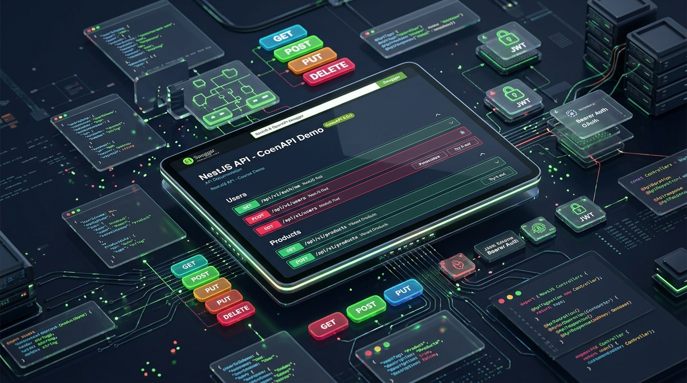
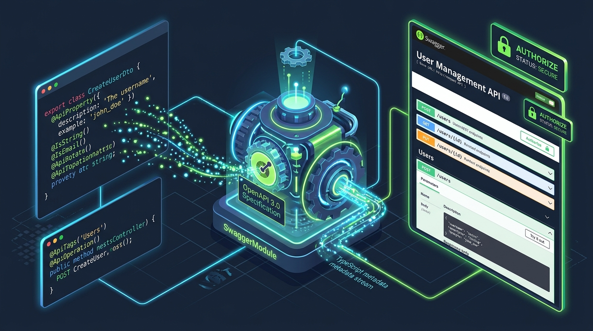
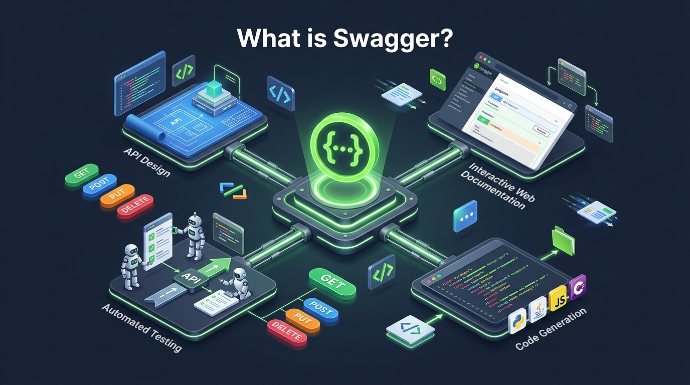
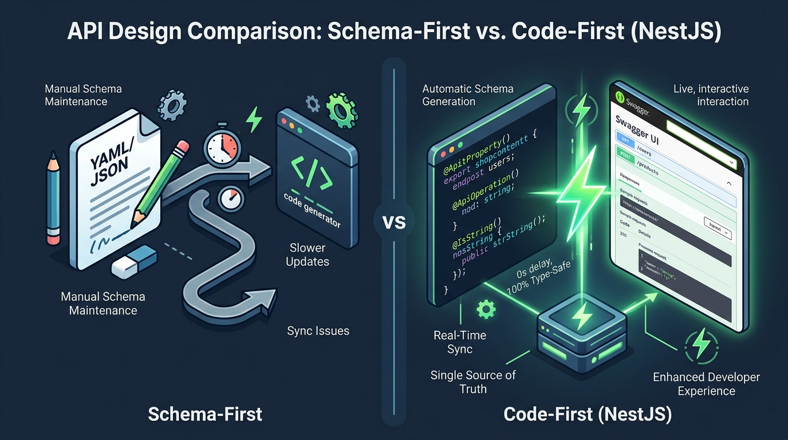
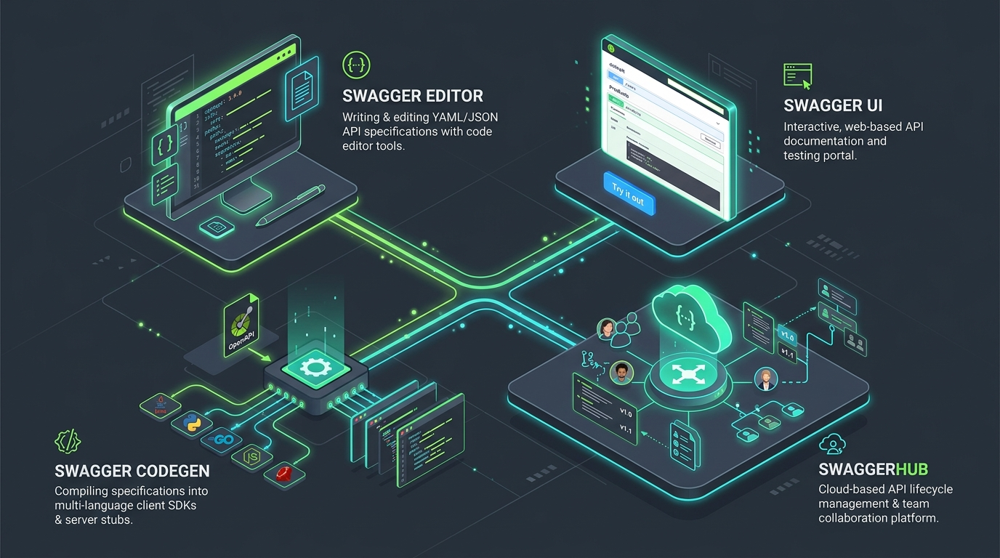
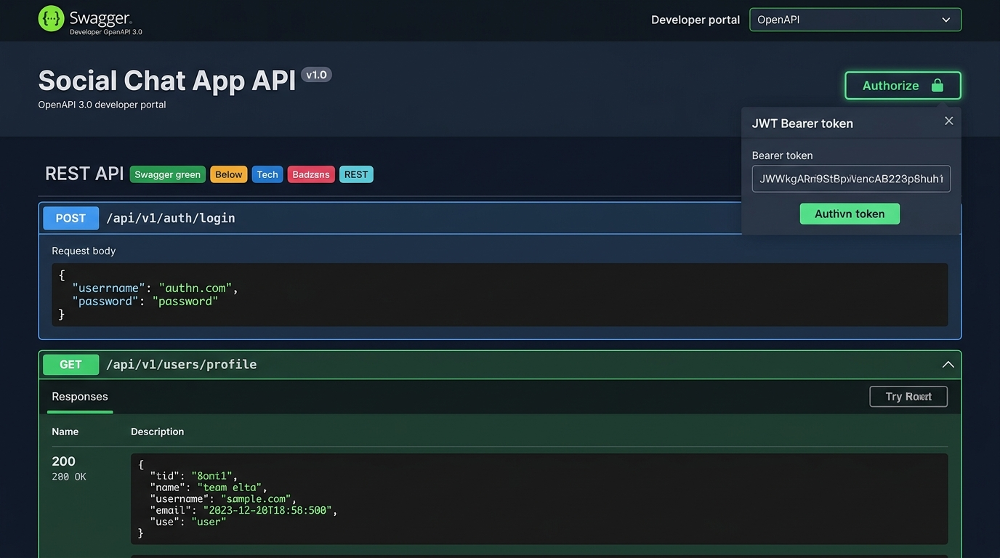

# Lesson 5.1: OpenAPI (Swagger) — Tự Động Hóa Tài Liệu API & Kiểm Thử Tương Tác Với @nestjs/swagger

<p align="center">
  
  
  
  
  
  
</p>

<p align="center">
  
</p>

---

> [!NOTE]
> ⏱️ **Thời lượng dự kiến:** 15 – 20 phút  
> 🎯 **Mục tiêu bài học:** Nắm vững bản chất tiêu chuẩn **OpenAPI Specification (OAS 3.0)** và hệ sinh thái công cụ **Swagger**; hiểu rõ nguồn gốc lịch sử và ranh giới phân biệt giữa OpenAPI và Swagger; làm chủ các thành phần cốt lõi của Swagger (Swagger Editor, Swagger UI, Swagger Codegen, SwaggerHub); so sánh sự khác biệt then chốt giữa hai trường phái thiết kế **Schema-First** và **Code-First**; tự tay cấu hình thư viện chính chủ `@nestjs/swagger` trong NestJS để tự động sinh tài liệu tương tác từ mã nguồn TypeScript; tích hợp cơ chế bảo mật JWT Bearer Authentication (`addBearerAuth()`) với tùy chọn lưu token `persistAuthorization`; khai báo Decorators chuẩn hóa DTOs và Controllers; thực hành kịch bản kiểm thử tương tác (Interactive Testing) toàn diện ngay trên trình duyệt mà không cần sử dụng Postman.

---

## 1. OpenAPI là gì?

### 📌 Khái Niệm Tiêu Chuẩn OpenAPI (OpenAPI Specification - OAS)

**OpenAPI** (tên đầy đủ là **OpenAPI Specification - OAS**) là một **tiêu chuẩn mở (Open Standard)** độc lập với ngôn ngữ lập trình, được sử dụng để mô tả cấu trúc các giao diện lập trình ứng dụng (API) hoạt động dựa trên giao thức HTTP — tiêu biểu là các dịch vụ **RESTful API**.

Hiểu một cách đơn giản, nếu coi một hệ thống phần mềm như một tòa nhà, thì OpenAPI chính là **bản vẽ thiết kế kỹ thuật kiến trúc** của toàn bộ các cánh cổng kết nối. Tệp tài liệu này đóng vai trò là một **bản giao ước (API Contract)** chính thức giữa:

- **Phía cung cấp (Backend Developers):** Đảm bảo API phục vụ đúng cấu trúc đã công bố.
- **Phía sử dụng (Frontend, Mobile Developers, QA Engineers, Third-party Partners):** Biết chính xác URL cần gọi, phương thức HTTP, các tham số đầu vào và kiểu dữ liệu trả về mà không cần đọc trực tiếp mã nguồn backend.

<p align="center">
  
</p>

### 📄 Cấu Trúc Định Dạng Tệp Đặc Tả OpenAPI

Đặc tả OpenAPI được biểu diễn dưới dạng một tệp văn bản có cấu trúc chuẩn theo định dạng **YAML** hoặc **JSON**. Một tài liệu OpenAPI tiêu chuẩn bao gồm các khối thông tin cơ bản:

1. **`openapi`**: Phiên bản chuẩn OpenAPI đang áp dụng (ví dụ: `3.0.0` hoặc `3.1.0`).
2. **`info`**: Thông tin tổng quan về API (tiêu đề `title`, mô tả `description`, phiên bản API `version`, tác giả, điều khoản sử dụng).
3. **`servers`**: Danh sách địa chỉ máy chủ (Base URLs) như môi trường Development, Staging, Production.
4. **`paths`**: Danh sách tất cả các Endpoint (đường dẫn tài nguyên) kèm theo các phương thức HTTP tương ứng (`GET`, `POST`, `PUT`, `DELETE`).
   - **`parameters`**: Các tham số truyền qua Path (`/users/{id}`), Query (`?page=1&limit=10`), hoặc Header.
   - **`requestBody`**: Cấu trúc dữ liệu gửi lên từ Client (Content-Type `application/json`, các trường bắt buộc, kiểu dữ liệu, ví dụ mẫu).
   - **`responses`**: Các mã trạng thái HTTP trả về (`200 OK`, `201 Created`, `400 Bad Request`, `401 Unauthorized`) cùng cấu trúc dữ liệu chi tiết kèm theo.
5. **`components/schemas`**: Khối định nghĩa các mô hình dữ liệu (Models/DTOs) tái sử dụng trong toàn bộ tài liệu, giúp tránh lặp lại cấu trúc nhiều lần.

Dưới đây là một tệp đặc tả OpenAPI 3.0 mẫu mô tả API xác thực tài khoản:

```yaml
openapi: 3.0.0
info:
  title: Social Chat App API
  description: Tài liệu RESTful API hệ thống Mạng xã hội & Chat Realtime
  version: 1.0.0
servers:
  - url: http://localhost:3000/api/v1
    description: Local Development Server
paths:
  /auth/login:
    post:
      tags:
        - auth
      summary: Đăng nhập hệ thống & lấy JWT Access Token
      requestBody:
        required: true
        content:
          application/json:
            schema:
              $ref: '#/components/schemas/LoginDto'
      responses:
        '200':
          description: Đăng nhập thành công, trả về Access Token
          content:
            application/json:
              schema:
                type: object
                properties:
                  accessToken:
                    type: string
                    example: eyJhbGciOiJIUzI1NiIsInR5cCI6IkpXVCJ9...
        '401':
          description: Sai email hoặc mật khẩu
components:
  schemas:
    LoginDto:
      type: object
      required:
        - email
        - password
      properties:
        email:
          type: string
          format: email
          example: user@example.com
        password:
          type: string
          minLength: 6
          example: Password@123
```

### 🎯 Giải Quyết Vấn Nạn "Lệch Cấu Trúc" (Schema Drift)

Trong quy trình phát triển truyền thống, các nhóm kỹ thuật thường duy trì tài liệu API qua các công cụ thủ công (Postman Collections xuất file JSON, Google Docs, Notion, Confluence).

Cách làm này tạo ra lỗ hổng nghiêm trọng mang tên **Schema Drift**:

- Khi lập trình viên Backend đổi tên trường `fullName` thành `name`, hoặc bổ sung ràng buộc mật khẩu tối thiểu 8 ký tự, họ rất dễ quên cập nhật tệp tài liệu văn bản bên ngoài.
- Đội ngũ Frontend lập trình theo tài liệu cũ liên tục nhận lỗi `400 Bad Request`, dẫn đến hàng giờ họp tranh cãi và debug lãng phí.
- **Tiêu chuẩn OpenAPI** giải quyết bài toán này bằng cách biến tài liệu thành một bản đặc tả có cấu trúc máy đọc được (**Machine-readable**), có thể được kiểm tra cú pháp (Validate) tự động, và đặc biệt là **tự động sinh ra trực tiếp từ mã nguồn**.

---

## 2. Swagger là gì?

### 📌 Khái Niệm Bộ Công Cụ Swagger

**Swagger** là một **bộ công cụ mã nguồn mở (Open-source Toolset)** phổ biến hàng đầu thế giới được xây dựng xoay quanh đặc tả OpenAPI, giúp các nhà phát triển thiết kế, xây dựng, tài liệu hóa, kiểm thử và sinh mã nguồn cho các RESTful APIs.

Nếu như **OpenAPI** là bản vẽ kiến trúc (Specification), thì **Swagger** chính là **bộ đồ nghề thi công hoàn chỉnh** (Tools) gồm thước đo, máy quét, xưởng gia công giúp hiện thực hóa bản vẽ đó ra đời sống thực tế.

<p align="center">
  
</p>

### 📜 Lịch Sử Hình Thành: Mối Quan Hệ Giữa OpenAPI & Swagger

Nhiều lập trình viên thường nhầm lẫn giữa **OpenAPI** và **Swagger**. Tóm tắt ngắn gọn:

- **Năm 2011:** Tony Tam khởi xướng dự án **Swagger** (bao gồm cả quy chuẩn đặc tả lẫn công cụ Swagger UI).
- **Năm 2015:** **SmartBear Software** mua lại Swagger và trao quyền quản lý phần đặc tả kỹ thuật cho **Linux Foundation** để thành lập liên minh _OpenAPI Initiative_.
- **Phân định rõ ngày nay:**
  - **OpenAPI:** Là **tiêu chuẩn đặc tả kỹ thuật (Specification)** dùng để mô tả API.
  - **Swagger:** Là **bộ công cụ phần mềm thực thi (Toolset)** do SmartBear phát triển (Swagger UI, Swagger Editor, Swagger Codegen, SwaggerHub).

---

### ⚖️ So Sánh Hai Trường Phái Phát Triển: Schema-First vs Code-First Trong NestJS

Khi bắt tay vào phát triển API với tiêu chuẩn OpenAPI, cộng đồng lập trình viên trên thế giới được chia thành hai trường phái rõ rệt:

<p align="center">
  
</p>

> [!TIP]
> **Khuyến Nghị Thực Chiến:** Trong hệ sinh thái **NestJS**, phương pháp tiếp cận **Code-First** thông qua thư viện `@nestjs/swagger` là tiêu chuẩn hàng đầu. Bạn chỉ cần viết mã TypeScript và gắn Decorators, tài liệu Swagger UI sẽ tự động cập nhật ngay lập tức (0 giây trễ), đảm bảo 100% Type-Safe và triệt tiêu hoàn toàn nguy cơ lệch cấu trúc (Schema Drift).

---

## 3. Những Chức Năng Chính Của Swagger

Hệ sinh thái Swagger cung cấp 4 công cụ cốt lõi phục vụ toàn bộ vòng đời phát triển API:

<p align="center">
  
</p>

- **Swagger Editor:** Trình biên tập trực quan trên trình duyệt giúp viết, kiểm tra cú pháp thời gian thực (YAML/JSON) và xem trước định nghĩa API theo chuẩn OpenAPI.
- **Swagger UI:** Giao diện web trực quan hóa tài liệu API, hỗ trợ tính năng `Try it out` để gửi request và kiểm thử API trực tiếp trên trình duyệt mà không cần Postman.
- **Swagger Codegen:** Công cụ tự động sinh mã nguồn (Client SDK cho TypeScript, Mobile hoặc Server Stub), giúp kết nối nhanh chóng giữa bản thiết kế và code thực tế.
- **SwaggerHub & SwaggerHub Explore:** Nền tảng SaaS đám mây quản lý toàn bộ vòng đời API doanh nghiệp (kiểm soát phiên bản, phân quyền, cộng tác nhóm và tích hợp CI/CD tự động).

---

## 4. Tự Động Hóa OpenAPI & Swagger UI Trong NestJS Với `@nestjs/swagger`

Sau khi đã nắm vững nền tảng lý thuyết về OpenAPI và Swagger, chúng ta sẽ bắt tay vào việc hiện thực hóa tài liệu tương tác cho ứng dụng NestJS của dự án **Social Chat App**.

Nhờ triết lý thiết kế hướng module và sức mạnh của **TypeScript Decorator Metadata Reflection**, NestJS cung cấp gói thư viện chính chủ `@nestjs/swagger`. Khi ứng dụng khởi động (`bootstrap`), `SwaggerModule` sẽ tự động quét toàn bộ cây ứng dụng:

1. **Quét Controller & Routes:** Thu thập thông tin đường dẫn (`/auth/login`, `/users/profile`), HTTP Method (`GET`, `POST`), và thẻ phân nhóm `@ApiTags()`.
2. **Quét DTOs & Validation Rules:** Đọc các thuộc tính được đánh dấu bằng `@ApiProperty()`, kiểu dữ liệu TypeScript, và các ràng buộc từ `class-validator` (`@MinLength()`, `@IsEmail()`).
3. **Biên dịch OpenAPI JSON Document:** Xuất ra tài liệu chuẩn OpenAPI 3.0 tại endpoint `/api/docs-json`.
4. **Mount Swagger UI Portal:** Tự động gắn giao diện Swagger UI tương tác tại endpoint `/api/docs`.

<p align="center">
  
</p>

---

### 📌 Bước 1: Cài Đặt Gói Phụ Thuộc Cần Thiết

Theo tài liệu chính thức từ [NestJS OpenAPI Documentation](https://docs.nestjs.com/openapi/introduction), trên nền tảng HTTP Express mặc định, bạn chỉ cần cài đặt duy nhất gói thư viện chính thức:

```bash
pnpm add @nestjs/swagger
```

> [!NOTE]
> Gói `@nestjs/swagger` đã đóng gói sẵn cả nhân biên dịch OpenAPI Specification lẫn toàn bộ tài nguyên tĩnh của giao diện Swagger UI. Bạn không cần phải cài đặt thêm gói `swagger-ui-express` thủ công.

---

### 📌 Bước 2: Cấu Hình `DocumentBuilder` Trong `src/main.ts`

Mở tệp `src/main.ts`. Hệ thống của chúng ta đã được thiết lập **Global Prefix `/api`** và **URI Versioning `/api/v1`** bằng `ConfigService` từ các module trước. Chúng ta sẽ cấu hình `DocumentBuilder` và gắn Swagger UI tại đường dẫn `/api/docs`:

📄 **`src/main.ts`**

```typescript
import { NestFactory } from '@nestjs/core';
import { AppModule } from './app.module';
import { ConfigService } from '@nestjs/config';
import { Logger, ValidationPipe, VersioningType } from '@nestjs/common';
import { DocumentBuilder, SwaggerModule } from '@nestjs/swagger';

async function bootstrap() {
  const app = await NestFactory.create(AppModule);
  const configService = app.get(ConfigService);

  const port = configService.get<number>('PORT', 3000);
  const globalPrefix = configService.get<string>('GLOBAL_PREFIX', 'api');
  const versionPrefix = configService.get<string>('VERSION_PREFIX', 'v');
  const versionApi = configService.get<string>('VERSION_API', '1');

  // 1. Cấu hình Global Prefix chuẩn RESTful: /api
  app.setGlobalPrefix(globalPrefix);

  // 2. Cấu hình URI Versioning: /api/v1/...
  app.enableVersioning({
    type: VersioningType.URI,
    defaultVersion: versionApi,
    prefix: versionPrefix,
  });

  // 3. Kích hoạt ValidationPipe toàn cục
  app.useGlobalPipes(
    new ValidationPipe({
      whitelist: true,
      forbidNonWhitelisted: true,
      transform: true,
      transformOptions: {
        enableImplicitConversion: true,
      },
    }),
  );

  // 4. Thiết lập OpenAPI Specification với DocumentBuilder
  const swaggerConfig = new DocumentBuilder()
    .setTitle('Social Chat App API')
    .setDescription(
      'Hệ thống REST API cho ứng dụng Mạng xã hội & Chat Realtime — Xây dựng với NestJS, PostgreSQL & Prisma ORM',
    )
    .setVersion(versionApi)
    // Cấu hình cơ chế xác thực JWT Bearer Token trên giao diện Swagger UI
    .addBearerAuth(
      {
        type: 'http',
        scheme: 'bearer',
        bearerFormat: 'JWT',
        name: 'JWT',
        description: 'Nhập JWT Access Token của bạn vào đây',
        in: 'header',
      },
      'JWT-auth', // Tên định danh Security Scheme (sẽ tham chiếu trong @ApiBearerAuth)
    )
    .build();

  // Khởi tạo tài liệu OpenAPI Document
  const document = SwaggerModule.createDocument(app, swaggerConfig);

  // 5. Gắn giao diện Swagger UI tại đường dẫn: /api/docs
  SwaggerModule.setup(`${globalPrefix}/docs`, app, document, {
    swaggerOptions: {
      persistAuthorization: true, // Giữ nguyên trạng thái Bearer Token khi refresh F5 trang web!
    },
  });

  await app.listen(port);

  Logger.log(
    `🚀 Server đang chạy tại: http://localhost:${port}/${globalPrefix}/${versionPrefix}${versionApi}`,
  );
  Logger.log(
    `📚 Cổng tài liệu Swagger UI: http://localhost:${port}/${globalPrefix}/docs`,
  );
}
bootstrap();
```

> [!IMPORTANT]
> **Sức Mạnh Của Tùy Chọn `persistAuthorization: true`:**  
> Trong trải nghiệm phát triển thực tế (DX - Developer Experience), mỗi khi bạn lưu file code, NestJS sẽ kích hoạt Hot-reload khởi động lại server. Nếu không có cờ cấu hình này, Swagger UI sẽ xóa sạch Token vừa đăng nhập, bắt bạn phải copy paste lại token từ đầu. Với `persistAuthorization: true`, token được lưu an toàn trong `localStorage` của trình duyệt và giữ nguyên kể cả khi bạn bấm F5!

---

### 📌 Bước 3: Chuẩn Hóa Schema DTOs Với `@ApiProperty()` & `@ApiPropertyOptional()`

Để Swagger UI hiển thị rõ ràng cấu trúc của các trường dữ liệu, thuộc tính bắt buộc, giá trị ví dụ (`example`) và mô tả tiếng Việt trực quan, chúng ta gắn decorators từ `@nestjs/swagger` vào các DTOs:

📄 **`src/auth/dto/register.dto.ts`**

```typescript
import { ApiProperty, ApiPropertyOptional } from '@nestjs/swagger';
import {
  IsEmail,
  IsNotEmpty,
  IsOptional,
  IsString,
  MinLength,
} from 'class-validator';

export class RegisterDto {
  @ApiProperty({
    description: 'Địa chỉ email người dùng (duy nhất trong hệ thống)',
    example: 'alice@example.com',
  })
  @IsEmail({}, { message: 'Email không đúng định dạng!' })
  @IsNotEmpty({ message: 'Email không được để trống!' })
  email: string;

  @ApiProperty({
    description: 'Mật khẩu đăng nhập (tối thiểu 6 ký tự)',
    example: 'Password@123',
    minLength: 6,
  })
  @IsString({ message: 'Mật khẩu phải là chuỗi ký tự!' })
  @IsNotEmpty({ message: 'Mật khẩu không được để trống!' })
  @MinLength(6, { message: 'Mật khẩu phải có ít nhất 6 ký tự!' })
  password: string;

  @ApiPropertyOptional({
    description: 'Họ và tên hiển thị của người dùng',
    example: 'Alice Nguyen',
  })
  @IsOptional()
  @IsString({ message: 'Họ tên phải là chuỗi ký tự!' })
  name?: string;
}
```

📄 **`src/auth/dto/login.dto.ts`**

```typescript
import { ApiProperty } from '@nestjs/swagger';
import { IsEmail, IsNotEmpty, IsString, MinLength } from 'class-validator';

export class LoginDto {
  @ApiProperty({
    description: 'Địa chỉ email đã đăng ký tài khoản',
    example: 'alice@example.com',
  })
  @IsEmail({}, { message: 'Email không đúng định dạng!' })
  @IsNotEmpty({ message: 'Email không được để trống!' })
  email: string;

  @ApiProperty({
    description: 'Mật khẩu bảo mật',
    example: 'Password@123',
    minLength: 6,
  })
  @IsString({ message: 'Mật khẩu phải là chuỗi ký tự!' })
  @IsNotEmpty({ message: 'Mật khẩu không được để trống!' })
  @MinLength(6, { message: 'Mật khẩu phải có ít nhất 6 ký tự!' })
  password: string;
}
```

---

### 💡 Điểm Khác Biệt Sống Còn: `PartialType` Của `@nestjs/swagger` vs `@nestjs/mapped-types`

Khi xây dựng các DTO cập nhật một phần dữ liệu (ví dụ: `UpdateProfileDto` hoặc `UpdatePostDto` ở bài học tiếp theo), ở Module 3 chúng ta từng sử dụng tiện ích `PartialType` từ thư viện `@nestjs/mapped-types`.

Hãy đặc biệt lưu ý sự khác biệt mang tính quyết định này:

```typescript
// ❌ CÁCH CŨ (Gây lỗi mất toàn bộ Schema Metadata trên Swagger UI):
// import { PartialType } from '@nestjs/mapped-types';

// ✅ CÁCH CHUẨN KHI TÍCH HỢP SWAGGER:
import { PartialType } from '@nestjs/swagger';
import { RegisterDto } from './register.dto';

export class UpdateProfileDto extends PartialType(RegisterDto) {}
```

> [!CAUTION]
> **Cảnh Báo Lỗi Schema Rỗng `{}`:**  
> Nếu bạn import `PartialType` từ gói `@nestjs/mapped-types`, NestJS runtime và `class-validator` vẫn hoạt động bình thường, nhưng **giao diện Swagger UI sẽ hiển thị một Schema rỗng `{}`**, khiến người xem tài liệu không thể biết DTO này gồm những trường nào!  
> **Quy tắc bắt buộc:** Luôn import các tiện ích `PartialType`, `OmitType`, `PickType`, `IntersectionType` từ thư viện **`@nestjs/swagger`**!

---

### 📌 Bước 4: Trang Trí OpenAPI Decorators Cho Controllers

Chúng ta tiến hành gắn các decorators tài liệu vào `AuthController` và `UsersController`:

- `@ApiTags('tên_nhóm')`: Gom các endpoint có liên quan vào cùng một thư mục trực quan trên giao diện Swagger.
- `@ApiBearerAuth('JWT-auth')`: Báo hiệu cho Swagger UI biết endpoint/controller này yêu cầu Bearer Token và hiển thị biểu tượng ổ khóa 🔓.
- `@ApiOperation({ summary: '...' })`: Tóm tắt ngắn gọn chức năng của API.
- `@ApiResponse({ status: ..., description: '...' })`: Mô tả chi tiết các trường hợp phản hồi thành công và thất bại.

#### 1. Cập Nhật `AuthController`:

📄 **`src/auth/auth.controller.ts`**

```typescript
import {
  Body,
  Controller,
  Get,
  HttpCode,
  HttpStatus,
  Post,
  UseGuards,
} from '@nestjs/common';
import { ApiOperation, ApiResponse, ApiTags } from '@nestjs/swagger';
import { ResponseMessage } from '@/shared/decorators/response-message.decorator';
import { AuthService } from './auth.service';
import { LoginDto } from './dto/login.dto';
import { RegisterDto } from './dto/register.dto';
import { GoogleAuthGuard } from './guards/google-auth.guard';
import { type GoogleUser } from './interfaces/google-user.interface';
import { Public } from '@/shared/decorators/public.decorator';
import { CurrentUser } from '@/shared/decorators/current-user.decorator';
import { SkipThrottle, Throttle } from '@nestjs/throttler';

@ApiTags('auth') // Gom nhóm toàn bộ endpoints xác thực vào tag "auth"
@Public() // Toàn bộ routes trong AuthController là công khai
@Controller('auth')
export class AuthController {
  constructor(private readonly authService: AuthService) {}

  @Post('register')
  @ApiOperation({
    summary: 'Đăng ký tài khoản người dùng mới',
    description:
      'Tạo tài khoản mới với email, password và name. Không yêu cầu Bearer Token.',
  })
  @ApiResponse({
    status: 201,
    description: 'Đăng ký tài khoản thành công',
  })
  @ApiResponse({
    status: 409,
    description: 'Email này đã được sử dụng trong hệ thống',
  })
  @ResponseMessage('Đăng ký tài khoản thành công!')
  async register(@Body() registerDto: RegisterDto) {
    return this.authService.register(registerDto);
  }

  @Throttle({
    short: { limit: 1, ttl: 1000 },
    long: { limit: 5, ttl: 60000 },
  })
  @Post('login')
  @HttpCode(HttpStatus.OK)
  @ApiOperation({
    summary: 'Đăng nhập hệ thống & lấy JWT Access Token',
    description:
      'Xác thực tài khoản bằng email/mật khẩu và nhận về Access Token có thời hạn.',
  })
  @ApiResponse({
    status: 200,
    description: 'Đăng nhập thành công, trả về JWT Access Token',
  })
  @ApiResponse({
    status: 401,
    description: 'Email hoặc mật khẩu không chính xác',
  })
  @ResponseMessage('Đăng nhập thành công!')
  async login(@Body() loginDto: LoginDto) {
    return this.authService.login(loginDto);
  }

  @Get('google')
  @UseGuards(GoogleAuthGuard)
  @ApiOperation({
    summary: 'Kích hoạt luồng đăng nhập bằng Google OAuth2',
    description:
      'Tự động chuyển hướng trình duyệt sang trang đăng nhập của Google.',
  })
  async googleAuth() {}

  @Get('google/callback')
  @UseGuards(GoogleAuthGuard)
  @ApiOperation({
    summary: 'Tiếp nhận mã ủy quyền callback từ Google',
    description:
      'Google chuyển hướng về kèm mã code. Hệ thống tạo tài khoản và phát hành Token.',
  })
  async googleAuthCallback(@CurrentUser() userData: GoogleUser) {
    return this.authService.socialLogin(userData);
  }

  @SkipThrottle({
    short: true,
    medium: true,
    long: true,
  })
  @Get('health')
  @ApiOperation({
    summary: 'Kiểm tra trạng thái sức khỏe (Healthcheck) của Auth Module',
  })
  healthCheck() {
    return { status: 'healthy', timestamp: new Date().toISOString() };
  }
}
```

---

#### 2. Cập Nhật `UsersController`:

📄 **`src/users/users.controller.ts`**

```typescript
import { Body, Controller, Get, Post } from '@nestjs/common';
import {
  ApiBearerAuth,
  ApiOperation,
  ApiResponse,
  ApiTags,
} from '@nestjs/swagger';
import { UsersService } from './users.service';
import { CreateUserDto } from './dto/create-user.dto';
import type { UserData } from '@/auth/interfaces/jwt.interface';
import { CurrentUser } from '@/shared/decorators/current-user.decorator';

@ApiTags('users') // Gom nhóm tài nguyên "users"
@ApiBearerAuth('JWT-auth') // 🔒 Đánh dấu toàn bộ Controller yêu cầu Bearer Token
@Controller('users')
export class UsersController {
  constructor(private readonly usersService: UsersService) {}

  @Get()
  @ApiOperation({ summary: 'Lấy danh sách tất cả người dùng trong hệ thống' })
  @ApiResponse({ status: 200, description: 'Lấy danh sách thành công' })
  findAll() {
    return this.usersService.findAll();
  }

  @Post()
  @ApiOperation({ summary: 'Tạo người dùng mới (Dành cho Quản trị viên)' })
  @ApiResponse({ status: 201, description: 'Tạo người dùng thành công' })
  createUser(@Body() body: CreateUserDto) {
    return this.usersService.create(body);
  }

  @Get('profile')
  @ApiOperation({
    summary: 'Xem hồ sơ cá nhân của người dùng hiện tại',
    description:
      'Trích xuất thông tin người dùng từ JWT Access Token trong Header.',
  })
  @ApiResponse({
    status: 200,
    description: 'Lấy thông tin hồ sơ tài khoản thành công',
  })
  @ApiResponse({
    status: 401,
    description: 'Chưa xác thực hoặc Bearer Token không hợp lệ / đã hết hạn',
  })
  getProfile(@CurrentUser() userData: UserData) {
    return {
      message: 'Xác thực tài khoản thành công',
      user: userData,
    };
  }
}
```

---

## 5. Kịch Bản Kiểm Tra & Thử Nghiệm Tương Tác (Hands-on Lab)

### Bước Chuẩn Bị: Khởi Động Server

Mở terminal tại thư mục gốc dự án và khởi chạy máy chủ NestJS:

```bash
pnpm start:dev
```

Mở trình duyệt Web tại địa chỉ: **`http://localhost:3000/api/docs`**

Bạn sẽ thấy giao diện Swagger UI hiện lên với tiêu đề **Social Chat App API**, hai nhóm endpoints **`auth`** và **`users`**, cùng nút **Authorize 🔓** nổi bật ở góc phải màn hình.

---

### 🟢 Kịch Bản 1: Khám Phá Schema & Thử Nghiệm Đăng Ký / Đăng Nhập Không Cần Postman

1. Nhấp chuột vào endpoint **`POST /api/v1/auth/register`**:
   - Quan sát mục **Request body**: Swagger UI tự động hiển thị mẫu JSON với các trường `email`, `password`, `name` cùng các giá trị mẫu `example` mà bạn đã cấu hình trong `RegisterDto`.
   - Bấm nút **Try it out**.
   - Nhập thông tin đăng ký:
     ```json
     {
       "email": "student_demo@example.com",
       "password": "Password@123",
       "name": "Thanh Nguyen"
     }
     ```
   - Bấm nút **Execute** màu xanh lớn.

📥 **Kết quả phản hồi HTTP nhận được ngay trên trình duyệt (`201 Created`):**

```json
{
  "statusCode": 201,
  "message": "Đăng ký tài khoản thành công!",
  "data": {
    "user": {
      "id": 1,
      "email": "student_demo@example.com",
      "name": "Thanh Nguyen",
      "role": "USER",
      "createdAt": "2026-09-24T15:20:00.000Z",
      "updatedAt": "2026-09-24T15:20:00.000Z"
    },
    "accessToken": "eyJhbGciOiJIUzI1NiIsInR5cCI6IkpXVCJ9..."
  },
  "timestamp": "2026-09-24T15:20:00.123Z",
  "path": "/api/v1/auth/register"
}
```

2. Tiếp tục nhấp vào endpoint **`POST /api/v1/auth/login`**:
   - Bấm **Try it out**, nhập tài khoản vừa tạo và bấm **Execute**.
   - Sao chép (Copy) chuỗi `accessToken` từ kết quả phản hồi `200 OK`.

---

### 🟢 Kịch Bản 2: Đăng Nhập Token Lên Swagger UI & Gọi Protected API

1. Cuộn lên đầu trang, bấm vào nút **Authorize 🔓** (ổ khóa màu xanh).
2. Hộp thoại **Available authorizations** xuất hiện:
   - Tại ô nhập liệu **Value**, dán chuỗi token bạn vừa copy: `eyJhbGciOiJIUzI1NiIsInR5cCI6IkpXVCJ9...`
   - Bấm nút **Authorize** ➔ Bấm **Close**.
   - Biểu tượng ổ khóa lập tức chuyển sang trạng thái đã khóa: **Authorize 🔒**!
3. Cuộn xuống nhóm **`users`**, mở endpoint **`GET /api/v1/users/profile`**:
   - Bấm nút **Try it out** ➔ Bấm **Execute**.

📥 **Kết quả phản hồi nhận được (`200 OK`):**

```json
{
  "statusCode": 200,
  "message": "Thao tác thực hiện thành công",
  "data": {
    "message": "Xác thực tài khoản thành công",
    "user": {
      "userId": 1,
      "email": "student_demo@example.com"
    }
  },
  "timestamp": "2026-09-24T15:22:10.000Z",
  "path": "/api/v1/users/profile"
}
```

> [!TIP]
> Quan sát mục **Curl** được Swagger UI tạo tự động, bạn sẽ thấy Swagger đã tự động gắn thêm header:  
> `-H "Authorization: Bearer eyJhbGci..."`. Bạn có thể kiểm thử toàn bộ API một cách mượt mà và trực quan 100% trên trình duyệt!

---

### 🔴 Kịch Bản 3: Kiểm Thử Lỗi Khi Chưa Authorize / Hết Hạn Token (Error Flow)

1. Bấm lại vào nút **Authorize 🔒** ➔ Bấm **Logout** để xóa Token đã lưu trong bộ nhớ.
2. Quay lại endpoint **`GET /api/v1/users/profile`** và bấm **Execute** một lần nữa.

📥 **Kết quả phản hồi nhận được (`401 Unauthorized`):**

```json
{
  "statusCode": 401,
  "message": "Bạn cần đăng nhập (gửi kèm Bearer Token) để truy cập tài nguyên này!",
  "error": "Unauthorized",
  "timestamp": "2026-09-24T15:25:00.000Z",
  "path": "/api/v1/users/profile"
}
```

Swagger UI đã phản ánh chính xác 100% cơ chế bảo vệ của `JwtAuthGuard` toàn cục mà chúng ta đã xây dựng từ Module 4!

---

## 6. Tổng Kết Bài Học & Checklist Ghi Nhớ

```mermaid
mindmap
  root(("OpenAPI & Swagger"))
    "1. Tiêu Chuẩn OpenAPI (OAS)"
      "Chuẩn đặc tả RESTful API mở"
      "Định dạng YAML hoặc JSON"
      "API Contract chuẩn quốc tế"
      "Triệt tiêu hoàn toàn Schema Drift"
    "2. Bộ Công Cụ Swagger"
      "Swagger Editor: Soạn thảo và kiểm tra"
      "Swagger UI: Cổng tài liệu tương tác"
      "Swagger Codegen: Tự động sinh Client SDK"
      "SwaggerHub: Quản lý vòng đời API trên Cloud"
    "3. Triết Lý Code-First NestJS"
      "TypeScript Reflection từ DTOs"
      "Tự động cập nhật tài liệu khi đổi code"
      "Không tốn công viết tay YAML"
    "4. Cấu Hình & Bảo Mật"
      "DocumentBuilder trong main.ts"
      "addBearerAuth JWT-auth"
      "persistAuthorization giữ token khi F5"
      "PartialType từ @nestjs/swagger"
```

### ✅ Checklist Ghi Nhớ Bài Học:

- [x] Hiểu rõ bản chất tiêu chuẩn **OpenAPI Specification (OAS 3.0)** là bản hợp đồng (API Contract) mô tả RESTful API bằng YAML/JSON.
- [x] Nắm vững nguồn gốc lịch sử từ Swagger sang OpenAPI và phân biệt chính xác: OpenAPI là tiêu chuẩn, Swagger là bộ công cụ thực thi.
- [x] Làm chủ 4 thành phần trụ cột trong hệ sinh thái Swagger: **Swagger Editor**, **Swagger UI**, **Swagger Codegen**, **SwaggerHub & SwaggerHub Explore**.
- [x] Hiểu sâu sự vượt trội của phương pháp tiếp cận **Code-First** (NestJS Reflection) so với việc viết tài liệu thủ công (Schema-First).
- [x] Cài đặt thành công thư viện chính chủ `@nestjs/swagger` bằng lệnh `pnpm add @nestjs/swagger`.
- [x] Cấu hình `DocumentBuilder` trong `src/main.ts`, đồng bộ hoàn hảo với Global Prefix `/api` và URI Versioning `/api/v1`.
- [x] Thiết lập `addBearerAuth('JWT-auth')` và bật cờ `persistAuthorization: true` để giữ phiên đăng nhập khi F5 trình duyệt.
- [x] Khai báo chi tiết `@ApiProperty()` và `@ApiPropertyOptional()` trên các DTOs của dự án.
- [x] Phân biệt sự khác biệt sống còn giữa `PartialType` của `@nestjs/swagger` và `@nestjs/mapped-types` để tránh lỗi Schema rỗng `{}`.
- [x] Sử dụng `@ApiTags()` và `@ApiBearerAuth()` trang trí `AuthController` và `UsersController`.
- [x] Thực hành thành thạo kịch bản kiểm thử tương tác (Interactive Testing): Đăng ký ➔ Đăng nhập ➔ Authorize ➔ Gọi Protected API trực tiếp trên Swagger UI mà không cần Postman.

---

👉 **Bài tiếp theo:** [Lesson 5.2: Posts API — CRUD Bài Viết & Phân Trang Cursor/Offset](../lesson-5.2/lesson-5.2.md)
