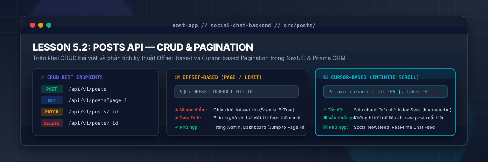
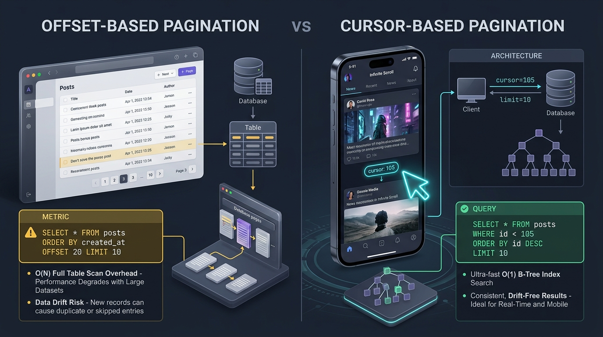
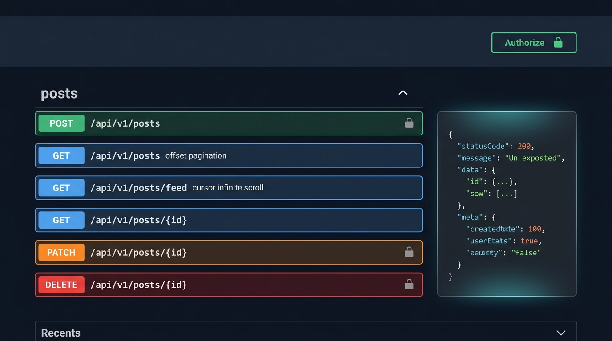
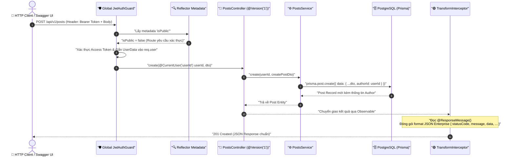

# Lesson 5.2: Posts API — CRUD Quản Lý Bài Viết & Phân Trang Cursor/Offset Tối Ưu Với Prisma

<p align="center">
  
  
  
  
  
  
</p>

<p align="center">
  
</p>

---

> [!NOTE]
> ⏱️ **Thời lượng dự kiến:** 12 – 15 phút  
> 🎯 **Mục tiêu bài học:** Xây dựng module CRUD quản lý Bài viết (`Post`) liên kết với Tác giả (`User`) bằng Prisma ORM; nắm vững bản chất toán học và hiệu năng cơ sở dữ liệu của hai kỹ thuật phân trang kinh điển: **Offset-based Pagination** (Trang/Giới hạn cho Web Admin) và **Cursor-based Pagination** (Con trỏ/Cuộn vô tận cho Mobile Social Feed); tích hợp đồng bộ với Request Pipeline Enterprise (Global Guard, `@Public()`, Custom Decorator `@CurrentUser('userId')`, `@Version('1')`, `@ResponseMessage()`); hoàn thiện tài liệu OpenAPI bằng Decorators `@nestjs/swagger` và thực hiện kiểm thử tương tác trực tiếp trên Swagger UI.

---

## 1. Thách Thức Hiệu Năng & Bài Toán Phân Trang Dữ Liệu Lớn (Big Data Pagination)

### 1.1 Cơn Ác Mộng Khi Truy Vấn Toàn Bộ Dữ Liệu (`SELECT * FROM posts`)

Trong môi trường phát triển (Development) với vài chục bài viết mẫu, câu lệnh `prisma.post.findMany()` thực thi trong chưa đầy 5ms. Tuy nhiên, khi hệ thống bước vào giai đoạn Production với hàng trăm nghìn hoặc hàng triệu bài đăng, việc trả về toàn bộ dữ liệu trong một request duy nhất sẽ lập tức kích hoạt chuỗi thảm họa hệ thống:

1. **Tràn bộ nhớ Node.js Process (Out Of Memory - OOM):**
   V8 Engine của Node.js cấp phát giới hạn heap memory mặc định (thường khoảng 1.4GB – 2GB). Khi nạp đồng thời hàng trăm nghìn bản ghi JSON vào RAM để serialize, bộ thu gom rác (Garbage Collector) bị quá tải khiến Event Loop tê liệt, dẫn đến sập ứng dụng với mã lỗi `exit code 137 (OOM Killed)`.
2. **Nghẽn Băng Thông CSDL & Mạng (Database I/O & Network Bottleneck):**
   Hàng trăm megabyte dữ liệu phải chuyển qua kết nối mạng giữa PostgreSQL và NestJS Server, làm tiêu tốn dung lượng I/O và làm nghẽn các truy vấn nghiệp vụ khác.
3. **Độ Trễ Phản Hồi Cao & Trải Nghiệm Người Dùng Kém (High Latency & Bad UX):**
   Time-To-First-Byte (TTFB) tăng vọt lên hàng chục giây. Khách hàng trên ứng dụng di động phải nhìn màn hình chờ (loading spinner) vô tận chỉ để đọc vài tin tức mới nhất.

Để giải quyết bài toán này, phân chia dữ liệu thành từng tập nhỏ (**Pagination**) là yêu cầu kiến trúc bắt buộc cho mọi REST API chuyên nghiệp.

---

### 1.2 So Sánh Chuyên Sâu: Offset-based vs Cursor-based Pagination

Hiện nay có 2 chiến lược phân trang cốt lõi trong công nghệ phần mềm:

<p align="center">
  
</p>

| Tiêu Chí Kỹ Thuật                        | Offset-based Pagination (Phân Trang Theo Trang)                                                                                                                   | Cursor-based Pagination (Phân Trang Theo Con Trỏ)                                                                                         |
| :--------------------------------------- | :---------------------------------------------------------------------------------------------------------------------------------------------------------------- | :---------------------------------------------------------------------------------------------------------------------------------------- |
| **Cơ Chế Truy Vấn**                      | Dựa vào số trang (`page`) và kích thước (`limit`). Bỏ qua $N$ bản ghi đầu và lấy $M$ bản ghi kế tiếp.                                                             | Dựa vào giá trị con trỏ (`cursor`) của bản ghi cuối cùng đã đọc và lấy $N$ bản ghi tiếp theo.                                             |
| **Cú Pháp Query API**                    | `GET /api/v1/posts?page=3&limit=10`                                                                                                                               | `GET /api/v1/posts/feed?cursor=105&take=10`                                                                                               |
| **Câu Lệnh SQL Tương Đương**             | `SELECT * FROM posts ORDER BY created_at DESC OFFSET 20 LIMIT 10;`                                                                                                | `SELECT * FROM posts WHERE id < 105 ORDER BY id DESC LIMIT 10;`                                                                           |
| **Độ Phức Tạp (Time Complexity)**        | **Chậm O(N)**: Càng về các trang sau, Database càng phải quét qua toàn bộ các hàng trước đó rồi mới loại bỏ.                                                      | **Siêu nhanh O(1)**: Tận dụng trực tiếp cấu trúc B-Tree Index trên trường `id` để nhảy thẳng tới vị trí con trỏ.                          |
| **Hiện Tượng Lệch Dữ Liệu (Data Drift)** | ⚠️ **Dễ trùng lặp hoặc bỏ sót:** Nếu có bài viết mới được thêm vào Page 1, toàn bộ bản ghi của Page 1 sẽ bị đẩy sang Page 2, khiến người dùng xem lại bài đã đọc. | 🟢 **Nhất quán 100% (Drift-Free):** Con trỏ neo chặt vào ID bài viết cụ thể, việc thêm bài mới ở đầu không làm xáo trộn kết quả phía sau. |
| **Khả Năng Nhảy Trang Tùy Ý**            | 🟢 **Hỗ trợ tốt:** Cho phép nhảy trực tiếp đến bất kỳ trang nào (Page 1 ➔ Page 50) và đếm được `totalPages`.                                                      | ❌ **Không hỗ trợ:** Chỉ có thể di chuyển tiến hoặc lùi tuần tự từ con trỏ hiện tại, không đếm được tổng số trang.                        |
| **Kịch Bản Sử Dụng Lý Tưởng**            | Giao diện Quản trị (Admin CMS, Data Table), danh sách sản phẩm thương mại điện tử cần thanh chuyển trang `1, 2, 3... 10`.                                         | Mạng xã hội (Facebook Feed, Twitter/X, TikTok), Ứng dụng di động cuộn vô tận (Infinite Scroll), Lịch sử tin nhắn Real-time.               |

---

## 2. Đồng Bộ Kiến Trúc Request Pipeline & OpenAPI Swagger UI

Để module `Posts` kế thừa hoàn hảo chuẩn mực Enterprise đã dày công xây dựng từ Module 3 đến Lesson 5.1, mỗi request đi qua một vòng đời xử lý đồng bộ và chặt chẽ:

<p align="center">
  
</p>

1. **Global `JwtAuthGuard`:** Mặc định bảo vệ toàn bộ API hệ thống. Những route xem bài viết công khai (`GET /posts`, `GET /posts/feed`, `GET /posts/:id`) được gắn nhãn `@Public()` để miễn trừ xác thực.
2. **Custom Decorator `@CurrentUser('userId')`:** Trích xuất trực tiếp `userId` (kiểu `number`) đã được giải mã từ JWT Payload trong `req.user`, giải quyết triệt để code smell `req.user` không an toàn kiểu dữ liệu.
3. **URI Versioning `@Version('1')`:** Khai báo tiền tố phiên bản `/api/v1/posts` đồng bộ toàn hệ thống.
4. **Transform Interceptor & `@ResponseMessage()`:** Đóng gói kết quả đầu ra thành cấu trúc JSON Enterprise tiêu chuẩn:
   ```json
   {
     "statusCode": 200,
     "message": "Thông điệp nghiệp vụ thành công",
     "data": { ... },
     "timestamp": "2026-09-24T15:30:00.000Z",
     "path": "/api/v1/posts"
   }
   ```
5. **OpenAPI Decorators:** Tự động sinh tài liệu Swagger UI sắc nét với `@ApiTags('posts')`, `@ApiBearerAuth('JWT-auth')`, `@ApiOperation()`, `@ApiResponse()`, và `@ApiProperty()`.



---

## 3. Hướng Dẫn Thực Hành Step-by-Step — Triển Khai Posts Module

### 📌 Bước 1: Khởi Tạo Các DTOs Với OpenAPI Decorators

Tạo các tệp DTO quy định dữ liệu đầu vào trong thư mục `src/posts/dto/`. Lưu ý sử dụng `@nestjs/swagger` để vừa xác thực runtime bằng `class-validator`, vừa tự động sinh lược đồ schema trên Swagger UI:

📄 **`src/posts/dto/create-post.dto.ts`**

```typescript
import { ApiProperty, ApiPropertyOptional } from '@nestjs/swagger';
import {
  IsBoolean,
  IsNotEmpty,
  IsOptional,
  IsString,
  MinLength,
} from 'class-validator';

export class CreatePostDto {
  @ApiProperty({
    description: 'Tiêu đề bài viết (tối thiểu 5 ký tự)',
    example: 'Xây dựng REST API hoàn chỉnh với NestJS & Prisma',
  })
  @IsString({ message: 'Tiêu đề bài viết phải là chuỗi ký tự' })
  @IsNotEmpty({ message: 'Tiêu đề bài viết không được để trống' })
  @MinLength(5, { message: 'Tiêu đề bài viết phải có ít nhất 5 ký tự' })
  title: string;

  @ApiProperty({
    description: 'Nội dung chi tiết của bài viết',
    example:
      'Bài viết này hướng dẫn chi tiết cách thiết kế schema và kỹ thuật phân trang tối ưu...',
  })
  @IsString({ message: 'Nội dung bài viết phải là chuỗi ký tự' })
  @IsNotEmpty({ message: 'Nội dung bài viết không được để trống' })
  content: string;

  @ApiPropertyOptional({
    description: 'Trạng thái xuất bản bài viết công khai',
    default: false,
    example: true,
  })
  @IsOptional()
  @IsBoolean({ message: 'Trạng thái xuất bản phải là kiểu boolean' })
  published?: boolean;
}
```

📄 **`src/posts/dto/update-post.dto.ts`**

```typescript
// 💡 Sử dụng PartialType từ '@nestjs/swagger' thay vì '@nestjs/mapped-types'
// để tự động kế thừa toàn bộ Swagger schema metadata và Validation rules từ CreatePostDto!
import { PartialType } from '@nestjs/swagger';
import { CreatePostDto } from './create-post.dto';

export class UpdatePostDto extends PartialType(CreatePostDto) {}
```

📄 **`src/posts/dto/query-post.dto.ts`**

```typescript
import { ApiPropertyOptional } from '@nestjs/swagger';
import { Type } from 'class-transformer';
import { IsInt, IsOptional, IsString, Max, Min } from 'class-validator';

export class QueryPostDto {
  // --- Các tham số cho Offset-based Pagination ---
  @ApiPropertyOptional({
    description: 'Số thứ tự trang (bắt đầu từ 1)',
    default: 1,
    example: 1,
  })
  @IsOptional()
  @Type(() => Number)
  @IsInt({ message: 'Số trang (page) phải là số nguyên' })
  @Min(1, { message: 'Số trang tối thiểu là 1' })
  page?: number = 1;

  @ApiPropertyOptional({
    description: 'Số lượng bài viết trên 1 trang (tối đa 100)',
    default: 10,
    example: 10,
  })
  @IsOptional()
  @Type(() => Number)
  @IsInt({ message: 'Giới hạn bản ghi (limit) phải là số nguyên' })
  @Min(1, { message: 'Giới hạn bản ghi tối thiểu là 1' })
  @Max(100, { message: 'Tối đa 100 bản ghi trên 1 trang' })
  limit?: number = 10;

  // --- Các tham số cho Cursor-based Pagination ---
  @ApiPropertyOptional({
    description: 'Con trỏ (ID bài viết cuối cùng đã tải) cho infinite scroll',
    example: 105,
  })
  @IsOptional()
  @Type(() => Number)
  @IsInt({ message: 'Cursor phải là ID của bài viết dạng số nguyên' })
  cursor?: number;

  @ApiPropertyOptional({
    description: 'Số lượng bài viết muốn lấy tiếp theo (Cursor pagination)',
    default: 10,
    example: 10,
  })
  @IsOptional()
  @Type(() => Number)
  @IsInt({ message: 'Take phải là số nguyên' })
  @Min(1, { message: 'Take tối thiểu là 1' })
  @Max(100, { message: 'Take tối đa là 100' })
  take?: number = 10;

  // --- Bộ lọc tìm kiếm ---
  @ApiPropertyOptional({
    description: 'Từ khóa tìm kiếm theo tiêu đề hoặc nội dung',
    example: 'NestJS',
  })
  @IsOptional()
  @IsString()
  search?: string;
}
```

---

### 📌 Bước 2: Triển Khai `PostsService` Tương Tác CSDL Qua Prisma

Tạo tệp service xử lý toàn bộ nghiệp vụ CRUD, tối ưu câu lệnh truy vấn với `Promise.all()` và hiện thực hóa hai thuật toán phân trang:

📄 **`src/posts/posts.service.ts`**

```typescript
import {
  ForbiddenException,
  Injectable,
  NotFoundException,
} from '@nestjs/common';
import { Prisma } from '@/generated/prisma/client';
import { PrismaService } from '@/prisma/prisma.service';
import { CreatePostDto } from './dto/create-post.dto';
import { QueryPostDto } from './dto/query-post.dto';
import { UpdatePostDto } from './dto/update-post.dto';

@Injectable()
export class PostsService {
  constructor(private readonly prisma: PrismaService) {}

  // 1. Tạo bài viết mới và gắn tác giả
  async create(authorId: number, createPostDto: CreatePostDto) {
    return this.prisma.post.create({
      data: {
        ...createPostDto,
        author: {
          connect: { id: authorId },
        },
      },
      select: {
        id: true,
        title: true,
        content: true,
        published: true,
        createdAt: true,
        updatedAt: true,
        authorId: true,
        author: {
          select: { id: true, email: true, name: true },
        },
      },
    });
  }

  // 2. Phân trang dạng Offset-based (Phù hợp Web Admin / Data Table)
  async findAllOffset(query: QueryPostDto) {
    const { page = 1, limit = 10, search } = query;
    const skip = (page - 1) * limit;

    const where: Prisma.PostWhereInput = {
      ...(search && {
        OR: [
          { title: { contains: search, mode: 'insensitive' } },
          { content: { contains: search, mode: 'insensitive' } },
        ],
      }),
    };

    // Thực thi song song findMany và count để tối ưu thời gian phản hồi I/O
    const [items, totalItems] = await Promise.all([
      this.prisma.post.findMany({
        where,
        skip,
        take: limit,
        orderBy: { createdAt: 'desc' },
        select: {
          id: true,
          title: true,
          published: true,
          createdAt: true,
          author: {
            select: { id: true, email: true, name: true },
          },
          _count: {
            select: { comments: true }, // Tối ưu: Đếm số lượng comments mà không nạp toàn bộ mảng!
          },
        },
      }),
      this.prisma.post.count({ where }),
    ]);

    const totalPages = Math.ceil(totalItems / limit);

    return {
      items,
      meta: {
        page,
        limit,
        totalItems,
        totalPages,
        hasNextPage: page < totalPages,
        hasPreviousPage: page > 1,
      },
    };
  }

  // 3. Phân trang dạng Cursor-based (Phù hợp Mobile Feed / Infinite Scroll)
  async findAllCursor(query: QueryPostDto) {
    const { cursor, take = 10, search } = query;

    const where: Prisma.PostWhereInput = {
      ...(search && {
        OR: [
          { title: { contains: search, mode: 'insensitive' } },
          { content: { contains: search, mode: 'insensitive' } },
        ],
      }),
    };

    // Kỹ thuật Peek Ahead: Lấy dư 1 phần tử (take + 1) để xác định hasNextPage mà không cần gọi count()
    const items = await this.prisma.post.findMany({
      where,
      take: take + 1,
      ...(cursor ? { cursor: { id: cursor }, skip: 1 } : {}),
      orderBy: { id: 'desc' },
      select: {
        id: true,
        title: true,
        published: true,
        createdAt: true,
        author: {
          select: { id: true, email: true, name: true },
        },
        _count: {
          select: { comments: true },
        },
      },
    });

    let hasNextPage = false;
    if (items.length > take) {
      hasNextPage = true;
      items.pop(); // Loại bỏ phần tử dư thừa sau khi đã xác nhận còn trang tiếp
    }

    const nextCursor = items.length > 0 ? items[items.length - 1].id : null;

    return {
      items,
      meta: {
        take,
        nextCursor,
        hasNextPage,
      },
    };
  }

  // 4. Lấy chi tiết bài viết theo ID
  async findOne(id: number) {
    const post = await this.prisma.post.findUnique({
      where: { id },
      include: {
        author: { select: { id: true, email: true, name: true } },
        comments: {
          select: { id: true, content: true, createdAt: true, authorId: true },
          orderBy: { createdAt: 'desc' },
        },
      },
    });

    if (!post) {
      throw new NotFoundException(`Không tìm thấy bài viết với ID #${id}`);
    }

    return post;
  }

  // 5. Cập nhật bài viết (Chỉ chính chủ tác giả mới được cập nhật)
  async update(id: number, userId: number, updatePostDto: UpdatePostDto) {
    const post = await this.findOne(id);

    if (post.authorId !== userId) {
      throw new ForbiddenException('Bạn không có quyền chỉnh sửa bài viết này');
    }

    return this.prisma.post.update({
      where: { id },
      data: updatePostDto,
      include: {
        author: { select: { id: true, email: true, name: true } },
      },
    });
  }

  // 6. Xóa bài viết (Chỉ chính chủ tác giả mới được xóa)
  async remove(id: number, userId: number) {
    const post = await this.findOne(id);

    if (post.authorId !== userId) {
      throw new ForbiddenException('Bạn không có quyền xóa bài viết này');
    }

    await this.prisma.post.delete({ where: { id } });

    return { id };
  }
}
```

---

### 📌 Bước 3: Triển Khai `PostsController` Đồng Bộ Decorators & OpenAPI Swagger

Tạo tệp controller áp dụng chuẩn mực `@Version('1')`, `@ResponseMessage()`, `@Public()`, `@CurrentUser('userId')` kết hợp với các Decorators OpenAPI Swagger (`@ApiTags`, `@ApiBearerAuth`, `@ApiOperation`, `@ApiParam`, `@ApiResponse`):

📄 **`src/posts/posts.controller.ts`**

```typescript
import {
  Body,
  Controller,
  Delete,
  Get,
  HttpCode,
  HttpStatus,
  Param,
  ParseIntPipe,
  Patch,
  Post,
  Query,
  Version,
} from '@nestjs/common';
import {
  ApiBearerAuth,
  ApiOperation,
  ApiParam,
  ApiResponse,
  ApiTags,
} from '@nestjs/swagger';
import { CurrentUser } from '@/shared/decorators/current-user.decorator';
import { Public } from '@/shared/decorators/public.decorator';
import { ResponseMessage } from '@/shared/decorators/response-message.decorator';
import { CreatePostDto } from './dto/create-post.dto';
import { QueryPostDto } from './dto/query-post.dto';
import { UpdatePostDto } from './dto/update-post.dto';
import { PostsService } from './posts.service';

@ApiTags('posts')
@Controller('posts')
export class PostsController {
  constructor(private readonly postsService: PostsService) {}

  // 1. POST /api/v1/posts — Tạo bài viết mới (Yêu cầu JWT Bearer Token)
  @ApiBearerAuth('JWT-auth')
  @ApiOperation({
    summary: 'Tạo bài viết mới',
    description:
      'Yêu cầu Bearer Token của người dùng đang đăng nhập để gắn quyền tác giả',
  })
  @ApiResponse({ status: 201, description: 'Tạo bài viết mới thành công' })
  @ApiResponse({
    status: 400,
    description: 'Dữ liệu đầu vào không hợp lệ (Validation Error)',
  })
  @ApiResponse({ status: 401, description: 'Chưa xác thực JWT Bearer Token' })
  @Version('1')
  @Post()
  @HttpCode(HttpStatus.CREATED)
  @ResponseMessage('Tạo bài viết mới thành công!')
  create(
    @CurrentUser('userId') userId: number,
    @Body() createPostDto: CreatePostDto,
  ) {
    return this.postsService.create(userId, createPostDto);
  }

  // 2. GET /api/v1/posts — Lấy danh sách bài viết phân trang Offset (Public API)
  @Public()
  @ApiOperation({
    summary: 'Lấy danh sách bài viết (Offset-based Pagination)',
    description:
      'Phù hợp cho Web Admin / Data Table với số trang (page) và giới hạn (limit)',
  })
  @ApiResponse({
    status: 200,
    description: 'Lấy danh sách bài viết phân trang thành công',
  })
  @Version('1')
  @Get()
  @ResponseMessage('Lấy danh sách bài viết phân trang thành công!')
  findAllOffset(@Query() query: QueryPostDto) {
    return this.postsService.findAllOffset(query);
  }

  // 3. GET /api/v1/posts/feed — Lấy newsfeed cuộn vô tận phân trang Cursor (Public API)
  @Public()
  @ApiOperation({
    summary: 'Lấy Newsfeed bài viết (Cursor-based Pagination)',
    description:
      'Phù hợp cho bảng tin di động, cuộn vô tận (Infinite Scroll Feed)',
  })
  @ApiResponse({
    status: 200,
    description: 'Lấy newsfeed cuộn vô tận thành công',
  })
  @Version('1')
  @Get('feed')
  @ResponseMessage('Lấy newsfeed cuộn vô tận thành công!')
  findAllCursor(@Query() query: QueryPostDto) {
    return this.postsService.findAllCursor(query);
  }

  // 4. GET /api/v1/posts/:id — Xem chi tiết bài viết (Public API)
  @Public()
  @ApiOperation({
    summary: 'Xem chi tiết bài viết theo ID',
    description:
      'Trả về thông tin bài viết kèm tác giả và danh sách bình luận mới nhất',
  })
  @ApiParam({
    name: 'id',
    description: 'ID số nguyên của bài viết cần xem',
    example: 1,
  })
  @ApiResponse({
    status: 200,
    description: 'Lấy thông tin chi tiết bài viết thành công',
  })
  @ApiResponse({ status: 404, description: 'Không tìm thấy bài viết' })
  @Version('1')
  @Get(':id')
  @ResponseMessage('Lấy thông tin chi tiết bài viết thành công!')
  findOne(@Param('id', ParseIntPipe) id: number) {
    return this.postsService.findOne(id);
  }

  // 5. PATCH /api/v1/posts/:id — Chỉnh sửa bài viết (Yêu cầu chính chủ tác giả)
  @ApiBearerAuth('JWT-auth')
  @ApiOperation({
    summary: 'Chỉnh sửa bài viết',
    description:
      'Chỉ chính chủ tác giả (authorId khớp với userId trong Token) mới có quyền chỉnh sửa',
  })
  @ApiParam({
    name: 'id',
    description: 'ID bài viết cần chỉnh sửa',
    example: 1,
  })
  @ApiResponse({ status: 200, description: 'Cập nhật bài viết thành công' })
  @ApiResponse({ status: 401, description: 'Chưa xác thực JWT Bearer Token' })
  @ApiResponse({
    status: 403,
    description: 'Không có quyền chỉnh sửa bài viết của người khác',
  })
  @ApiResponse({ status: 404, description: 'Không tìm thấy bài viết' })
  @Version('1')
  @Patch(':id')
  @ResponseMessage('Cập nhật bài viết thành công!')
  update(
    @Param('id', ParseIntPipe) id: number,
    @CurrentUser('userId') userId: number,
    @Body() updatePostDto: UpdatePostDto,
  ) {
    return this.postsService.update(id, userId, updatePostDto);
  }

  // 6. DELETE /api/v1/posts/:id — Xóa bài viết (Yêu cầu chính chủ tác giả)
  @ApiBearerAuth('JWT-auth')
  @ApiOperation({
    summary: 'Xóa bài viết',
    description: 'Chỉ chính chủ tác giả mới có quyền xóa bài viết này',
  })
  @ApiParam({ name: 'id', description: 'ID bài viết cần xóa', example: 1 })
  @ApiResponse({ status: 200, description: 'Xóa bài viết thành công' })
  @ApiResponse({ status: 401, description: 'Chưa xác thực JWT Bearer Token' })
  @ApiResponse({
    status: 403,
    description: 'Không có quyền xóa bài viết của người khác',
  })
  @ApiResponse({ status: 404, description: 'Không tìm thấy bài viết' })
  @Version('1')
  @Delete(':id')
  @ResponseMessage('Xóa bài viết thành công!')
  remove(
    @Param('id', ParseIntPipe) id: number,
    @CurrentUser('userId') userId: number,
  ) {
    return this.postsService.remove(id, userId);
  }
}
```

---

### 📌 Bước 4: Đăng Ký `PostsModule` & Khai Báo Trong `AppModule`

Đóng gói các thành phần vào `PostsModule`:

📄 **`src/posts/posts.module.ts`**

```typescript
import { Module } from '@nestjs/common';
import { PostsController } from './posts.controller';
import { PostsService } from './posts.service';

@Module({
  controllers: [PostsController],
  providers: [PostsService],
  exports: [PostsService],
})
export class PostsModule {}
```

Và khai báo vào mảng `imports` của `AppModule`:

📄 **`src/app.module.ts`**

```typescript
import { Module } from '@nestjs/common';
import { PostsModule } from './posts/posts.module';

@Module({
  imports: [
    // các module khác...
    PostsModule,
  ],
})
export class AppModule {}
```

---

## 4. Kịch Bản Kiểm Tra & Thử Nghiệm (Hands-on Lab)

> [!TIP]
> Đảm bảo rằng cơ sở dữ liệu PostgreSQL đang chạy (`docker compose up -d`) và ứng dụng NestJS đang hoạt động ở chế độ theo dõi (`pnpm start:dev`).

### 🟢 Kịch Bản 1: Thành Công (Success Flow)

#### 1. Tạo bài viết mới có xác thực JWT (`POST /api/v1/posts`)

Gửi HTTP POST request kèm Header `Authorization: Bearer <TOKEN>`:

```bash
curl -X POST http://localhost:3000/api/v1/posts \
  -H "Authorization: Bearer <YOUR_ACCESS_TOKEN>" \
  -H "Content-Type: application/json" \
  -d '{
    "title": "Kỹ thuật phân trang Cursor-based tối ưu trong NestJS",
    "content": "Phân trang con trỏ tận dụng triệt để B-Tree Index giúp loại bỏ độ trễ O(N) của OFFSET...",
    "published": true
  }'
```

**Kết quả kỳ vọng (HTTP 201 Created — Định dạng chuẩn qua `TransformInterceptor`):**

```json
{
  "statusCode": 201,
  "message": "Tạo bài viết mới thành công!",
  "data": {
    "id": 1,
    "title": "Kỹ thuật phân trang Cursor-based tối ưu trong NestJS",
    "content": "Phân trang con trỏ tận dụng triệt để B-Tree Index giúp loại bỏ độ trễ O(N) của OFFSET...",
    "published": true,
    "createdAt": "2026-09-24T15:30:00.000Z",
    "updatedAt": "2026-09-24T15:30:00.000Z",
    "authorId": 1,
    "author": {
      "id": 1,
      "email": "dev@nestjs.com",
      "name": "Alex Developer"
    }
  },
  "timestamp": "2026-09-24T15:30:00.000Z",
  "path": "/api/v1/posts"
}
```

---

#### 2. Phân trang Offset-based (`GET /api/v1/posts?page=1&limit=2`)

Truy vấn danh sách bài viết theo trang và giới hạn:

```bash
curl -X GET "http://localhost:3000/api/v1/posts?page=1&limit=2"
```

**Kết quả kỳ vọng (HTTP 200 OK — Bao gồm cấu trúc `items` và `meta` đầy đủ):**

```json
{
  "statusCode": 200,
  "message": "Lấy danh sách bài viết phân trang thành công!",
  "data": {
    "items": [
      {
        "id": 2,
        "title": "Kiến trúc Clean Architecture trong dự án NestJS",
        "published": true,
        "createdAt": "2026-09-24T15:35:00.000Z",
        "author": {
          "id": 1,
          "email": "dev@nestjs.com",
          "name": "Alex Developer"
        },
        "_count": {
          "comments": 5
        }
      },
      {
        "id": 1,
        "title": "Kỹ thuật phân trang Cursor-based tối ưu trong NestJS",
        "published": true,
        "createdAt": "2026-09-24T15:30:00.000Z",
        "author": {
          "id": 1,
          "email": "dev@nestjs.com",
          "name": "Alex Developer"
        },
        "_count": {
          "comments": 0
        }
      }
    ],
    "meta": {
      "page": 1,
      "limit": 2,
      "totalItems": 2,
      "totalPages": 1,
      "hasNextPage": false,
      "hasPreviousPage": false
    }
  },
  "timestamp": "2026-09-24T15:36:00.000Z",
  "path": "/api/v1/posts"
}
```

---

#### 3. Phân trang Cursor-based Feed (`GET /api/v1/posts/feed?take=1`)

Truy vấn bảng tin cuộn vô tận với kích thước `take = 1`:

```bash
curl -X GET "http://localhost:3000/api/v1/posts/feed?take=1"
```

**Kết quả kỳ vọng trang đầu:**

```json
{
  "statusCode": 200,
  "message": "Lấy newsfeed cuộn vô tận thành công!",
  "data": {
    "items": [
      {
        "id": 2,
        "title": "Kiến trúc Clean Architecture trong dự án NestJS",
        "published": true,
        "createdAt": "2026-09-24T15:35:00.000Z",
        "author": {
          "id": 1,
          "email": "dev@nestjs.com",
          "name": "Alex Developer"
        },
        "_count": {
          "comments": 5
        }
      }
    ],
    "meta": {
      "take": 1,
      "nextCursor": 2,
      "hasNextPage": true
    }
  },
  "timestamp": "2026-09-24T15:37:00.000Z",
  "path": "/api/v1/posts/feed"
}
```

**Truy vấn trang kế tiếp bằng `cursor = 2`:**

```bash
curl -X GET "http://localhost:3000/api/v1/posts/feed?cursor=2&take=1"
```

Ứng dụng sẽ lập tức trả về bài viết ID 1 với `hasNextPage = false` và `nextCursor = 1` mà không tốn công quét lại bản ghi ID 2!

---

### 🔴 Kịch Bản 2: Kiểm Thử Lỗi & Ngăn Chặn (Blocked / Error Flow)

#### 1. Lỗi Validation DTO (Tiêu đề quá ngắn & nội dung rỗng)

Gửi body thiếu trường hoặc vi phạm `@MinLength(5)`:

```bash
curl -X POST http://localhost:3000/api/v1/posts \
  -H "Authorization: Bearer <YOUR_ACCESS_TOKEN>" \
  -H "Content-Type: application/json" \
  -d '{
    "title": "Nest",
    "content": ""
  }'
```

**Kết quả kỳ vọng (HTTP 400 Bad Request — Chặn đứng tại ValidationPipe):**

```json
{
  "statusCode": 400,
  "message": [
    "Tiêu đề bài viết phải có ít nhất 5 ký tự",
    "Nội dung bài viết không được để trống"
  ],
  "error": "Bad Request",
  "timestamp": "2026-09-24T15:38:00.000Z",
  "path": "/api/v1/posts"
}
```

---

#### 2. Lỗi Chưa Đăng Nhập Gọi API Bảo Vệ (`401 Unauthorized`)

Gửi request sửa bài viết mà không gửi kèm Header Authorization:

```bash
curl -X PATCH http://localhost:3000/api/v1/posts/1 \
  -H "Content-Type: application/json" \
  -d '{ "title": "Tiêu đề mới" }'
```

**Kết quả kỳ vọng (HTTP 401 Unauthorized — Chặn đứng tại JwtAuthGuard):**

```json
{
  "statusCode": 401,
  "message": "Unauthorized",
  "timestamp": "2026-09-24T15:38:30.000Z",
  "path": "/api/v1/posts/1"
}
```

---

#### 3. Lỗi Forbidden 403 Khi Sửa/Xóa Bài Viết Của Người Khác

Người dùng B (`userId = 2`) cố tình gửi request xóa bài viết `#1` của tác giả A (`userId = 1`):

```bash
curl -X DELETE http://localhost:3000/api/v1/posts/1 \
  -H "Authorization: Bearer <TOKEN_USER_B>"
```

**Kết quả kỳ vọng (HTTP 403 Forbidden — Ngăn chặn hành vi leo thang đặc quyền):**

```json
{
  "statusCode": 403,
  "message": "Bạn không có quyền xóa bài viết này",
  "error": "Forbidden",
  "timestamp": "2026-09-24T15:39:00.000Z",
  "path": "/api/v1/posts/1"
}
```

---

### 🖥️ Kịch Bản 3: Thử Nghiệm Tương Tác Trực Quan Trên Swagger UI (`/api/docs`)

Nhờ đã cài đặt `@nestjs/swagger` từ **Lesson 5.1**, bạn có thể trải nghiệm toàn diện luồng CRUD và phân trang trực tiếp trên trình duyệt:

1. **Mở Swagger Portal:** Truy cập trình duyệt tại địa chỉ `http://localhost:3000/api/docs`.
2. **Authorize Bearer Token:**
   - Nhấn nút **Authorize 🔓** màu xanh lá ở góc trên bên phải giao diện.
   - Dán chuỗi Bearer Token nhận được từ API đăng nhập (Module 4) theo định dạng: `Bearer <YOUR_ACCESS_TOKEN>`.
   - Nhấn **Authorize** rồi nhấn **Close**. Biểu tượng ổ khóa sẽ đóng lại thành **🔒**.
3. **Thực thi `POST /api/v1/posts`:**
   - Mở rộng tag `posts`, chọn endpoint `POST /api/v1/posts`.
   - Nhấn **Try it out**, Swagger UI sẽ tự động điền sẵn JSON mẫu lấy từ `@ApiProperty()` trong `CreatePostDto`.
   - Nhấn **Execute** và quan sát kết quả phản hồi `201 Created` kèm `TransformInterceptor` đóng gói trực quan!
4. **Thực thi `GET /api/v1/posts` & `GET /api/v1/posts/feed`:**
   - Nhập giá trị thử nghiệm cho `page`, `limit` hoặc `cursor`, `take` vào giao diện form trực quan.
   - Nhấn **Execute** để xem dữ liệu JSON bài viết phân trang chuẩn Enterprise.

---

## 5. Tổng Kết Bài Học & Checklist Ghi Nhớ

```mermaid
mindmap
  root(("Posts API & Phân Trang"))
    "Thao Tác CRUD"
      "Create: Gán tác giả tự động qua @CurrentUser userId"
      "Read: Phân chia Offset vs Cursor Pagination"
      "Update và Delete: Kiểm soát phân quyền chính chủ bài viết"
    "Kỹ Thuật Phân Trang"
      "Offset-based: page và limit - Phù hợp Web Admin O(N)"
      "Cursor-based: cursor và take - Phù hợp Infinite Feed O(1)"
      "Tối ưu Prisma: Promise.all và select _count"
    "Đồng Bộ Architecture"
      "Global JwtAuthGuard kết hợp @Public decorator"
      "@Version 1 đồng bộ URL /api/v1/posts"
      "@ResponseMessage và TransformInterceptor format JSON"
    "OpenAPI Swagger Docs"
      "@ApiTags posts và @ApiBearerAuth JWT-auth"
      "@ApiOperation và @ApiResponse đa mã trạng thái"
      "@ApiProperty và PartialType từ @nestjs/swagger"
```

### ✅ Checklist Ghi Nhớ Bài Học:

- [x] Hiểu rõ bản chất kỹ thuật và điểm yếu O(N) cùng hiện tượng Data Drift của **Offset-based Pagination**.
- [x] Làm chủ thuật toán **Cursor-based Pagination** O(1) với kỹ thuật lấy dư 1 phần tử (Peek Ahead) để xác định `hasNextPage`.
- [x] Thiết kế DTOs validation chuẩn mực cho Create, Update và Query params (`page`, `limit`, `cursor`, `take`).
- [x] Kế thừa `PartialType` từ `@nestjs/swagger` để giữ nguyên toàn bộ OpenAPI schema metadata.
- [x] Đã đồng bộ kiến trúc Request Pipeline: `@Public()` cho Public API, `@CurrentUser('userId')` cho Protected API.
- [x] Áp dụng `@Version('1')` và `@ResponseMessage()` để tạo JSON Enterprise Response đồng nhất với các module trước.
- [x] Tối ưu hóa truy vấn CSDL Prisma bằng cách kết hợp `Promise.all()` và `_count: { select: { comments: true } }`.
- [x] Kiểm soát phân quyền chính chủ bài viết, chặn đứng hành vi sửa/xóa trái phép với `ForbiddenException` (`403 Forbidden`).
- [x] Tích hợp OpenAPI Swagger decorators cho DTOs và Controller, kiểm thử tương tác thành công trên Swagger UI.

---

👈 **Bài trước:** [Lesson 5.1: OpenAPI (Swagger) — Tự Động Hóa Tài Liệu API & Kiểm Thử Tương Tác Với @nestjs/swagger](../lesson-5.1/lesson-5.1.md)  
👉 **Bài tiếp theo:** [Lesson 5.3: File Upload — Upload Ảnh Đại Diện / Bài Viết Với Multer](../lesson-5.3/lesson-5.3.md)
