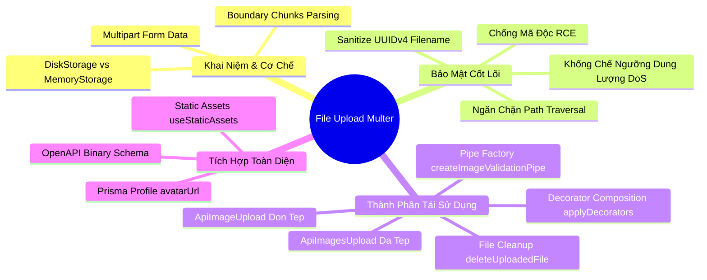

# Lesson 5.3: File Upload — Upload Ảnh Đại Diện / Bài Viết Với Multer Trong NestJS

<p align="center">
  
  
  
  
  
  
</p>

<p align="center">
  
</p>

---

> [!NOTE]
> ⏱️ **Thời lượng:** 12 – 15 phút thực chiến  
> 🎯 **Mục tiêu:** Nắm vững luồng upload tệp tin đa phương tiện (`multipart/form-data`) trong NestJS; thiết lập lá chắn bảo mật chống mã độc & tràn đĩa; tích hợp giao diện chọn file tương tác trên Swagger UI; hiện thực hóa 2 tính năng thực tế: **Đổi avatar tài khoản** (kèm cơ chế dọn dẹp file cũ) và **Upload album ảnh bài viết**.

---

## 1. Trực Quan Hóa Bài Toán & Ma Trận Rủi Ro An Ninh Mạng

### 📱 Sản Phẩm Thực Tế Chúng Ta Sẽ Xây Dựng

Trước khi đi vào code, hãy cùng nhìn vào giao diện người dùng thực tế mà bộ API này sẽ phục vụ:

<p align="center">
  
</p>

- 👤 **Modal đổi Avatar:** Cho phép kéo-thả ảnh, giới hạn tối đa **2MB** (chỉ chấp nhận JPG/PNG/WEBP), cập nhật tức thì ảnh đại diện cá nhân.
- 📝 **Modal tạo Bài Viết:** Đính kèm đồng thời nhiều ảnh album (**tối đa 5 ảnh**, mỗi ảnh tối đa 5MB) với thanh tiến trình tải lên.

---

### 🔥 Góc Thực Chiến: 4 "Tai Nạn Kinh Hoàng" Khi Xử Lý File Upload

> [!CAUTION]
>
> 1. **Thảm họa ghi đè file (`avatar.png`):** Dùng trực tiếp tên file gốc của user. Khi User B tải lên ảnh tên `avatar.png`, toàn bộ avatar của User A trước đó bị ghi đè!
> 2. **Lỗ hổng Path Traversal (`../../`):** Hacker gửi tên file `../../main.ts`. Server lưu đè và phá hủy toàn bộ mã nguồn khởi động hệ thống.
> 3. **Tấn công DoS dung lượng:** Không chặn size, kẻ xấu gửi file nén rác 10GB liên tục làm tê liệt RAM và đầy ổ đĩa server.
> 4. **Ngụy tạo định dạng (MIME Spoofing):** Đổi tên file mã độc `shell.php` thành `shell.jpg` hòng qua mặt bộ lọc sơ sài.

---

## 2. Kiến Trúc Request Pipeline & So Sánh Nơi Lưu Trữ

### 🧩 Kiến Trúc Luồng Xử Lý Dữ Liệu Trong NestJS

Dưới đây là sơ đồ chi tiết hành trình của một file ảnh từ khi rời khỏi thiết bị Client cho đến khi an tọa an toàn trong thư mục máy chủ và CSDL PostgreSQL:

<p align="center">
  
</p>

---

### ⚖️ So Sánh 3 Chiến Lược Lưu Trữ File

| Tiêu chí       | 🏠 1. Local Disk (`diskStorage`)                                            | 🧠 2. In-Memory (`memoryStorage`)                           | ☁️ 3. Cloud Storage (S3/Cloudinary)                                                    |
| :------------- | :-------------------------------------------------------------------------- | :---------------------------------------------------------- | :------------------------------------------------------------------------------------- |
| **Vị trí lưu** | Thư mục cục bộ (`./uploads/`)                                               | Tạm thời trong RAM (`file.buffer`)                          | Máy chủ đám mây chuyên dụng qua CDN                                                    |
| **Ưu điểm**    | ⚡ Cực kỳ đơn giản, không tốn tiền, không cần config bên thứ 3.             | Tiện xử lý ảnh nhanh (crop, resize, watermark với `sharp`). | 🚀 Vô hạn dung lượng, tải siêu tốc, hỗ trợ hệ thống nhiều cụm server (Multi-instance). |
| **Nhược điểm** | ⚠️ Không đồng bộ khi chạy nhiều container Docker (Server nào biết file đó). | 💥 Dễ gây tràn RAM (OOM) nếu nhiều user upload cùng lúc.    | Cần thẻ tín dụng, setup SDK & quản lý access key bảo mật.                              |
| **Ứng dụng**   | **Học tập, MVP, Server đơn lẻ (Monolith).**                                 | **Bước đệm xử lý ảnh trước khi đẩy lên S3.**                | **Môi trường Production thực tế quy mô lớn.**                                          |

---

## 3. Hướng Dẫn Thực Hành Step-by-Step

### 📂 Cấu Trúc Mã Nguồn Triển Khai

```
src/
├── shared/
│   ├── decorators/
│   │   └── api-file.decorator.ts       👈 Decorator Composition (Swagger + Multer Interceptor)
│   ├── pipes/
│   │   └── image-validation.pipe.ts    👈 Reusable Pipe Factory (Dung lượng + Định dạng)
│   └── helpers/
│       └── multer.helper.ts            👈 DiskStorage an toàn & Dọn dẹp rác file cũ
├── users/
│   ├── users.controller.ts             👈 Controller siêu sạch (chỉ 5 dòng code)
│   └── users.service.ts                👈 Cập nhật Profile.avatarUrl & tự xóa file cũ
├── posts/
│   └── posts.controller.ts             👈 Upload Album đa tệp với @ApiImagesUpload
└── main.ts                             👈 Kích hoạt Static Assets (/uploads)
```

---

### 📌 Bước 1: Cài Đặt Type Definitions Cho Multer

```bash
pnpm add -D @types/multer
```

---

### 📌 Bước 2: Xây Dựng Helper Cấu Hình Multer & Dọn Rác File Cũ

Tệp helper này đảm nhiệm 3 nhiệm vụ quan trọng:

1. Tự động kiểm tra và tạo thư mục lưu trữ nếu chưa có.
2. Sinh tên tệp ngẫu nhiên kết hợp UUIDv4 chống ghi đè và triệt tiêu lỗi **Path Traversal**.
3. Cung cấp hàm **`deleteUploadedFile`** giúp dọn dẹp file cũ khi người dùng thay ảnh đại diện, tránh rác ổ cứng.

📄 **`src/shared/helpers/multer.helper.ts`**

```typescript
import { BadRequestException, Logger } from '@nestjs/common';
import { diskStorage } from 'multer';
import { existsSync, mkdirSync, unlinkSync } from 'node:fs';
import { extname, join } from 'node:path';
import { randomUUID } from 'node:crypto';
import type { Request } from 'express';

const logger = new Logger('MulterHelper');

/**
 * 1. DiskStorage Factory: Tự động tạo thư mục và sinh tên tệp UUID an toàn
 */
export const createMulterDiskStorage = (subFolder: string) => {
  const destinationPath = join(process.cwd(), 'uploads', subFolder);

  return diskStorage({
    destination: (req, file, cb) => {
      if (!existsSync(destinationPath)) {
        mkdirSync(destinationPath, { recursive: true });
      }
      cb(null, destinationPath);
    },
    filename: (req, file, cb) => {
      // Làm sạch extension gốc (ví dụ: .JPG -> .jpg)
      const fileExtension = extname(file.originalname).toLowerCase();
      // Sinh tên file: [folder]-[timestamp]-[uuid].[ext]
      const uniqueName = `${subFolder}-${Date.now()}-${randomUUID()}${fileExtension}`;
      cb(null, uniqueName);
    },
  });
};

export const ALLOWED_IMAGE_TYPES: Record<string, string> = {
  '.jpg': 'image/jpeg',
  '.jpeg': 'image/jpeg',
  '.png': 'image/png',
  '.webp': 'image/webp',
  '.gif': 'image/gif',
};

/**
 * 2. File Filter: Kiểm tra đuôi file và tự động chuẩn hóa mimetype
 */
export const imageFileFilter = (
  req: Request,
  file: Express.Multer.File,
  cb: (error: Error | null, acceptFile: boolean) => void,
) => {
  const ext = extname(file.originalname).toLowerCase();
  const mimeType = ALLOWED_IMAGE_TYPES[ext];

  if (!mimeType) {
    return cb(
      new BadRequestException(
        `Chỉ chấp nhận file ảnh: ${Object.keys(ALLOWED_IMAGE_TYPES).join(', ')}`,
      ),
      false,
    );
  }

  // Tự động gán đúng MIME chuẩn dựa vào extension đã qua kiểm duyệt
  file.mimetype = mimeType;
  cb(null, true);
};

/**
 * 3. File Cleanup Helper: Xóa file vật lý trên ổ đĩa một cách an toàn
 * @param relativePath Đường dẫn tương đối dạng '/uploads/avatars/abc.png'
 */
export const deleteUploadedFile = (relativePath?: string | null) => {
  if (!relativePath) return;

  try {
    // Loại bỏ dấu gạch chéo đầu nếu có để ghép path chuẩn
    const sanitizedPath = relativePath.startsWith('/')
      ? relativePath.slice(1)
      : relativePath;
    const fullPath = join(process.cwd(), sanitizedPath);

    if (existsSync(fullPath)) {
      unlinkSync(fullPath);
      logger.log(`🗑️ Đã xóa file cũ: ${sanitizedPath}`);
    }
  } catch (error) {
    logger.warn(`⚠️ Không thể xóa file: ${relativePath}`, error);
  }
};
```

---

### 📌 Bước 3: Tạo Reusable Pipe Factory Cho Kiểm Tra File Ảnh

Thay vì phải gõ chuỗi `new ParseFilePipeBuilder().addFileTypeValidator(...).addMaxSizeValidator(...).build()` ở mọi controller, chúng ta tạo một hàm Factory tái sử dụng linh hoạt:

Tạo tệp 📄 **`src/shared/pipes/image-validation.pipe.ts`**:

```typescript
import { HttpStatus, ParseFilePipeBuilder } from '@nestjs/common';

interface ImageValidationOptions {
  maxSizeInMb?: number; // Dung lượng tối đa (mặc định 2MB)
  required?: boolean; // Bắt buộc phải có file hay không (mặc định true)
}

/**
 * Factory tạo Pipe kiểm duyệt file ảnh tái sử dụng toàn dự án
 */
export const createImageValidationPipe = (options?: ImageValidationOptions) => {
  const maxSizeInMb = options?.maxSizeInMb ?? 2;
  const isRequired = options?.required ?? true;

  return new ParseFilePipeBuilder()
    .addFileTypeValidator({
      fileType: /(jpg|jpeg|png|webp)$/i,
      fallbackToMimetype: true, // Hỗ trợ diskStorage khi file.buffer không lưu trong RAM
    })
    .addMaxSizeValidator({
      maxSize: maxSizeInMb * 1024 * 1024,
      message: `Dung lượng ảnh không được vượt quá ${maxSizeInMb}MB!`,
    })
    .build({
      errorHttpStatusCode: HttpStatus.BAD_REQUEST,
      fileIsRequired: isRequired,
    });
};
```

---

### 📌 Bước 4: Xây Dựng Custom Decorators Với `applyDecorators`

Áp dụng kỹ thuật Decorator Composition đã học từ **Lesson 3.5**, chúng ta gộp toàn bộ các cấu hình sau vào **01 Custom Decorator duy nhất**:

1. `@UseInterceptors(FileInterceptor(...))` hoặc `@UseInterceptors(FilesInterceptor(...))`
2. `@ApiConsumes('multipart/form-data')`
3. `@ApiBody(...)` với Schema nhị phân tương thích Swagger UI

Tạo tệp 📄 **`src/shared/decorators/api-file.decorator.ts`**:

```typescript
import { applyDecorators, UseInterceptors } from '@nestjs/common';
import { FileInterceptor, FilesInterceptor } from '@nestjs/platform-express';
import { ApiBody, ApiConsumes } from '@nestjs/swagger';
import {
  createMulterDiskStorage,
  imageFileFilter,
} from '../helpers/multer.config';

interface SingleFileUploadOptions {
  folder: string; // Thư mục con lưu trữ (ví dụ: 'avatars', 'banners')
  description?: string;
}

interface MultipleFilesUploadOptions {
  folder: string; // Thư mục con lưu trữ (ví dụ: 'posts')
  maxCount?: number; // Số lượng file tối đa (mặc định 5)
  description?: string;
}

/**
 * Decorator tải lên 01 file ảnh: Tự động cấu hình Multer Interceptor & Swagger Form
 */
export const ApiImageUpload = (
  fieldName: string = 'file',
  options: SingleFileUploadOptions,
) => {
  return applyDecorators(
    UseInterceptors(
      FileInterceptor(fieldName, {
        storage: createMulterDiskStorage(options.folder),
        fileFilter: imageFileFilter,
      }),
    ),
    ApiConsumes('multipart/form-data'),
    ApiBody({
      description: options.description ?? 'Chọn file ảnh để tải lên',
      schema: {
        type: 'object',
        properties: {
          [fieldName]: {
            type: 'string',
            format: 'binary',
          },
        },
        required: [fieldName],
      },
    }),
  );
};

/**
 * Decorator tải lên nhiều file ảnh cùng lúc: Tự động cấu hình FilesInterceptor & Swagger Form
 */
export const ApiImagesUpload = (
  fieldName: string = 'files',
  options: MultipleFilesUploadOptions,
) => {
  const maxCount = options.maxCount ?? 5;

  return applyDecorators(
    UseInterceptors(
      FilesInterceptor(fieldName, maxCount, {
        storage: createMulterDiskStorage(options.folder),
        fileFilter: imageFileFilter,
      }),
    ),
    ApiConsumes('multipart/form-data'),
    ApiBody({
      description:
        options.description ?? `Chọn danh sách ảnh (tối đa ${maxCount} file)`,
      schema: {
        type: 'object',
        properties: {
          [fieldName]: {
            type: 'array',
            items: {
              type: 'string',
              format: 'binary',
            },
          },
        },
        required: [fieldName],
      },
    }),
  );
};
```

---

### 📌 Bước 5: Triển Khai API Upload Avatar Người Dùng (`UsersModule`)

Hãy quan sát xem `UsersController` và `UsersService` trở nên sạch đẹp và mạnh mẽ như thế nào khi áp dụng bộ công cụ Reusable trên!

Cập nhật tệp 📄 **`src/users/users.service.ts`**:

```typescript
import { Injectable, NotFoundException } from '@nestjs/common';
import { PrismaService } from '../prisma/prisma.service';
import { deleteUploadedFile } from '../shared/helpers/multer.config';

@Injectable()
export class UsersService {
  constructor(private readonly prisma: PrismaService) {}

  /**
   * Cập nhật ảnh đại diện người dùng và tự động xóa bỏ ảnh cũ
   */
  async updateAvatar(userId: number, newAvatarUrl: string) {
    // 1. Tìm bản ghi Profile hiện tại của User
    const existingProfile = await this.prisma.profile.findUnique({
      where: { userId },
    });

    // 2. Nếu đã có avatar trước đó, xóa bỏ file ảnh cũ trên đĩa cứng để tránh rác!
    if (existingProfile?.avatarUrl) {
      deleteUploadedFile(existingProfile.avatarUrl);
    }

    // 3. Cập nhật đường dẫn avatar mới vào CSDL
    const updatedProfile = await this.prisma.profile.upsert({
      where: { userId },
      create: {
        userId,
        avatarUrl: newAvatarUrl,
      },
      update: {
        avatarUrl: newAvatarUrl,
      },
    });

    return {
      userId,
      avatarUrl: updatedProfile.avatarUrl,
    };
  }
}
```

Cập nhật tệp 📄 **`src/users/users.controller.ts`**:

```typescript
import { Controller, Post, UploadedFile } from '@nestjs/common';
import { ApiBearerAuth, ApiOperation, ApiTags } from '@nestjs/swagger';
import { UsersService } from './users.service';
import { ResponseMessage } from 'src/shared/decorators/response-message.decorator';
import { CurrentUser } from 'src/shared/decorators/current-user.decorator';
import { ApiImageUpload } from 'src/shared/decorators/api-file.decorator';
import { createImageValidationPipe } from 'src/shared/pipes/image-validation.pipe';

@ApiTags('users')
@Controller('users')
export class UsersController {
  constructor(private readonly usersService: UsersService) {}

  @Post('avatar')
  @ApiBearerAuth('JWT-auth')
  @ApiOperation({ summary: 'Upload và cập nhật ảnh đại diện cá nhân' })
  @ApiImageUpload('avatar', {
    folder: 'avatars',
    description: 'File ảnh đại diện (JPG, PNG, WEBP - Tối đa 2MB)',
  })
  @ResponseMessage('Cập nhật ảnh đại diện thành công!')
  async uploadAvatar(
    @CurrentUser('userId') userId: number,
    @UploadedFile(createImageValidationPipe({ maxSizeInMb: 2 }))
    file: Express.Multer.File,
  ) {
    const avatarUrl = `/uploads/avatars/${file.filename}`;
    const result = await this.usersService.updateAvatar(userId, avatarUrl);

    return {
      filename: file.filename,
      size: `${(file.size / 1024).toFixed(1)} KB`,
      mimetype: file.mimetype,
      url: result.avatarUrl,
    };
  }
}
```

---

### 📌 Bước 6: Triển Khai API Upload Album Ảnh Bài Viết (`PostsModule`)

📄 **`src/posts/posts.controller.ts`**

```typescript
import { Controller, Post, UploadedFiles } from '@nestjs/common';
import { ApiBearerAuth, ApiOperation, ApiTags } from '@nestjs/swagger';
import { ResponseMessage } from 'src/shared/decorators/response-message.decorator';
import { ApiImagesUpload } from 'src/shared/decorators/api-file.decorator';
import { createImageValidationPipe } from 'src/shared/pipes/image-validation.pipe';

@ApiTags('posts')
@Controller('posts')
export class PostsController {
  @Post('upload-images')
  @ApiBearerAuth('JWT-auth')
  @ApiOperation({
    summary: 'Upload danh sách ảnh đính kèm bài viết (Tối đa 5 ảnh)',
  })
  @ApiImagesUpload('images', {
    folder: 'posts',
    maxCount: 5,
    description: 'Chọn danh sách ảnh bài viết (Tối đa 5 file, mỗi file <= 5MB)',
  })
  @ResponseMessage('Tải lên danh sách ảnh bài viết thành công!')
  uploadPostImages(
    @UploadedFiles(createImageValidationPipe({ maxSizeInMb: 5 }))
    files: Express.Multer.File[],
  ) {
    const uploadedList = files.map((file) => ({
      originalName: file.originalname,
      filename: file.filename,
      size: `${(file.size / 1024).toFixed(1)} KB`,
      url: `/uploads/posts/${file.filename}`,
    }));

    return {
      total: uploadedList.length,
      items: uploadedList,
    };
  }
}
```

---

### 📌 Bước 7: Kích Hoạt Phục Vụ Tệp Tĩnh Trong `main.ts`

📄 **`src/main.ts`**

```typescript
import { NestFactory } from '@nestjs/core';
import { AppModule } from './app.module';
import { NestExpressApplication } from '@nestjs/platform-express';
import { join } from 'node:path';

async function bootstrap() {
  // 💡 Ép kiểu sang NestExpressApplication để truy cập các hàm static của Express
  const app = await NestFactory.create<NestExpressApplication>(AppModule);

  // Cấu hình phục vụ thư mục tĩnh 'uploads'
  app.useStaticAssets(join(process.cwd(), 'uploads'), {
    prefix: '/uploads/',
  });

  // ... các cấu hình pipes, swagger, listen giữ nguyên
}
void bootstrap();
```

---

## 4. Kịch Bản Kiểm Tra & Thử Nghiệm (Hands-on Lab)

### 🟢 Kịch Bản 1: Upload Avatar Hợp Lệ & Tự Dọn Rác File Cũ

#### Bước 1: Gửi Request Upload Avatar Lần 1

```bash
curl -X POST http://localhost:3000/api/v1/users/avatar \
  -H "Authorization: Bearer <TOKEN_CỦA_BẠN>" \
  -F "avatar=@/path/to/avatar-1.png"
```

**Phản hồi thành công (HTTP 201 Created):**

```json
{
  "statusCode": 201,
  "message": "Cập nhật ảnh đại diện thành công!",
  "data": {
    "filename": "avatars-1725785000000-7a8f9b2c.png",
    "size": "512.4 KB",
    "mimetype": "image/png",
    "url": "/uploads/avatars/avatars-1725785000000-7a8f9b2c.png"
  }
}
```

#### Bước 2: Upload Avatar Lần 2 (Kiểm tra cơ chế dọn rác)

Tải tiếp file `avatar-2.png`. Quan sát Terminal backend, bạn sẽ thấy log tự động:  
`[MulterHelper] 🗑️ Đã xóa file cũ: uploads/avatars/avatars-1725785000000-7a8f9b2c.png`  
👉 **Ổ đĩa máy chủ luôn sạch sẽ, không bị tích tụ file rác của các avatar cũ!**

---

### 🔴 Kịch Bản 2: Kiểm Thử Chặn Đứng 3 Mối Đe Dọa An Ninh

#### 1. Chặn file quá khổ (> 2MB):

```bash
curl -X POST http://localhost:3000/api/v1/users/avatar \
  -H "Authorization: Bearer <TOKEN>" \
  -F "avatar=@/path/to/video-nang-15mb.mp4"
```

```json
{
  "statusCode": 400,
  "message": "Dung lượng ảnh không được vượt quá 2MB!",
  "error": "Bad Request"
}
```

---

#### 2. Chặn file script độc hại (`.sh`, `.php`, `.exe`):

```bash
curl -X POST http://localhost:3000/api/v1/users/avatar \
  -H "Authorization: Bearer <TOKEN>" \
  -F "avatar=@/path/to/malicious_exploit.sh"
```

```json
{
  "statusCode": 400,
  "message": "Validation failed (expected type is /(jpg|jpeg|png|webp)$/i)",
  "error": "Bad Request"
}
```

---

#### 3. Chặn request không gửi kèm tệp tin:

```bash
curl -X POST http://localhost:3000/api/v1/users/avatar \
  -H "Authorization: Bearer <TOKEN>"
```

```json
{
  "statusCode": 400,
  "message": "File is required",
  "error": "Bad Request"
}
```

---

### 🖥️ Kịch Bản 3: Trải Nghiệm Thao Tác Trực Quan Trên Swagger UI

Mở trình duyệt truy cập: **`http://localhost:3000/api/docs`**

```
┌──────────────────────────────────────────────────────────────┐
│  POST /api/v1/users/avatar           [Authorize 🔒]          │
├──────────────────────────────────────────────────────────────┤
│  Request Content-Type: multipart/form-data                   │
│                                                              │
│  avatar: [ Choose File ]  my-avatar.png                      │
│                                                              │
│  [ Execute ] 🚀                                              │
├──────────────────────────────────────────────────────────────┤
│  Response Code: 201 Created                                  │
│  { "url": "/uploads/avatars/avatars-1725...png" }            │
└──────────────────────────────────────────────────────────────┘
```

1. Bấm **Authorize 🔒**, dán JWT Token vào form.
2. Tìm đến tag `users` ➔ chọn `POST /api/v1/users/avatar`.
3. Bấm **Try it out** ➔ Nhờ decorator `@ApiImageUpload`, Swagger tự động nhận diện schema binary và hiển thị nút **Choose File**.
4. Chọn một tấm ảnh bất kỳ và bấm **Execute** để kiểm tra kết quả tức thì!

---

## 5. Tổng Kết Bài Học & Checklist Ghi Nhớ



### ✅ Checklist Tự Đánh Giá Sau Bài Học:

- [x] Hiểu rõ vì sao upload file bắt buộc dùng `multipart/form-data` thay vì JSON thông thường.
- [x] Nắm vững 4 hiểm họa bảo mật lớn nhất khi upload file và cách phòng ngừa triệt để.
- [x] Xây dựng được **Decorator Composition** (`@ApiImageUpload`, `@ApiImagesUpload`) kết hợp gọn gàng Multer Interceptor và OpenAPI Schema.
- [x] Xây dựng được **Pipe Factory** (`createImageValidationPipe`) tái sử dụng ở mọi endpoint trong hệ thống.
- [x] Triển khai được cơ chế tự dọn dẹp file cũ (`deleteUploadedFile`) khi người dùng thay đổi ảnh đại diện.
- [x] Cấu hình `app.useStaticAssets()` để phục vụ ảnh công khai qua URL tĩnh.
- [x] Đồng bộ dữ liệu ảnh đại diện trực tiếp vào CSDL PostgreSQL qua Prisma ORM.

---

👈 **Bài trước:** [Lesson 5.2: Posts API — CRUD Bài Viết & Phân Trang Cursor/Offset Trong NestJS](../lesson-5.2/lesson-5.2.md)  
👉 **Bài tiếp theo:** [Lesson 5.4: Comments API — Thêm Bình Luận Dưới Bài Viết Trong NestJS](../lesson-5.4/lesson-5.4.md)
