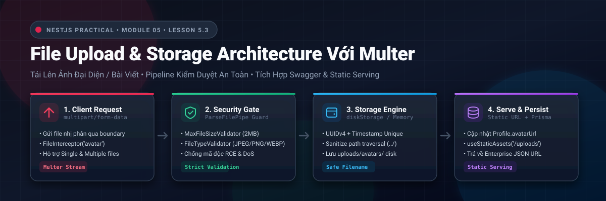
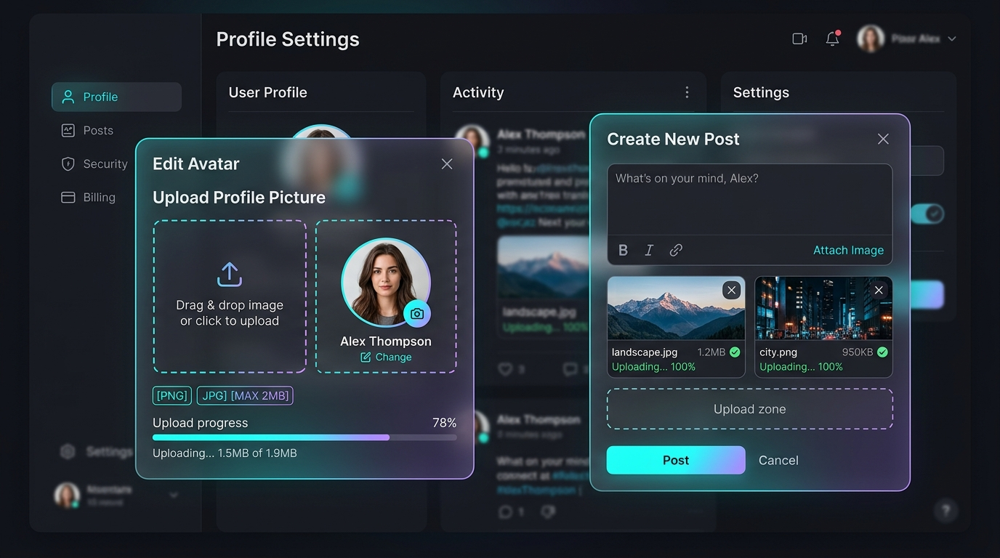
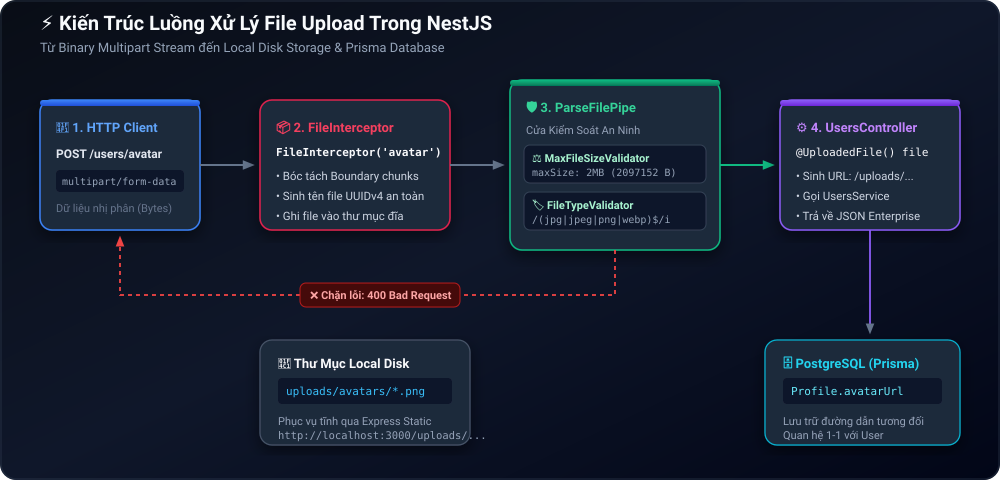
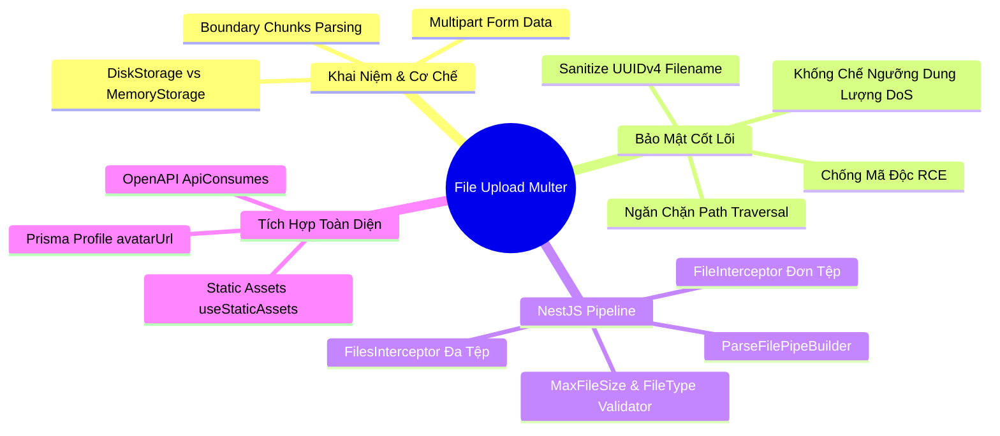

# Lesson 5.3: File Upload — Upload Ảnh Đại Diện / Bài Viết Với Multer Trong NestJS

<p align="center">
  
  
  
  
  
  
</p>

<p align="center">
  
</p>

---

> [!NOTE]
> ⏱️ **Thời lượng:** 12 – 15 phút thực chiến  
> 🎯 **Mục tiêu:** Làm chủ luồng upload tệp tin đa phương tiện (`multipart/form-data`) trong NestJS; thiết lập lá chắn bảo mật chống mã độc & tràn đĩa; tích hợp giao diện chọn file tương tác trên Swagger UI; hiện thực hóa 2 tính năng thực tế: **Đổi avatar tài khoản** và **Upload album ảnh bài viết**.

---

## 1. Trực Quan Hóa Bài Toán & Ma Trận Rủi Ro An Ninh Mạng

### 📱 Sản Phẩm Thực Tế Chúng Ta Sẽ Xây Dựng

Trước khi đi vào code, hãy cùng nhìn vào giao diện người dùng thực tế mà bộ API này sẽ phục vụ:

<p align="center">
  
</p>

- 👤 **Modal đổi Avatar:** Cho phép kéo-thả ảnh, giới hạn tối đa **2MB** (chỉ chấp nhận JPG/PNG/WEBP), cập nhật tức thì ảnh đại diện cá nhân.
- 📝 **Modal tạo Bài Viết:** Đính kèm đồng thời nhiều ảnh album (**tối đa 5 ảnh**, mỗi ảnh tối đa 5MB) với thanh tiến trình tải lên.

---

### 🔥 Góc Thực Chiến: 4 "Tai Nạn Kinh Hoàng" Khi Xử Lý File Upload

> [!CAUTION]
>
> 1. **Thảm họa ghi đè file (`avatar.png`):** Dùng trực tiếp tên file gốc của user. Khi User B tải lên ảnh tên `avatar.png`, toàn bộ avatar của User A trước đó bị ghi đè!
> 2. **Lỗ hổng Path Traversal (`../../`):** Hacker gửi tên file `../../main.ts`. Server lưu đè và phá hủy toàn bộ mã nguồn khởi động hệ thống.
> 3. **Tấn công DoS dung lượng:** Không chặn size, kẻ xấu gửi file nén rác 10GB liên tục làm tê liệt RAM và đầy ổ đĩa server.
> 4. **Ngụy tạo định dạng (MIME Spoofing):** Đổi tên file mã độc `shell.php` thành `shell.jpg` hòng qua mặt bộ lọc sơ sài.

---

## 2. Kiến Trúc Request Pipeline & So Sánh Nơi Lưu Trữ

### 🧩 Kiến Trúc Luồng Xử Lý Dữ Liệu Trong NestJS

Dưới đây là sơ đồ chi tiết hành trình của một file ảnh từ khi rời khỏi thiết bị Client cho đến khi an tọa an toàn trong thư mục máy chủ và CSDL PostgreSQL:

<p align="center">
  
</p>

---

### ⚖️ So Sánh 3 Chiến Lược Lưu Trữ File

| Tiêu chí       | 🏠 1. Local Disk (`diskStorage`)                                            | 🧠 2. In-Memory (`memoryStorage`)                           | ☁️ 3. Cloud Storage (S3/Cloudinary)                                                    |
| :------------- | :-------------------------------------------------------------------------- | :---------------------------------------------------------- | :------------------------------------------------------------------------------------- |
| **Vị trí lưu** | Thư mục cục bộ (`./uploads/`)                                               | Tạm thời trong RAM (`file.buffer`)                          | Máy chủ đám mây chuyên dụng qua CDN                                                    |
| **Ưu điểm**    | ⚡ Cực kỳ đơn giản, không tốn tiền, không cần config bên thứ 3.             | Tiện xử lý ảnh nhanh (crop, resize, watermark với `sharp`). | 🚀 Vô hạn dung lượng, tải siêu tốc, hỗ trợ hệ thống nhiều cụm server (Multi-instance). |
| **Nhược điểm** | ⚠️ Không đồng bộ khi chạy nhiều container Docker (Server nào biết file đó). | 💥 Dễ gây tràn RAM (OOM) nếu nhiều user upload cùng lúc.    | Cần thẻ tín dụng, setup SDK & quản lý access key bảo mật.                              |
| **Ứng dụng**   | **Học tập, MVP, Server đơn lẻ (Monolith).**                                 | **Bước đệm xử lý ảnh trước khi đẩy lên S3.**                | **Môi trường Production thực tế quy mô lớn.**                                          |

---

## 3. Hướng Dẫn Thực Hành Step-by-Step

```
📂 Cấu trúc thư mục chúng ta sẽ triển khai:
src/
├── shared/
│   ├── dto/
│   │   └── file-upload.dto.ts     👈 Khai báo Swagger Multipart Schema
│   └── helpers/
│       └── multer.config.ts       👈 Bộ sinh UUID & Sanitize extension an toàn
├── users/
│   ├── users.controller.ts        👈 API POST /users/avatar (1 file)
│   └── users.service.ts           👈 Cập nhật Profile.avatarUrl qua Prisma
├── posts/
│   └── posts.controller.ts        👈 API POST /posts/upload-images (nhiều file)
└── main.ts                        👈 Kích hoạt Static Assets (/uploads)
```

---

### 📌 Bước 1: Cài Đặt Type Definitions Cho Multer

Trong NestJS Express, Multer đã có sẵn bên dưới. Chúng ta chỉ cần bổ sung type definition cho TypeScript:

```bash
pnpm add -D @types/multer
```

---

### 📌 Bước 2: Xây Dựng Helper Cấu Hình Multer An Toàn

📄 **`src/shared/helpers/multer.config.ts`**

```typescript
import { BadRequestException } from '@nestjs/common';
import { diskStorage } from 'multer';
import { existsSync, mkdirSync } from 'node:fs';
import { extname, join } from 'node:path';
import { randomUUID } from 'node:crypto';
import type { Request } from 'express';

/**
 * Tạo DiskStorage Engine tự động kiểm tra thư mục & sinh tên UUID độc nhất
 */
export const createMulterDiskStorage = (subFolder: string) => {
  const destinationPath = join(process.cwd(), 'uploads', subFolder);

  return diskStorage({
    destination: (req, file, cb) => {
      // 1. Tự động tạo thư mục nếu chưa tồn tại (recursive: true)
      if (!existsSync(destinationPath)) {
        mkdirSync(destinationPath, { recursive: true });
      }
      cb(null, destinationPath);
    },
    filename: (req, file, cb) => {
      // 2. Làm sạch extension (chỉ lấy đuôi gốc chữ thường)
      const fileExtension = extname(file.originalname).toLowerCase();

      // 3. Tên file duy nhất: prefix + timestamp + UUIDv4 (Triệt tiêu ghi đè & Path Traversal)
      const uniqueName = `${subFolder}-${Date.now()}-${randomUUID()}${fileExtension}`;
      cb(null, uniqueName);
    },
  });
};

/**
 * Bộ lọc định dạng MIME an toàn (Chỉ nhận file ảnh phổ biến)
 */
export const imageFileFilter = (
  req: Request,
  file: Express.Multer.File,
  cb: (error: Error | null, acceptFile: boolean) => void,
) => {
  const allowedMimeTypes = [
    'image/jpeg',
    'image/png',
    'image/webp',
    'image/gif',
  ];

  if (allowedMimeTypes.includes(file.mimetype)) {
    cb(null, true);
  } else {
    cb(
      new BadRequestException(
        `Định dạng '${file.mimetype}' không hợp lệ! Chỉ chấp nhận JPG, PNG, WEBP hoặc GIF.`,
      ),
      false,
    );
  }
};
```

> [!TIP]
> **Điểm mấu chốt:** Việc dùng `randomUUID()` kết hợp `extname()` loại bỏ hoàn toàn nguy cơ **Path Traversal** (như `../../passwords.txt`) vì tên file gốc của người dùng không bao giờ được dùng để lưu trữ trên đĩa cứng!

---

### 📌 Bước 3: Tạo DTOs Cho Giao Diện Swagger Multipart

Để Swagger UI hiển thị nút bấm **Choose File** thay vì ô nhập JSON, chúng ta cần định nghĩa schema dạng `binary`:

📄 **`src/shared/dto/file-upload.dto.ts`**

```typescript
import { ApiProperty } from '@nestjs/swagger';

export class UploadAvatarDto {
  @ApiProperty({
    type: 'string',
    format: 'binary',
    description: 'File ảnh đại diện (JPG, PNG, WEBP - Tối đa 2MB)',
  })
  avatar: any;
}

export class UploadPostImagesDto {
  @ApiProperty({
    type: 'array',
    items: {
      type: 'string',
      format: 'binary',
    },
    description: 'Danh sách ảnh bài viết (Tối đa 5 ảnh, mỗi ảnh tối đa 5MB)',
  })
  images: any[];
}
```

---

### 📌 Bước 4: Triển Khai API Upload Avatar Cá Nhân (`/users/avatar`)

Cập nhật Service để lưu đường dẫn ảnh vào bảng `profiles` thông qua Prisma:

📄 **`src/users/users.service.ts`**

```typescript
// Thêm phương thức updateAvatar vào UsersService:
async updateAvatar(userId: number, avatarUrl: string) {
  const user = await this.prisma.user.findUnique({
    where: { id: userId },
  });

  if (!user) {
    throw new NotFoundException('Không tìm thấy tài khoản người dùng');
  }

  // Cập nhật hoặc tạo mới Profile tương ứng với User (Quan hệ 1-1)
  const profile = await this.prisma.profile.upsert({
    where: { userId },
    create: { userId, avatarUrl },
    update: { avatarUrl },
  });

  return {
    userId,
    avatarUrl: profile.avatarUrl,
  };
}
```

Triển khai Endpoint Controller với `FileInterceptor` và `ParseFilePipeBuilder`:

📄 **`src/users/users.controller.ts`**

```typescript
import {
  Controller,
  Post,
  HttpStatus,
  ParseFilePipeBuilder,
  UploadedFile,
  UseInterceptors,
} from '@nestjs/common';
import { FileInterceptor } from '@nestjs/platform-express';
import {
  ApiBearerAuth,
  ApiBody,
  ApiConsumes,
  ApiOperation,
  ApiTags,
} from '@nestjs/swagger';
import { UsersService } from './users.service';
import { UploadAvatarDto } from '../shared/dto/file-upload.dto';
import { ResponseMessage } from 'src/shared/decorators/response-message.decorator';
import { CurrentUser } from 'src/shared/decorators/current-user.decorator';
import {
  createMulterDiskStorage,
  imageFileFilter,
} from 'src/shared/helpers/multer.config';

@ApiTags('users')
@Controller('users')
export class UsersController {
  constructor(private readonly usersService: UsersService) {}

  @Post('avatar')
  @ApiBearerAuth('JWT-auth')
  @ApiOperation({ summary: 'Upload và cập nhật ảnh đại diện cá nhân' })
  @ApiConsumes('multipart/form-data')
  @ApiBody({ description: 'Chọn file ảnh đại diện', type: UploadAvatarDto })
  @ResponseMessage('Cập nhật ảnh đại diện thành công!')
  @UseInterceptors(
    FileInterceptor('avatar', {
      storage: createMulterDiskStorage('avatars'),
      fileFilter: imageFileFilter,
    }),
  )
  async uploadAvatar(
    @CurrentUser('userId') userId: number,
    @UploadedFile(
      new ParseFilePipeBuilder()
        .addFileTypeValidator({
          fileType: /(jpg|jpeg|png|webp)$/i,
        })
        .addMaxSizeValidator({
          maxSize: 2 * 1024 * 1024, // 2MB
          message: 'Dung lượng file vượt quá giới hạn 2MB cho phép!',
        })
        .build({
          errorHttpStatusCode: HttpStatus.BAD_REQUEST,
          fileIsRequired: true,
        }),
    )
    file: Express.Multer.File,
  ) {
    const avatarUrl = `/uploads/avatars/${file.filename}`;
    const result = await this.usersService.updateAvatar(userId, avatarUrl);

    return {
      filename: file.filename,
      size: `${(file.size / 1024).toFixed(1)} KB`,
      mimetype: file.mimetype,
      url: result.avatarUrl,
    };
  }
}
```

---

### 📌 Bước 5: Triển Khai API Upload Album Ảnh Bài Viết (`/posts/upload-images`)

Khi đăng bài viết kèm nhiều hình ảnh, chúng ta dùng `FilesInterceptor` (số nhiều) để nhận tối đa 5 file cùng lúc:

📄 **`src/posts/posts.controller.ts`**

```typescript
import {
  Controller,
  Post,
  HttpStatus,
  ParseFilePipeBuilder,
  UploadedFiles,
  UseInterceptors,
} from '@nestjs/common';
import { FilesInterceptor } from '@nestjs/platform-express';
import {
  ApiBearerAuth,
  ApiBody,
  ApiConsumes,
  ApiOperation,
  ApiTags,
} from '@nestjs/swagger';
import { UploadPostImagesDto } from '../shared/dto/file-upload.dto';
import { ResponseMessage } from 'src/shared/decorators/response-message.decorator';
import {
  createMulterDiskStorage,
  imageFileFilter,
} from 'src/shared/helpers/multer.config';

@ApiTags('posts')
@Controller('posts')
export class PostsController {
  @Post('upload-images')
  @ApiBearerAuth('JWT-auth')
  @ApiOperation({
    summary: 'Upload danh sách ảnh đính kèm bài viết (Tối đa 5 ảnh)',
  })
  @ApiConsumes('multipart/form-data')
  @ApiBody({ description: 'Chọn danh sách ảnh', type: UploadPostImagesDto })
  @ResponseMessage('Tải lên danh sách ảnh bài viết thành công!')
  @UseInterceptors(
    FilesInterceptor('images', 5, {
      storage: createMulterDiskStorage('posts'),
      fileFilter: imageFileFilter,
    }),
  )
  uploadPostImages(
    @UploadedFiles(
      new ParseFilePipeBuilder()
        .addFileTypeValidator({
          fileType: /(jpg|jpeg|png|webp)$/i,
        })
        .addMaxSizeValidator({
          maxSize: 5 * 1024 * 1024, // 5MB mỗi ảnh
          message: 'Mỗi ảnh bài viết không được vượt quá 5MB!',
        })
        .build({
          errorHttpStatusCode: HttpStatus.BAD_REQUEST,
          fileIsRequired: true,
        }),
    )
    files: Express.Multer.File[],
  ) {
    const uploadedList = files.map((file) => ({
      originalName: file.originalname,
      filename: file.filename,
      size: `${(file.size / 1024).toFixed(1)} KB`,
      url: `/uploads/posts/${file.filename}`,
    }));

    return {
      total: uploadedList.length,
      items: uploadedList,
    };
  }
}
```

---

### 📌 Bước 6: Kích Hoạt Phục Vụ Tệp Tĩnh Trong `main.ts`

Để trình duyệt có thể hiển thị trực tiếp ảnh qua link `http://localhost:3000/uploads/...`, ta kích hoạt tính năng phục vụ tệp tĩnh:

📄 **`src/main.ts`**

```typescript
import { NestFactory } from '@nestjs/core';
import { AppModule } from './app.module';
import { NestExpressApplication } from '@nestjs/platform-express';
import { join } from 'node:path';

async function bootstrap() {
  // 💡 Ép kiểu sang NestExpressApplication để truy cập các hàm static của Express
  const app = await NestFactory.create<NestExpressApplication>(AppModule);

  // Cấu hình phục vụ thư mục tĩnh 'uploads'
  app.useStaticAssets(join(process.cwd(), 'uploads'), {
    prefix: '/uploads/',
  });

  // ... các cấu hình pipes, swagger, listen giữ nguyên
}
void bootstrap();
```

---

## 4. Kịch Bản Kiểm Tra & Thử Nghiệm (Hands-on Lab)

### 🟢 Kịch Bản 1: Upload Avatar Hợp Lệ

Gửi request đính kèm file ảnh `profile.png` (dung lượng 500KB) kèm Token xác thực:

```bash
curl -X POST http://localhost:3000/api/v1/users/avatar \
  -H "Authorization: Bearer <TOKEN_CỦA_BẠN>" \
  -F "avatar=@/path/to/profile.png"
```

**Phản hồi thành công (HTTP 201 Created):**

```json
{
  "statusCode": 201,
  "message": "Cập nhật ảnh đại diện thành công!",
  "data": {
    "filename": "avatars-1725785000000-7a8f9b2c-3d4e.png",
    "size": "512.4 KB",
    "mimetype": "image/png",
    "url": "/uploads/avatars/avatars-1725785000000-7a8f9b2c-3d4e.png"
  }
}
```

👉 **Kiểm tra trực quan:** Copy đường dẫn `http://localhost:3000/uploads/avatars/avatars-1725785000000-7a8f9b2c-3d4e.png` dán vào trình duyệt — bức ảnh sẽ hiển thị ngay lập tức!

---

### 🔴 Kịch Bản 2: Kiểm Thử Chặn Đứng 3 Mối Đe Dọa An Ninh

#### 1. Chặn file quá khổ (> 2MB):

```bash
curl -X POST http://localhost:3000/api/v1/users/avatar \
  -H "Authorization: Bearer <TOKEN>" \
  -F "avatar=@/path/to/video-nang-15mb.mp4"
```

```json
{
  "statusCode": 400,
  "message": "Dung lượng file vượt quá giới hạn 2MB cho phép!",
  "error": "Bad Request"
}
```

---

#### 2. Chặn file script độc hại (`.sh`, `.php`, `.exe`):

```bash
curl -X POST http://localhost:3000/api/v1/users/avatar \
  -H "Authorization: Bearer <TOKEN>" \
  -F "avatar=@/path/to/malicious_exploit.sh"
```

```json
{
  "statusCode": 400,
  "message": "Validation failed (expected type is /(jpg|jpeg|png|webp)$/i)",
  "error": "Bad Request"
}
```

---

#### 3. Chặn request không gửi kèm tệp tin:

```bash
curl -X POST http://localhost:3000/api/v1/users/avatar \
  -H "Authorization: Bearer <TOKEN>"
```

```json
{
  "statusCode": 400,
  "message": "File is required",
  "error": "Bad Request"
}
```

---

### 🖥️ Kịch Bản 3: Trải Nghiệm Thao Tác Trực Quan Trên Swagger UI

Mở trình duyệt truy cập: **`http://localhost:3000/api/docs`**

```
┌──────────────────────────────────────────────────────────────┐
│  POST /api/v1/users/avatar           [Authorize 🔒]          │
├──────────────────────────────────────────────────────────────┤
│  Request Content-Type: multipart/form-data                   │
│                                                              │
│  avatar: [ Choose File ]  my-avatar.png                      │
│                                                              │
│  [ Execute ] 🚀                                              │
├──────────────────────────────────────────────────────────────┤
│  Response Code: 201 Created                                  │
│  { "url": "/uploads/avatars/avatars-1725...png" }            │
└──────────────────────────────────────────────────────────────┘
```

1. Bấm **Authorize 🔒**, dán JWT Token vào form.
2. Tìm đến tag `users` ➔ chọn `POST /api/v1/users/avatar`.
3. Bấm **Try it out** ➔ Bấm nút **Choose File** và chọn một tấm ảnh từ máy tính của bạn.
4. Bấm **Execute** và thưởng thức thành quả!

---

## 5. Tổng Kết Bài Học & Checklist Ghi Nhớ



### ✅ Checklist Tự Đánh Giá Sau Bài Học:

- [x] Hiểu rõ vì sao upload file bắt buộc dùng `multipart/form-data` thay vì JSON thông thường.
- [x] Nắm vững 4 hiểm họa bảo mật lớn nhất khi upload file và cách phòng ngừa triệt để.
- [x] Thiết kế được helper Multer tự sinh thư mục và đặt tên UUIDv4 an toàn tuyệt đối.
- [x] Làm chủ `FileInterceptor` (1 file) và `FilesInterceptor` (nhiều file).
- [x] Áp dụng `ParseFilePipeBuilder` để kiểm duyệt cả dung lượng (`maxSize`) lẫn định dạng ảnh (`fileType`).
- [x] Cấu hình `@ApiConsumes('multipart/form-data')` để Swagger hiển thị nút Choose File.
- [x] Biết cách phục vụ ảnh qua URL bằng `app.useStaticAssets()`.
- [x] Cập nhật đường dẫn avatar vào CSDL PostgreSQL qua Prisma ORM.

---

👈 **Bài trước:** [Lesson 5.2: Posts API — CRUD Bài Viết & Phân Trang Cursor/Offset Trong NestJS](../lesson-5.2/lesson-5.2.md)  
👉 **Bài tiếp theo:** Lesson 5.4: Comments API — Thêm Bình Luận Dưới Bài Viết
