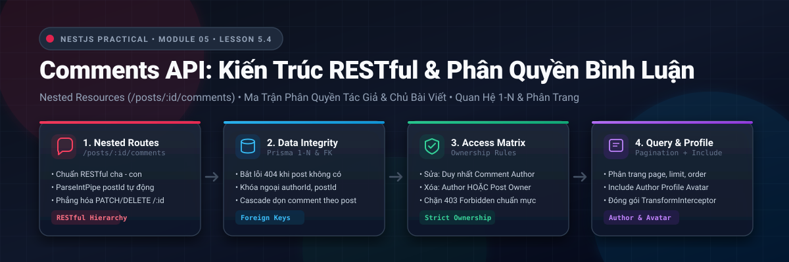
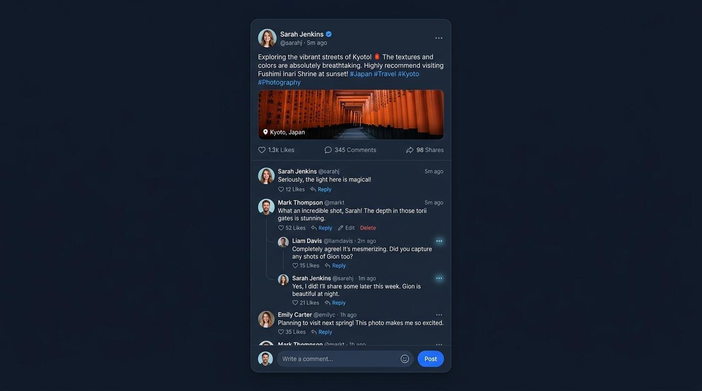
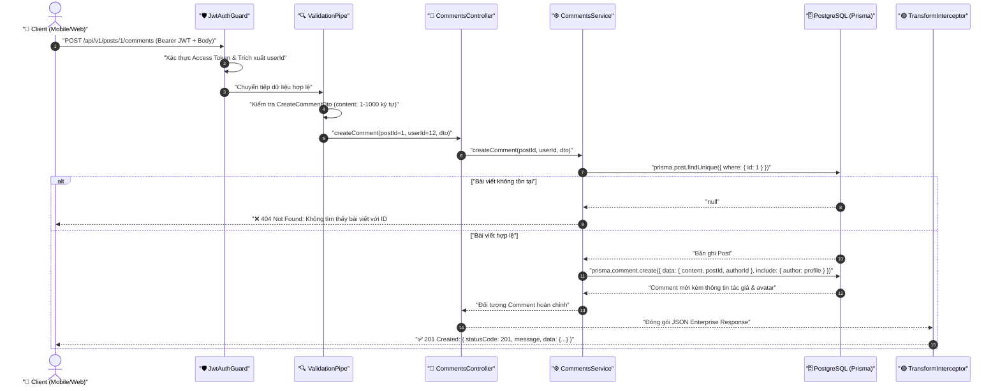
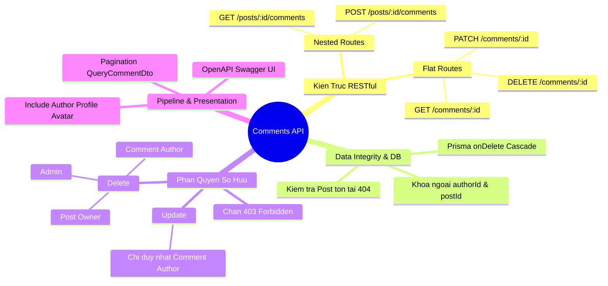

# Lesson 5.4: Comments API — Thêm Bình Luận Dưới Bài Viết Trong NestJS

<p align="center">
  
  
  
  
  
  
</p>

<p align="center">
  
</p>

---

> [!NOTE]
> ⏱️ **Thời lượng dự kiến:** 12 – 15 phút thực chiến  
> 🎯 **Mục tiêu bài học:** Nắm vững tư duy thiết kế RESTful API cho tài nguyên phân cấp (Nested Resources); làm chủ quan hệ 1-N giữa Bài viết (`Post`), Người dùng (`User`) và Bình luận (`Comment`); xử lý toàn vẹn dữ liệu khi liên kết khóa ngoại; xây dựng **Ma trận phân quyền sở hữu (Ownership Authorization Matrix)** bảo vệ bình luận khỏi các hành vi can thiệp trái phép; tích hợp phân trang, tải thông tin tác giả kèm ảnh đại diện đại diện avatar và chuẩn bị sẵn sàng cho kiến trúc phát sự kiện bất đồng bộ ở bài tiếp theo.

---

## 1. Đặt Vấn Đề & Tư Duy Thiết Kế RESTful Cho Quan Hệ Phân Cấp (1-N)

### 📱 Trải Nghiệm Người Dùng Thực Tế (Social Feed & Comments)

Trong bất kỳ mạng xã hội nào (Facebook, Reddit, Threads hay Twitter/X), bài viết không tồn tại đơn độc mà luôn đi kèm khu vực tương tác cộng đồng: danh sách các bình luận (`Comments`).

Trước khi viết từng dòng code, hãy quan sát giao diện người dùng thực tế mà bộ API của chúng ta sẽ phục vụ:

<p align="center">
  
</p>

Quan sát giao diện trên, chúng ta nhận thấy rõ các yêu cầu nghiệp vụ:

1. **Gắn liền với bài viết:** Một bình luận luôn thuộc về **chính xác 1 bài viết** cụ thể. Không thể có bình luận "mồ côi" trôi nổi mà không có bài viết cha.
2. **Định danh tác giả rõ ràng:** Mỗi bình luận hiển thị ảnh đại diện (`avatarUrl`), tên người dùng (`name`), thời gian gửi (`createdAt`) và nội dung bình luận (`content`).
3. **Phân trang độc lập:** Một bài viết nổi tiếng có thể có hàng nghìn bình luận. Backend không thể nhồi nhét tất cả bình luận vào một lần gọi API lấy chi tiết bài viết, mà cần API phân trang riêng biệt.
4. **Quyền thao tác giới hạn:** Chỉ người viết ra bình luận mới được sửa; nhưng người đăng bài viết (Chủ tus) cũng phải có quyền xóa những bình luận khiếm nhã trên bài của mình!

---

### ⚖️ So Sánh Thiết Kế URL: Phân Cấp (Nested) vs Phẳng (Flat)

Khi thiết kế API cho các tài nguyên có quan hệ cha - con chặt chẽ (`Post ➔ Comments`), các kỹ sư backend thường đứng trước câu hỏi: **Nên dùng URL lồng nhau hay URL phẳng?**

| Phương thức       | Thiết kế URL Phân Cấp (Nested URI)          | Thiết kế URL Phẳng (Flat URI)                       | Đánh Giá & Quyết Định Thiết Kế                                                                                                      |
| :---------------- | :------------------------------------------ | :-------------------------------------------------- | :---------------------------------------------------------------------------------------------------------------------------------- |
| **Tạo bình luận** | `POST /api/v1/posts/:postId/comments`       | `POST /api/v1/comments` _(gửi `postId` trong body)_ | 🏆 **Nested URI trực quan vượt trội:** Thể hiện rõ ngữ nghĩa "tạo bình luận trong phạm vi bài viết `:postId`".                      |
| **Lấy danh sách** | `GET /api/v1/posts/:postId/comments`        | `GET /api/v1/comments?postId=12`                    | 🏆 **Nested URI tự nhiên:** Khách hàng muốn xem bình luận của bài viết nào thì truyền ID bài viết đó trực tiếp trên đường dẫn.      |
| **Sửa bình luận** | `PATCH /api/v1/posts/:postId/comments/:id`  | `PATCH /api/v1/comments/:id`                        | 🏆 **Flat URI tinh gọn:** Khi đã có ID bình luận (`:id`), việc bắt buộc Client truyền thêm `:postId` là dư thừa và dễ gây sai lệch. |
| **Xóa bình luận** | `DELETE /api/v1/posts/:postId/comments/:id` | `DELETE /api/v1/comments/:id`                       | 🏆 **Flat URI tối ưu:** Thao tác xóa trực tiếp theo khóa chính của bình luận.                                                       |

> [!TIP]
> **Quy Tắc Vàng Trong Thiết Kế RESTful:**  
> Dùng **Nested URI** khi cần xác định phạm vi của tài nguyên cha (`POST/GET /posts/:postId/comments`), và dùng **Flat URI** khi đã có định danh duy nhất của tài nguyên con (`PATCH/DELETE /comments/:id`).

---

### 🛡️ Ma Trận Phân Quyền Sở Hữu (Comment Ownership Matrix)

Bảo mật mạng xã hội không chỉ dừng ở việc "có token hay không", mà cốt lõi nằm ở **kiểm tra quyền sở hữu đối tượng (Object-Level Authorization)**:

| Hành Động          |  Người Lạ (Chưa Đăng Nhập)   |       Người Dùng Khác       | Tác Giả Bình Luận (`authorId`) | Chủ Bài Viết (`post.authorId`) |   Quản Trị Viên (`ADMIN`)   |
| :----------------- | :--------------------------: | :-------------------------: | :----------------------------: | :----------------------------: | :-------------------------: |
| **Xem bình luận**  |    ✅ Cho phép (`200 OK`)    |   ✅ Cho phép (`200 OK`)    |     ✅ Cho phép (`200 OK`)     |     ✅ Cho phép (`200 OK`)     |   ✅ Cho phép (`200 OK`)    |
| **Thêm bình luận** | ❌ Chặn (`401 Unauthorized`) | ✅ Cho phép (`201 Created`) |  ✅ Cho phép (`201 Created`)   |  ✅ Cho phép (`201 Created`)   | ✅ Cho phép (`201 Created`) |
| **Sửa bình luận**  | ❌ Chặn (`401 Unauthorized`) |  ❌ Chặn (`403 Forbidden`)  |   ✅ **Cho phép (`200 OK`)**   |   ❌ Chặn (`403 Forbidden`)    |  ❌ Chặn (`403 Forbidden`)  |
| **Xóa bình luận**  | ❌ Chặn (`401 Unauthorized`) |  ❌ Chặn (`403 Forbidden`)  |   ✅ **Cho phép (`200 OK`)**   |   ✅ **Cho phép (`200 OK`)**   | ✅ **Cho phép (`200 OK`)**  |

> [!IMPORTANT]
>
> - **Chỉ duy nhất tác giả mới được sửa nội dung bình luận:** Không ai (kể cả chủ bài viết hay admin) được tự ý thay đổi lời nói của người khác.
> - **Chủ bài viết có quyền xóa bình luận trên bài của mình:** Đây là cơ chế kiểm duyệt nội dung (moderation) bắt buộc của các mạng xã hội để ngăn chặn spam, quấy rối hoặc thông tin độc hại.

---

## 2. Mô Hình Dữ Liệu & Request Pipeline

### 🧩 Quan Hệ Prisma Schema & Ràng Buộc Khóa Ngoại

Nhìn lại Data Model `Comment` mà chúng ta đã khai báo từ **Module 2**:

```prisma
model Comment {
  id        Int      @id @default(autoincrement())
  content   String
  createdAt DateTime @default(now())
  updatedAt DateTime @updatedAt

  // Quan hệ Khóa ngoại
  postId   Int
  post     Post @relation(fields: [postId], references: [id], onDelete: Cascade)
  authorId Int
  author   User @relation(fields: [authorId], references: [id], onDelete: Cascade)

  @@map("comments")
}
```

- **`onDelete: Cascade`:** Khi một `Post` hoặc một `User` bị xóa khỏi hệ thống, toàn bộ các bản ghi `Comment` liên quan sẽ tự động bị xóa đồng thời bởi PostgreSQL, triệt tiêu hoàn toàn rủi ro dữ liệu rác (Orphan Records).
- **Kiểm tra bài viết trước khi tạo:** Dù cơ sở dữ liệu có ràng buộc khóa ngoại (Foreign Key Constraint), ở tầng ứng dụng NestJS, chúng ta phải chủ động kiểm tra sự tồn tại của bài viết để trả về mã lỗi thân thiện `404 Not Found` thay vì để Prisma quăng lỗi nội bộ `P2003` (Foreign Key Constraint Failed).

---

### ⚡ Sơ Đồ Tuần Tự Xử Lý Request (Sequence Diagram)

Dưới đây là hành trình hoàn chỉnh của một HTTP Request khi người dùng gửi bình luận mới:



---

## 3. Hướng Dẫn Thực Hành Step-by-Step

### 📂 Cấu Trúc Mã Nguồn Module Comments

Toàn bộ tính năng được đóng gói gọn gàng trong thư mục `src/comments/`:

```
src/comments/
├── dto/
│   ├── create-comment.dto.ts    👈 Validate dữ liệu tạo bình luận
│   ├── update-comment.dto.ts    👈 Validate nội dung cập nhật
│   └── query-comment.dto.ts     👈 Validate tham số phân trang & sắp xếp
├── comments.service.ts          👈 Nghiệp vụ, truy vấn Prisma & Phân quyền sở hữu
├── comments.controller.ts       👈 Định tuyến RESTful & Swagger OpenAPI
└── comments.module.ts           👈 Đóng gói NestJS Module
```

---

### 📌 Bước 1: Xây Dựng Các Data Transfer Objects (DTOs)

#### 1. DTO Tạo Bình Luận

Kiểm tra nội dung bình luận không được bỏ trống và độ dài nằm trong ngưỡng an toàn từ 1 đến 1000 ký tự.

📄 **`src/comments/dto/create-comment.dto.ts`**

```typescript
import { ApiProperty } from '@nestjs/swagger';
import { IsNotEmpty, IsString, MaxLength, MinLength } from 'class-validator';

export class CreateCommentDto {
  @ApiProperty({
    description: 'Nội dung của bình luận (tối đa 1000 ký tự)',
    example: 'Bài viết rất hữu ích và chi tiết! Cảm ơn tác giả nhiều.',
  })
  @IsString({ message: 'Nội dung bình luận phải là chuỗi ký tự' })
  @IsNotEmpty({ message: 'Nội dung bình luận không được để trống' })
  @MinLength(1, { message: 'Nội dung bình luận phải có ít nhất 1 ký tự' })
  @MaxLength(1000, { message: 'Nội dung bình luận tối đa 1000 ký tự' })
  content: string;
}
```

#### 2. DTO Cập Nhật Bình Luận

📄 **`src/comments/dto/update-comment.dto.ts`**

```typescript
import { ApiProperty } from '@nestjs/swagger';
import { IsNotEmpty, IsString, MaxLength, MinLength } from 'class-validator';

export class UpdateCommentDto {
  @ApiProperty({
    description: 'Nội dung cập nhật của bình luận',
    example: 'Nội dung bình luận sau khi đã được chỉnh sửa bổ sung.',
  })
  @IsString({ message: 'Nội dung bình luận phải là chuỗi ký tự' })
  @IsNotEmpty({ message: 'Nội dung bình luận không được để trống' })
  @MinLength(1, { message: 'Nội dung bình luận phải có ít nhất 1 ký tự' })
  @MaxLength(1000, { message: 'Nội dung bình luận tối đa 1000 ký tự' })
  content: string;
}
```

#### 3. DTO Phân Trang Bình Luận

Sử dụng `class-transformer` chuyển đổi query params sang kiểu số và kiểm soát giới hạn an toàn.

📄 **`src/comments/dto/query-comment.dto.ts`**

```typescript
import { ApiPropertyOptional } from '@nestjs/swagger';
import { Type } from 'class-transformer';
import { IsIn, IsInt, IsOptional, Max, Min } from 'class-validator';

export class QueryCommentDto {
  @ApiPropertyOptional({
    description: 'Số thứ tự trang (mặc định là 1)',
    default: 1,
    example: 1,
  })
  @IsOptional()
  @Type(() => Number)
  @IsInt({ message: 'Số trang page phải là số nguyên' })
  @Min(1, { message: 'Số trang tối thiểu là 1' })
  page?: number = 1;

  @ApiPropertyOptional({
    description: 'Số lượng bình luận trên mỗi trang (tối đa 50)',
    default: 10,
    example: 10,
  })
  @IsOptional()
  @Type(() => Number)
  @IsInt({ message: 'Số lượng bản ghi limit phải là số nguyên' })
  @Min(1, { message: 'Số lượng bản ghi tối thiểu là 1' })
  @Max(50, { message: 'Tối đa 50 bình luận trên một trang' })
  limit?: number = 10;

  @ApiPropertyOptional({
    description:
      'Thứ tự sắp xếp theo thời gian tạo (desc: mới nhất, asc: cũ nhất)',
    enum: ['asc', 'desc'],
    default: 'desc',
    example: 'desc',
  })
  @IsOptional()
  @IsIn(['asc', 'desc'], { message: 'Thứ tự sắp xếp phải là asc hoặc desc' })
  order?: 'asc' | 'desc' = 'desc';
}
```

---

### 📌 Bước 2: Xây Dựng Comments Service

Tệp service này đảm nhận 5 phương thức cốt lõi:

1. **`createComment`:** Đảm bảo bài viết tồn tại trước khi thêm mới bình luận; nạp kèm thông tin tác giả và avatar profile.
2. **`findCommentsByPost`:** Truy vấn danh sách bình luận kèm phân trang và tính toán metadata (`totalPages`, `hasNextPage`, `hasPreviousPage`).
3. **`findOne`:** Xem chi tiết 1 bình luận.
4. **`updateComment`:** Kiểm tra quyền tác giả (`authorId === userId`), quăng `ForbiddenException` nếu vi phạm.
5. **`removeComment`:** Thực thi **Ma trận phân quyền** (Chỉ tác giả bình luận HOẶC chủ bài viết mới có quyền xóa).

📄 **`src/comments/comments.service.ts`**

```typescript
import {
  ForbiddenException,
  Injectable,
  NotFoundException,
} from '@nestjs/common';
import { PrismaService } from '../prisma/prisma.service';
import { CreateCommentDto } from './dto/create-comment.dto';
import { QueryCommentDto } from './dto/query-comment.dto';
import { UpdateCommentDto } from './dto/update-comment.dto';

@Injectable()
export class CommentsService {
  constructor(private readonly prisma: PrismaService) {}

  /**
   * Tạo bình luận mới cho bài viết
   */
  async createComment(
    postId: number,
    authorId: number,
    createCommentDto: CreateCommentDto,
  ) {
    // 1. Kiểm tra bài viết mục tiêu có tồn tại hay không
    const post = await this.prisma.post.findUnique({
      where: { id: postId },
    });

    if (!post) {
      throw new NotFoundException(`Không tìm thấy bài viết với ID #${postId}`);
    }

    // 2. Tạo bình luận gắn liền với postId và authorId
    return await this.prisma.comment.create({
      data: {
        content: createCommentDto.content,
        postId,
        authorId,
      },
      include: {
        author: {
          select: {
            id: true,
            name: true,
            email: true,
            profile: {
              select: {
                avatarUrl: true,
              },
            },
          },
        },
      },
    });
  }

  /**
   * Lấy danh sách bình luận của bài viết kèm phân trang
   */
  async findCommentsByPost(postId: number, query: QueryCommentDto) {
    // 1. Đảm bảo bài viết tồn tại
    const post = await this.prisma.post.findUnique({
      where: { id: postId },
    });

    if (!post) {
      throw new NotFoundException(`Không tìm thấy bài viết với ID #${postId}`);
    }

    const { page = 1, limit = 10, order = 'desc' } = query;
    const skip = (page - 1) * limit;

    // 2. Truy vấn song song danh sách bình luận và tổng số lượng
    const [items, totalItems] = await Promise.all([
      this.prisma.comment.findMany({
        where: { postId },
        skip,
        take: limit,
        orderBy: { createdAt: order },
        include: {
          author: {
            select: {
              id: true,
              name: true,
              email: true,
              profile: {
                select: {
                  avatarUrl: true,
                },
              },
            },
          },
        },
      }),
      this.prisma.comment.count({ where: { postId } }),
    ]);

    const totalPages = Math.ceil(totalItems / limit);

    return {
      items,
      meta: {
        page,
        limit,
        totalItems,
        totalPages,
        hasNextPage: page < totalPages,
        hasPreviousPage: page > 1,
      },
    };
  }

  /**
   * Xem chi tiết 1 bình luận theo ID
   */
  async findOne(id: number) {
    const comment = await this.prisma.comment.findUnique({
      where: { id },
      include: {
        author: {
          select: {
            id: true,
            name: true,
            email: true,
            profile: {
              select: {
                avatarUrl: true,
              },
            },
          },
        },
      },
    });

    if (!comment) {
      throw new NotFoundException(`Không tìm thấy bình luận với ID #${id}`);
    }

    return comment;
  }

  /**
   * Chỉnh sửa nội dung bình luận (Chỉ tác giả bình luận có quyền)
   */
  async updateComment(
    id: number,
    userId: number,
    updateCommentDto: UpdateCommentDto,
  ) {
    const comment = await this.prisma.comment.findUnique({
      where: { id },
    });

    if (!comment) {
      throw new NotFoundException(`Không tìm thấy bình luận với ID #${id}`);
    }

    if (comment.authorId !== userId) {
      throw new ForbiddenException(
        'Bạn không có quyền chỉnh sửa bình luận của người khác!',
      );
    }

    return await this.prisma.comment.update({
      where: { id },
      data: updateCommentDto,
      include: {
        author: {
          select: {
            id: true,
            name: true,
            email: true,
            profile: {
              select: {
                avatarUrl: true,
              },
            },
          },
        },
      },
    });
  }

  /**
   * Xóa bình luận (Chỉ tác giả bình luận hoặc Chủ bài viết mới có quyền xóa)
   */
  async removeComment(id: number, userId: number) {
    const comment = await this.prisma.comment.findUnique({
      where: { id },
      include: {
        post: {
          select: {
            authorId: true,
          },
        },
      },
    });

    if (!comment) {
      throw new NotFoundException(`Không tìm thấy bình luận với ID #${id}`);
    }

    const isCommentAuthor = comment.authorId === userId;
    const isPostAuthor = comment.post.authorId === userId;

    if (!isCommentAuthor && !isPostAuthor) {
      throw new ForbiddenException(
        'Bạn không có quyền xóa bình luận này! Chỉ tác giả bình luận hoặc chủ bài viết mới được phép xóa.',
      );
    }

    await this.prisma.comment.delete({ where: { id } });

    return { id };
  }
}
```

---

### 📌 Bước 3: Xây Dựng Comments Controller

Controller kết hợp nhuần nhuyễn cả 2 phong cách định tuyến:

- **Nested Route:** `POST /posts/:postId/comments` và `GET /posts/:postId/comments`
- **Flat Route:** `GET /comments/:id`, `PATCH /comments/:id` và `DELETE /comments/:id`

📄 **`src/comments/comments.controller.ts`**

```typescript
import {
  Body,
  Controller,
  Delete,
  Get,
  HttpCode,
  HttpStatus,
  Param,
  ParseIntPipe,
  Patch,
  Post,
  Query,
} from '@nestjs/common';
import { ApiOperation, ApiParam, ApiResponse, ApiTags } from '@nestjs/swagger';
import { CurrentUser } from '../shared/decorators/current-user.decorator';
import { Public } from '../shared/decorators/public.decorator';
import { ResponseMessage } from '../shared/decorators/response-message.decorator';
import { CommentsService } from './comments.service';
import { CreateCommentDto } from './dto/create-comment.dto';
import { QueryCommentDto } from './dto/query-comment.dto';
import { UpdateCommentDto } from './dto/update-comment.dto';

@ApiTags('comments')
@Controller()
export class CommentsController {
  constructor(private readonly commentsService: CommentsService) {}

  @ApiOperation({
    summary: 'Thêm bình luận mới dưới bài viết',
    description:
      'Yêu cầu Bearer Token đăng nhập. Hệ thống sẽ tự động xác thực bài viết tồn tại trước khi tạo bình luận.',
  })
  @ApiParam({
    name: 'postId',
    description: 'ID của bài viết cần thêm bình luận',
    example: 1,
  })
  @ApiResponse({ status: 201, description: 'Tạo bình luận thành công' })
  @ApiResponse({ status: 400, description: 'Dữ liệu bình luận không hợp lệ' })
  @ApiResponse({ status: 401, description: 'Chưa xác thực JWT Token' })
  @ApiResponse({ status: 404, description: 'Không tìm thấy bài viết' })
  @Post('posts/:postId/comments')
  @HttpCode(HttpStatus.CREATED)
  @ResponseMessage('Thêm bình luận mới thành công!')
  createComment(
    @Param('postId', ParseIntPipe) postId: number,
    @CurrentUser('userId') userId: number,
    @Body() createCommentDto: CreateCommentDto,
  ) {
    return this.commentsService.createComment(postId, userId, createCommentDto);
  }

  @Public()
  @ApiOperation({
    summary: 'Lấy danh sách bình luận của bài viết (Phân trang)',
    description:
      'API công khai. Hỗ trợ phân trang theo trang (page), giới hạn (limit) và thứ tự sắp xếp thời gian (order).',
  })
  @ApiParam({
    name: 'postId',
    description: 'ID của bài viết cần lấy bình luận',
    example: 1,
  })
  @ApiResponse({
    status: 200,
    description: 'Lấy danh sách bình luận thành công',
  })
  @ApiResponse({ status: 404, description: 'Không tìm thấy bài viết' })
  @Get('posts/:postId/comments')
  @ResponseMessage('Lấy danh sách bình luận thành công!')
  findCommentsByPost(
    @Param('postId', ParseIntPipe) postId: number,
    @Query() query: QueryCommentDto,
  ) {
    return this.commentsService.findCommentsByPost(postId, query);
  }

  @Public()
  @ApiOperation({
    summary: 'Xem chi tiết một bình luận theo ID',
    description:
      'API công khai để xem nội dung và thông tin người đăng bình luận.',
  })
  @ApiParam({ name: 'id', description: 'ID của bình luận', example: 1 })
  @ApiResponse({
    status: 200,
    description: 'Lấy thông tin bình luận thành công',
  })
  @ApiResponse({ status: 404, description: 'Không tìm thấy bình luận' })
  @Get('comments/:id')
  @ResponseMessage('Lấy chi tiết bình luận thành công!')
  findOne(@Param('id', ParseIntPipe) id: number) {
    return this.commentsService.findOne(id);
  }

  @ApiOperation({
    summary: 'Chỉnh sửa nội dung bình luận',
    description:
      'Chỉ chính chủ tác giả đã tạo bình luận mới có quyền chỉnh sửa.',
  })
  @ApiParam({
    name: 'id',
    description: 'ID của bình luận cần chỉnh sửa',
    example: 1,
  })
  @ApiResponse({ status: 200, description: 'Cập nhật bình luận thành công' })
  @ApiResponse({ status: 400, description: 'Dữ liệu không hợp lệ' })
  @ApiResponse({ status: 401, description: 'Chưa xác thực JWT Token' })
  @ApiResponse({
    status: 403,
    description: 'Không có quyền chỉnh sửa bình luận này',
  })
  @ApiResponse({ status: 404, description: 'Không tìm thấy bình luận' })
  @Patch('comments/:id')
  @ResponseMessage('Cập nhật bình luận thành công!')
  updateComment(
    @Param('id', ParseIntPipe) id: number,
    @CurrentUser('userId') userId: number,
    @Body() updateCommentDto: UpdateCommentDto,
  ) {
    return this.commentsService.updateComment(id, userId, updateCommentDto);
  }

  @ApiOperation({
    summary: 'Xóa bình luận',
    description:
      'Chỉ tác giả bình luận hoặc chủ bài viết (Post Owner) mới có quyền xóa bình luận này.',
  })
  @ApiParam({
    name: 'id',
    description: 'ID của bình luận cần xóa',
    example: 1,
  })
  @ApiResponse({ status: 200, description: 'Xóa bình luận thành công' })
  @ApiResponse({ status: 401, description: 'Chưa xác thực JWT Token' })
  @ApiResponse({
    status: 403,
    description: 'Không có quyền xóa bình luận này',
  })
  @ApiResponse({ status: 404, description: 'Không tìm thấy bình luận' })
  @Delete('comments/:id')
  @ResponseMessage('Xóa bình luận thành công!')
  removeComment(
    @Param('id', ParseIntPipe) id: number,
    @CurrentUser('userId') userId: number,
  ) {
    return this.commentsService.removeComment(id, userId);
  }
}
```

---

### 📌 Bước 4: Đóng Gói Module & Đăng Ký Vào AppModule

📄 **`src/comments/comments.module.ts`**

```typescript
import { Module } from '@nestjs/common';
import { CommentsController } from './comments.controller';
import { CommentsService } from './comments.service';

@Module({
  controllers: [CommentsController],
  providers: [CommentsService],
  exports: [CommentsService],
})
export class CommentsModule {}
```

📄 **`src/app.module.ts`**

```typescript
import { Module } from '@nestjs/common';
// ... các imports khác
import { PostsModule } from './posts/posts.module';
import { CommentsModule } from './comments/comments.module'; // 👈 Thêm import
import { AuthModule } from './auth/auth.module';

@Module({
  imports: [
    // ...
    PostsModule,
    CommentsModule, // 👈 Đăng ký module
    AuthModule,
  ],
  // ...
})
export class AppModule {}
```

---

## 4. Kịch Bản Kiểm Tra & Thử Nghiệm (Hands-on Lab)

### 🟢 Kịch Bản 1: Luồng Thành Công (Success Flow)

#### 1. Đăng nhập để lấy Access Token

```bash
curl -X POST http://localhost:3000/api/v1/auth/login \
  -H "Content-Type: application/json" \
  -d '{"email": "admin@socialchat.com", "password": "admin_password"}'
```

Lưu token nhận được vào biến môi trường:

```bash
export TOKEN="eyJhbGciOiJIUzI1NiIsIn..."
```

#### 2. Thêm bình luận vào bài viết #1 (`POST /api/v1/posts/1/comments`)

```bash
curl -X POST http://localhost:3000/api/v1/posts/1/comments \
  -H "Authorization: Bearer $TOKEN" \
  -H "Content-Type: application/json" \
  -d '{
    "content": "Kiến trúc NestJS và Prisma thiết kế trong khóa học này quá đỉnh!"
  }'
```

**Kết quả phản hồi (`201 Created`):**

```json
{
  "statusCode": 201,
  "message": "Thêm bình luận mới thành công!",
  "data": {
    "id": 51,
    "content": "Kiến trúc NestJS và Prisma thiết kế trong khóa học này quá đỉnh!",
    "postId": 1,
    "authorId": 1,
    "createdAt": "2026-09-08T10:45:00.000Z",
    "updatedAt": "2026-09-08T10:45:00.000Z",
    "author": {
      "id": 1,
      "name": "System Admin",
      "email": "admin@socialchat.com",
      "profile": {
        "avatarUrl": "/uploads/avatars/admin-avatar.png"
      }
    }
  },
  "timestamp": "2026-09-08T10:45:00.120Z",
  "path": "/api/v1/posts/1/comments"
}
```

#### 3. Lấy danh sách bình luận bài viết #1 có phân trang (`GET /api/v1/posts/1/comments?page=1&limit=5&order=desc`)

```bash
curl -X GET "http://localhost:3000/api/v1/posts/1/comments?page=1&limit=5&order=desc"
```

**Kết quả phản hồi (`200 OK`):**

```json
{
  "statusCode": 200,
  "message": "Lấy danh sách bình luận thành công!",
  "data": {
    "items": [
      {
        "id": 51,
        "content": "Kiến trúc NestJS và Prisma thiết kế trong khóa học này quá đỉnh!",
        "createdAt": "2026-09-08T10:45:00.000Z",
        "author": {
          "id": 1,
          "name": "System Admin",
          "profile": {
            "avatarUrl": "/uploads/avatars/admin-avatar.png"
          }
        }
      }
    ],
    "meta": {
      "page": 1,
      "limit": 5,
      "totalItems": 1,
      "totalPages": 1,
      "hasNextPage": false,
      "hasPreviousPage": false
    }
  }
}
```

#### 4. Chỉnh sửa bình luận chính chủ (`PATCH /api/v1/comments/51`)

```bash
curl -X PATCH http://localhost:3000/api/v1/comments/51 \
  -H "Authorization: Bearer $TOKEN" \
  -H "Content-Type: application/json" \
  -d '{
    "content": "Kiến trúc NestJS và Prisma thiết kế trong khóa học này quá đỉnh! (Đã cập nhật)"
  }'
```

---

### 🔴 Kịch Bản 2: Kiểm Thử Lỗi & Ngăn Chặn Phân Quyền (Blocked & Error Flow)

#### 1. Bình luận vào bài viết không tồn tại (`404 Not Found`)

```bash
curl -X POST http://localhost:3000/api/v1/posts/999999/comments \
  -H "Authorization: Bearer $TOKEN" \
  -H "Content-Type: application/json" \
  -d '{"content": "Bình luận dạo vào bài viết ma..."}'
```

**Kết quả phản hồi (`404 Not Found`):**

```json
{
  "statusCode": 404,
  "message": "Không tìm thấy bài viết với ID #999999",
  "error": "Not Found",
  "timestamp": "2026-09-08T10:46:12.345Z",
  "path": "/api/v1/posts/999999/comments"
}
```

#### 2. Sửa bình luận của người khác (`403 Forbidden`)

Đăng nhập bằng tài khoản User B (`TOKEN_B`), cố ý gửi yêu cầu sửa bình luận #51 (vốn thuộc về Admin User A):

```bash
curl -X PATCH http://localhost:3000/api/v1/comments/51 \
  -H "Authorization: Bearer $TOKEN_B" \
  -H "Content-Type: application/json" \
  -d '{"content": "Tôi đang cố ý sửa trộm bình luận của bạn!"}'
```

**Kết quả phản hồi (`403 Forbidden`):**

```json
{
  "statusCode": 403,
  "message": "Bạn không có quyền chỉnh sửa bình luận của người khác!",
  "error": "Forbidden",
  "timestamp": "2026-09-08T10:47:00.000Z",
  "path": "/api/v1/comments/51"
}
```

#### 3. Chủ bài viết xóa bình luận vi phạm trên bài của mình (`200 OK`)

Giả sử User B đăng bài viết #2. User C vào bình luận spam bài viết đó (Comment #52).  
Khi User B (chủ bài viết #2) gửi yêu cầu xóa Comment #52:

```bash
curl -X DELETE http://localhost:3000/api/v1/comments/52 \
  -H "Authorization: Bearer $TOKEN_USER_B"
```

**Kết quả:** Hệ thống chấp thuận xóa thành công (`200 OK`), bảo vệ quyền quản trị bài viết cho chủ tus!

---

### 🖥️ Kịch Bản 3: Thao Tác Trực Quan Trên Swagger UI

Mở trình duyệt truy cập: **`http://localhost:3000/api/docs`**

```
┌────────────────────────────────────────────────────────────────────────┐
│  TAG: comments                                                         │
├────────────────────────────────────────────────────────────────────────┤
│  POST   /api/v1/posts/{postId}/comments      [Thêm bình luận mới]  🔒  │
│  GET    /api/v1/posts/{postId}/comments      [Danh sách bình luận] 🌐  │
│  GET    /api/v1/comments/{id}                [Chi tiết bình luận]  🌐  │
│  PATCH  /api/v1/comments/{id}                [Chỉnh sửa nội dung]  🔒  │
│  DELETE /api/v1/comments/{id}                [Xóa bình luận]       🔒  │
└────────────────────────────────────────────────────────────────────────┘
```

1. Bấm **Authorize 🔒** ở góc trên cùng bên phải và dán Access Token vào.
2. Tìm đến tag **`comments`** và chọn `POST /api/v1/posts/{postId}/comments`.
3. Nhập `postId: 1`, điền JSON `{"content": "Testing via Swagger UI"}`.
4. Bấm **Execute** và kiểm tra ngay kết quả phản hồi chuẩn Enterprise JSON!

---

## 5. Tổng Kết Bài Học & Checklist Ghi Nhớ



### ✅ Checklist Tự Đánh Giá Sau Bài Học:

- [x] Hiểu rõ sự khác biệt và ngữ cảnh áp dụng giữa **Nested URI** (`/posts/:postId/comments`) và **Flat URI** (`/comments/:id`).
- [x] Nắm vững cơ chế bảo toàn toàn vẹn dữ liệu: kiểm tra bài viết tồn tại (`NotFoundException`) trước khi tạo quan hệ khóa ngoại.
- [x] Làm chủ **Ma trận phân quyền sở hữu (Ownership Authorization Matrix)**: phân định rạch ròi giữa quyền của tác giả bình luận và quyền quản trị của chủ bài viết.
- [x] Tích hợp phân trang với `QueryCommentDto`, truy vấn đồng thời danh sách và tổng số lượng (`Promise.all`), trả về metadata chuẩn mực.
- [x] Nạp thông tin hồ sơ người dùng (`author.profile.avatarUrl`) phục vụ render giao diện mạng xã hội trực quan.
- [x] Kiểm thử toàn diện trên Swagger UI với đầy đủ kịch bản thành công và chặn lỗi 400, 401, 403, 404.

---

> [!TIP]
> 🚀 **Bước đệm cho bài tiếp theo:**  
> Hiện tại, khi một người dùng để lại bình luận dưới bài viết, chủ bài viết vẫn chưa hề hay biết. Ở **Lesson 5.5**, chúng ta sẽ áp dụng **Kiến trúc hướng sự kiện (Event-Driven Architecture)** với `@nestjs/event-emitter`. Mỗi khi `createComment` thành công, hệ thống sẽ tự động phát sự kiện `comment.created` để module thông báo tạo Notification cho chủ bài viết một cách bất đồng bộ và hoàn toàn tách rời (decoupled)!

---

👈 **Bài trước:** [Lesson 5.3: File Upload — Upload Ảnh Đại Diện / Bài Viết Với Multer Trong NestJS](../lesson-5.3/lesson-5.3.md)  
👉 **Bài tiếp theo:** Lesson 5.5: Event-Driven: Bắn Sự Kiện comment.created Với @nestjs/event-emitter Để Tự Động Tạo Notification
