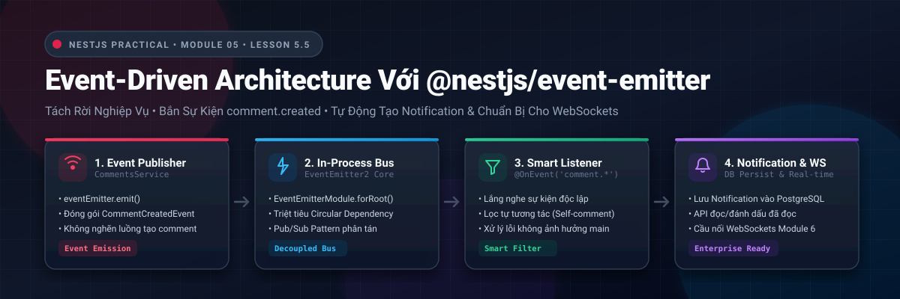
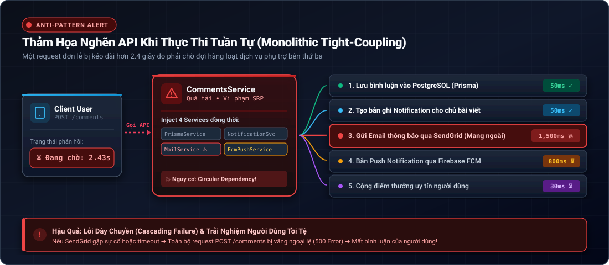
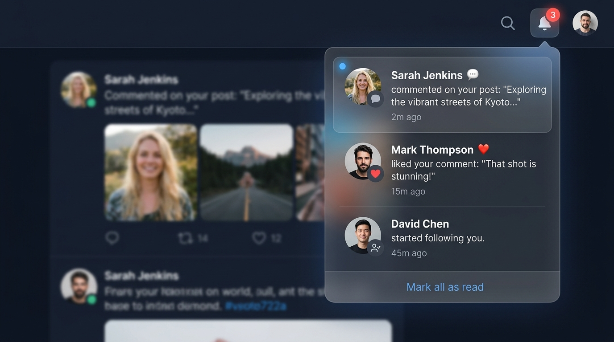
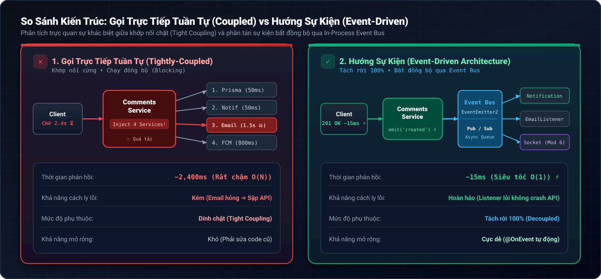
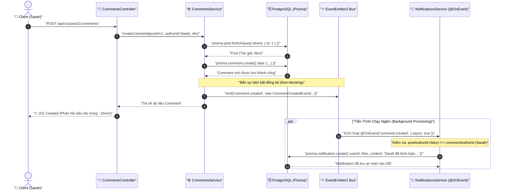
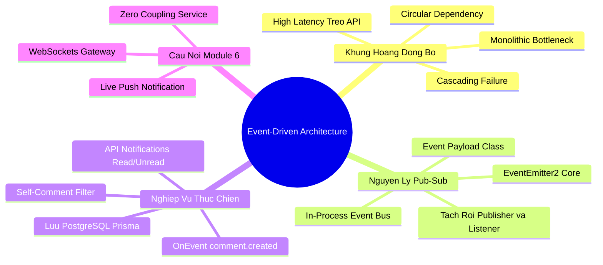

# Lesson 5.5: Event-Driven Architecture — Tách Rời Nghiệp Vụ & Tự Động Tạo Notification Với @nestjs/event-emitter

<p align="center">
  
  
  
  
  
  
</p>

<p align="center">
  
</p>

---

> [!NOTE]
> ⏱️ **Thời lượng dự kiến:** 12 – 15 phút thực chiến  
> 🎯 **Mục tiêu bài học:** Nắm vững bản chất của **Kiến trúc Hướng Sự Kiện (Event-Driven Architecture - EDA)** trong ứng dụng mạng xã hội; hiểu rõ cơ chế Pub/Sub (Publish/Subscribe) với In-process Event Bus `@nestjs/event-emitter`; giải quyết triệt để vấn đề nghẽn API và phụ thuộc vòng (Circular Dependency); tự tay thiết lập luồng phát sự kiện `comment.created` và lắng nghe bất đồng bộ để tự động tạo thông báo (`Notification`) lưu vào PostgreSQL; hoàn thiện bài toán kiểm duyệt nghiệp vụ thông minh (không tự gửi thông báo cho chính mình) và sẵn sàng tích hợp WebSockets Real-time ở Module 6.

---

## 1. Đặt Vấn Đề: Khủng Hoảng "Thắt Nút Cổ Chai" (Tight Coupling Bottleneck)

### 💥 Thảm Họa Khi Gọi Trực Tiếp Tuần Tự (Monolithic In-line Execution)

Trong một ứng dụng mạng xã hội hoàn chỉnh, hành động **"Người dùng gửi bình luận"** không chỉ đơn thuần là ghi một bản ghi vào bảng `comments`. Nó kéo theo một chuỗi các nghiệp vụ phụ trợ (Side Effects):

<p align="center">
  
</p>

Hậu quả tai hại xảy ra ngay lập tức trong môi trường thực tế:

1. **API bị tê liệt (High Latency):** Người dùng bấm gửi bình luận nhưng màn hình xoay tròn gần 3 giây chỉ vì hệ thống phải đợi gửi mail và đẩy push notification.
2. **Lỗi dây chuyền (Cascading Failure):** Nếu server email bên thứ ba bị timeout hoặc gặp lỗi mạng, toàn bộ hàm `createComment` bị văng ngoại lệ (`throw error`), khiến người dùng ngỡ rằng bình luận thất bại dù thực tế dữ liệu comment đã lưu!
3. **Vi phạm nguyên lý SRP & Phụ thuộc vòng (Circular Dependency):** `CommentsService` phải gánh vác trách nhiệm gửi mail, đẩy push, tính điểm. Nếu `NotificationsService` cũng muốn truy vấn bình luận, hai module sẽ inject chéo nhau gây lỗi crash ứng dụng `Circular dependency detected`.

---

### 📱 Trải Nghiệm Người Dùng Thực Tế: Notification Popover

Trước khi đi vào giải pháp kiến trúc, hãy quan sát giao diện người dùng thực tế mà cơ chế sự kiện này sẽ phục vụ:

<p align="center">
  
</p>

- Khi **Sarah Jenkins** bình luận vào bài viết của bạn, chuông thông báo trên góc màn hình lập tức sáng lên với huy hiệu đỏ **"3"**.
- Mở danh sách thông báo, bạn nhìn thấy rõ: avatar của Sarah, thời gian tương đối (`2m ago`), trích dẫn nội dung bình luận, kèm chấm tròn xanh đánh dấu trạng thái chưa đọc.
- Bấm nút **"Mark all as read"** ở dưới cùng để đánh dấu toàn bộ thông báo là đã xem.

---

<p align="center">
  
</p>

---

## 2. Kiến Trúc Event-Driven Trong NestJS & Nguyên Lý `@nestjs/event-emitter`

### 🧩 Mô Hình In-Process Event Bus

Package chính thức **`@nestjs/event-emitter`** được xây dựng dựa trên thư viện hiệu năng cao **`EventEmitter2`**, mang lại mô hình Publish/Subscribe (Pub/Sub) ngay trong tiến trình ứng dụng Node.js:

```
[Publisher: CommentsService]
            │
            ▼ (bắn sự kiện: this.eventEmitter.emit('comment.created', event))
  ┌─────────────────────────────────────────────────────────┐
  │         ⚡ In-Process Event Bus (EventEmitter2)          │
  └────────────────────────┬────────────────────────────────┘
                           │
         ┌─────────────────┼─────────────────┐
         ▼                 ▼                 ▼
[NotificationsListener] [SocketListener]  [AuditLogListener]
 (Lưu DB PostgreSQL)    (Real-time push)    (Ghi nhật ký)
```

---

### ⚡ Sơ Đồ Tuần Tự Luồng Dữ Liệu (Sequence Diagram)

Dưới đây là chi tiết hành trình xử lý bất đồng bộ khi sự kiện được phát đi:



> [!IMPORTANT]
> **Quy Tắc Nghiệp Vụ Thực Tế — Bộ Lọc Tự Tương Tác (Self-Interaction Filter):**  
> Khi tác giả bài viết tự bình luận dưới bài của chính mình (`postAuthorId === commentAuthorId`), Listener sẽ tự động nhận diện và **bỏ qua**, không tạo thông báo rác làm phiền người dùng!

---

## 3. Hướng Dẫn Thực Hành Step-by-Step

### 📂 Cấu Trúc Mã Nguồn Sau Khi Hoàn Thiện

```
src/
├── comments/
│   ├── events/
│   │   └── comment-created.event.ts   👈 Event Payload Class
│   ├── comments.service.ts            👈 Bắn sự kiện qua EventEmitter2
│   └── comments.module.ts
├── notifications/
│   ├── dto/
│   │   └── query-notification.dto.ts  👈 Phân trang & lọc thông báo
│   ├── notifications.service.ts       👈 Listener @OnEvent & Lưu PostgreSQL
│   ├── notifications.controller.ts    👈 API xem & đánh dấu đã đọc
│   └── notifications.module.ts        👈 Đóng gói Notification Module
└── app.module.ts                      👈 EventEmitterModule.forRoot()
```

---

### 📌 Bước 1: Cài Đặt Thư Viện `@nestjs/event-emitter`

Mở terminal tại thư mục gốc của dự án và thực hiện cài đặt:

```bash
pnpm add @nestjs/event-emitter
```

---

### 📌 Bước 2: Kích Hoạt `EventEmitterModule` Toàn Cục Trong `AppModule`

Đăng ký `EventEmitterModule.forRoot()` vào mảng `imports` của `AppModule` để khởi tạo In-process Event Bus cho toàn bộ ứng dụng:

📄 **`src/app.module.ts`**

```typescript
import { Module } from '@nestjs/common';
import { EventEmitterModule } from '@nestjs/event-emitter';
// ... các imports khác
import { CommentsModule } from './comments/comments.module';
import { NotificationsModule } from './notifications/notifications.module';

@Module({
  imports: [
    // ...
    EventEmitterModule.forRoot(), // 👈 Kích hoạt Event Emitter toàn cục
    CommentsModule,
    NotificationsModule, // 👈 Đăng ký NotificationsModule
    // ...
  ],
})
export class AppModule {}
```

---

### 📌 Bước 3: Định Nghĩa Event Payload Class

Tạo một class thuần TypeScript đóng gói toàn bộ dữ liệu ngữ cảnh của sự kiện. Việc dùng class mang lại type-safety tuyệt đối và gợi ý code tự động (IntelliSense) cho mọi Listener:

📄 **`src/comments/events/comment-created.event.ts`**

```typescript
export class CommentCreatedEvent {
  constructor(
    public readonly commentId: number,
    public readonly postId: number,
    public readonly postTitle: string,
    public readonly postAuthorId: number,
    public readonly commentAuthorId: number,
    public readonly commentAuthorName: string,
    public readonly content: string,
  ) {}
}
```

---

### 📌 Bước 4: Tích Hợp `EventEmitter2` Vào `CommentsService`

Inject `EventEmitter2` vào constructor của `CommentsService`. Sau khi bình luận được tạo thành công trong cơ sở dữ liệu, gọi `this.eventEmitter.emit()`:

📄 **`src/comments/comments.service.ts`**

```typescript
import {
  ForbiddenException,
  Injectable,
  NotFoundException,
} from '@nestjs/common';
import { EventEmitter2 } from '@nestjs/event-emitter'; // 👈 Import EventEmitter2
import { PrismaService } from '../prisma/prisma.service';
import { CreateCommentDto } from './dto/create-comment.dto';
import { QueryCommentDto } from './dto/query-comment.dto';
import { UpdateCommentDto } from './dto/update-comment.dto';
import { CommentCreatedEvent } from './events/comment-created.event'; // 👈 Import Event Class

@Injectable()
export class CommentsService {
  constructor(
    private readonly prisma: PrismaService,
    private readonly eventEmitter: EventEmitter2, // 👈 Inject EventEmitter2
  ) {}

  async createComment(
    postId: number,
    authorId: number,
    createCommentDto: CreateCommentDto,
  ) {
    // 1. Kiểm tra bài viết tồn tại
    const post = await this.prisma.post.findUnique({
      where: { id: postId },
    });

    if (!post) {
      throw new NotFoundException(`Không tìm thấy bài viết với ID #${postId}`);
    }

    // 2. Tạo bình luận trong Database
    const comment = await this.prisma.comment.create({
      data: {
        content: createCommentDto.content,
        postId,
        authorId,
      },
      include: {
        author: {
          select: {
            id: true,
            name: true,
            email: true,
            profile: {
              select: {
                avatarUrl: true,
              },
            },
          },
        },
      },
    });

    // 3. Bắn sự kiện 'comment.created' tới Event Bus
    this.eventEmitter.emit(
      'comment.created',
      new CommentCreatedEvent(
        comment.id,
        post.id,
        post.title,
        post.authorId,
        authorId,
        comment.author?.name || 'Thành viên cộng đồng',
        comment.content,
      ),
    );

    return comment;
  }

  // ... các phương thức khác giữ nguyên
}
```

> [!TIP]
> Lưu ý rằng `CommentsService` hoàn toàn **KHÔNG CẦN BIẾT** `NotificationsService` có tồn tại hay không. Nó chỉ thực hiện đúng trách nhiệm của mình: lưu comment và thông báo cho hệ thống rằng "Bình luận vừa được tạo xong!".

---

### 📌 Bước 5: Xây Dựng `NotificationsService` Với `@OnEvent`

Service này đảm nhận việc đăng ký lắng nghe sự kiện bằng decorator `@OnEvent('comment.created', { async: true })`, đồng thời cung cấp các phương thức truy vấn thông báo cho người dùng:

📄 **`src/notifications/notifications.service.ts`**

```typescript
import {
  ForbiddenException,
  Injectable,
  Logger,
  NotFoundException,
} from '@nestjs/common';
import { OnEvent } from '@nestjs/event-emitter';
import { Prisma } from 'src/generated/prisma/client';
import { CommentCreatedEvent } from '../comments/events/comment-created.event';
import { PrismaService } from '../prisma/prisma.service';
import { QueryNotificationDto } from './dto/query-notification.dto';

@Injectable()
export class NotificationsService {
  private readonly logger = new Logger(NotificationsService.name);

  constructor(private readonly prisma: PrismaService) {}

  /**
   * Listener xử lý sự kiện 'comment.created' bất đồng bộ
   */
  @OnEvent('comment.created', { async: true })
  async handleCommentCreated(event: CommentCreatedEvent) {
    this.logger.log(
      `📥 Nhận sự kiện 'comment.created' cho bài viết #${event.postId} (Tác giả bài viết: #${event.postAuthorId}, Người bình luận: #${event.commentAuthorId})`,
    );

    // 1. Nghiệp vụ: Không gửi thông báo khi tự bình luận bài của chính mình
    if (event.postAuthorId === event.commentAuthorId) {
      this.logger.log(
        `⏭️ Bỏ qua tạo thông báo: Người dùng #${event.commentAuthorId} tự bình luận vào bài viết của chính mình.`,
      );
      return;
    }

    // 2. Rút gọn nội dung preview nếu bình luận quá dài (> 60 ký tự)
    const previewContent =
      event.content.length > 60
        ? `${event.content.substring(0, 57)}...`
        : event.content;

    // 3. Lưu bản ghi thông báo mới vào PostgreSQL qua Prisma
    try {
      const notification = await this.prisma.notification.create({
        data: {
          userId: event.postAuthorId,
          title: 'Bình luận mới trên bài viết của bạn',
          content: `${event.commentAuthorName} đã bình luận: "${previewContent}"`,
        },
      });

      this.logger.log(
        `🔔 Đã tạo thông báo #${notification.id} thành công cho người dùng #${event.postAuthorId}`,
      );
    } catch (error) {
      const err = error instanceof Error ? error : new Error(String(error));
      this.logger.error(
        `❌ Lỗi khi tạo bản ghi thông báo cho sự kiện comment.created: ${err.message}`,
        err.stack,
      );
    }
  }

  /**
   * Lấy danh sách thông báo của người dùng hiện tại có phân trang
   */
  async getUserNotifications(userId: number, query: QueryNotificationDto) {
    const { page = 1, limit = 10, isRead } = query;
    const skip = (page - 1) * limit;

    const where: Prisma.NotificationWhereInput = { userId };
    if (typeof isRead === 'boolean') {
      where.isRead = isRead;
    }

    const [items, totalItems, unreadCount] = await Promise.all([
      this.prisma.notification.findMany({
        where,
        skip,
        take: limit,
        orderBy: { createdAt: 'desc' },
      }),
      this.prisma.notification.count({ where }),
      this.prisma.notification.count({
        where: { userId, isRead: false },
      }),
    ]);

    const totalPages = Math.ceil(totalItems / limit);

    return {
      items,
      meta: {
        page,
        limit,
        totalItems,
        totalPages,
        unreadCount,
        hasNextPage: page < totalPages,
        hasPreviousPage: page > 1,
      },
    };
  }

  /**
   * Đánh dấu 1 thông báo là đã đọc
   */
  async markAsRead(id: number, userId: number) {
    const notification = await this.prisma.notification.findUnique({
      where: { id },
    });

    if (!notification) {
      throw new NotFoundException(`Không tìm thấy thông báo với ID #${id}`);
    }

    if (notification.userId !== userId) {
      throw new ForbiddenException(
        'Bạn không có quyền thao tác trên thông báo của người khác!',
      );
    }

    return await this.prisma.notification.update({
      where: { id },
      data: { isRead: true },
    });
  }

  /**
   * Đánh dấu tất cả thông báo của user hiện tại là đã đọc
   */
  async markAllAsRead(userId: number) {
    const result = await this.prisma.notification.updateMany({
      where: {
        userId,
        isRead: false,
      },
      data: {
        isRead: true,
      },
    });

    return {
      updatedCount: result.count,
    };
  }
}
```

---

### 📌 Bước 6: Xây Dựng `NotificationsController` & DTO Phân Trang

📄 **`src/shared/decorators/to-boolean.decorator.ts`**

```typescript
import { Transform } from 'class-transformer';

/**
 * Decorator chuyển đổi an toàn các giá trị boolean từ HTTP Query String / Body
 * thành kiểu boolean nguyên thủy (`true` hoặc `false`).
 */
export function ToBoolean() {
  return Transform(
    ({
      value,
      obj,
      key,
    }: {
      value: unknown;
      obj?: Record<string, unknown>;
      key?: string;
    }) => {
      // Khi enableImplicitConversion: true, class-transformer đã gọi Boolean('false') => true trước.
      // Ta lấy giá trị nguyên bản từ raw object `obj[key]` để kiểm tra chính xác.
      const rawValue = obj && key ? obj[key] : value;
      if (rawValue === 'true' || rawValue === true) {
        return true;
      }
      if (rawValue === 'false' || rawValue === false) {
        return false;
      }
      return rawValue;
    },
  );
}
```

📄 **`src/notifications/dto/query-notification.dto.ts`**

```typescript
import { ApiPropertyOptional } from '@nestjs/swagger';
import { Type } from 'class-transformer';
import { IsBoolean, IsInt, IsOptional, Max, Min } from 'class-validator';
import { ToBoolean } from 'src/shared/decorators/to-boolean.decorator';

export class QueryNotificationDto {
  @ApiPropertyOptional({
    description: 'Số thứ tự trang (mặc định là 1)',
    default: 1,
    example: 1,
  })
  @IsOptional()
  @Type(() => Number)
  @IsInt({ message: 'Số trang page phải là số nguyên' })
  @Min(1, { message: 'Số trang tối thiểu là 1' })
  page?: number = 1;

  @ApiPropertyOptional({
    description: 'Số lượng thông báo trên mỗi trang (tối đa 50)',
    default: 10,
    example: 10,
  })
  @IsOptional()
  @Type(() => Number)
  @IsInt({ message: 'Số lượng bản ghi limit phải là số nguyên' })
  @Min(1, { message: 'Số lượng bản ghi tối thiểu là 1' })
  @Max(50, { message: 'Tối đa 50 thông báo trên một trang' })
  limit?: number = 10;

  @ApiPropertyOptional({
    description: 'Lọc theo trạng thái đã đọc (true/false)',
    example: false,
  })
  @IsOptional()
  @ToBoolean()
  @IsBoolean({ message: 'isRead phải là giá trị boolean' })
  isRead?: boolean;
}
```

📄 **`src/notifications/notifications.controller.ts`**

```typescript
import {
  Controller,
  Get,
  Param,
  ParseIntPipe,
  Patch,
  Query,
} from '@nestjs/common';
import { ApiOperation, ApiParam, ApiResponse, ApiTags } from '@nestjs/swagger';
import { CurrentUser } from '../shared/decorators/current-user.decorator';
import { ResponseMessage } from '../shared/decorators/response-message.decorator';
import { QueryNotificationDto } from './dto/query-notification.dto';
import { NotificationsService } from './notifications.service';

@ApiTags('notifications')
@Controller('notifications')
export class NotificationsController {
  constructor(private readonly notificationsService: NotificationsService) {}

  @ApiOperation({
    summary: 'Lấy danh sách thông báo của người dùng đang đăng nhập',
    description:
      'Yêu cầu Bearer Token đăng nhập. Hỗ trợ phân trang và lọc theo trạng thái đã đọc (isRead).',
  })
  @ApiResponse({
    status: 200,
    description: 'Lấy danh sách thông báo thành công',
  })
  @ApiResponse({ status: 401, description: 'Chưa xác thực JWT Token' })
  @Get()
  @ResponseMessage('Lấy danh sách thông báo thành công!')
  getUserNotifications(
    @CurrentUser('userId') userId: number,
    @Query() query: QueryNotificationDto,
  ) {
    return this.notificationsService.getUserNotifications(userId, query);
  }

  @ApiOperation({
    summary: 'Đánh dấu tất cả thông báo là đã đọc',
    description:
      'Cập nhật toàn bộ thông báo chưa đọc của người dùng hiện tại thành đã đọc.',
  })
  @ApiResponse({
    status: 200,
    description: 'Đánh dấu tất cả thông báo đã đọc thành công',
  })
  @ApiResponse({ status: 401, description: 'Chưa xác thực JWT Token' })
  @Patch('read-all')
  @ResponseMessage('Đánh dấu tất cả thông báo đã đọc thành công!')
  markAllAsRead(@CurrentUser('userId') userId: number) {
    return this.notificationsService.markAllAsRead(userId);
  }

  @ApiOperation({
    summary: 'Đánh dấu một thông báo là đã đọc',
    description: 'Chỉ chính chủ người nhận thông báo mới có quyền cập nhật.',
  })
  @ApiParam({ name: 'id', description: 'ID của thông báo', example: 1 })
  @ApiResponse({
    status: 200,
    description: 'Đánh dấu thông báo đã đọc thành công',
  })
  @ApiResponse({ status: 401, description: 'Chưa xác thực JWT Token' })
  @ApiResponse({
    status: 403,
    description: 'Không có quyền thao tác trên thông báo của người khác',
  })
  @ApiResponse({ status: 404, description: 'Không tìm thấy thông báo' })
  @Patch(':id/read')
  @ResponseMessage('Đánh dấu thông báo đã đọc thành công!')
  markAsRead(
    @Param('id', ParseIntPipe) id: number,
    @CurrentUser('userId') userId: number,
  ) {
    return this.notificationsService.markAsRead(id, userId);
  }
}
```

---

### 📌 Bước 7: Đóng Gói `NotificationsModule`

📄 **`src/notifications/notifications.module.ts`**

```typescript
import { Module } from '@nestjs/common';
import { NotificationsController } from './notifications.controller';
import { NotificationsService } from './notifications.service';

@Module({
  controllers: [NotificationsController],
  providers: [NotificationsService],
  exports: [NotificationsService],
})
export class NotificationsModule {}
```

---

## 4. Kịch Bản Kiểm Tra & Thử Nghiệm (Hands-on Lab)

### 🟢 Kịch Bản 1: Luồng Thành Công (Success Flow — Tự Động Bắn Sự Kiện & Tạo Thông Báo)

#### 1. Đăng nhập tài khoản User B (Người bình luận)

```bash
curl -X POST http://localhost:3000/api/v1/auth/login \
  -H "Content-Type: application/json" \
  -d '{"email": "user2@socialchat.com", "password": "user_password"}'
```

Lưu token vào biến môi trường:

```bash
export TOKEN_USER_B="eyJhbGciOiJIUzI1NiIsIn..."
```

#### 2. User B gửi bình luận vào Bài viết #1 (Vốn thuộc sở hữu của User A - Admin)

```bash
curl -X POST http://localhost:3000/api/v1/posts/1/comments \
  -H "Authorization: Bearer $TOKEN_USER_B" \
  -H "Content-Type: application/json" \
  -d '{
    "content": "Bài viết quá hay! Chúc tác giả luôn dồi dào sức khỏe."
  }'
```

**Quan sát Terminal máy chủ NestJS:**

```text
[CommentsService] 📥 Đã tạo comment #55 cho bài viết #1
[NotificationsService] 📥 Nhận sự kiện 'comment.created' cho bài viết #1 (Tác giả bài viết: #1, Người bình luận: #2)
[NotificationsService] 🔔 Đã tạo thông báo #1 thành công cho người dùng #1
```

#### 3. Đăng nhập tài khoản User A (Chủ bài viết) để kiểm tra danh sách thông báo

```bash
curl -X POST http://localhost:3000/api/v1/auth/login \
  -H "Content-Type: application/json" \
  -d '{"email": "admin@socialchat.com", "password": "admin_password"}'

export TOKEN_USER_A="eyJhbGciOiJIUzI1NiIsIn..."
```

Gọi API lấy danh sách thông báo:

```bash
curl -X GET http://localhost:3000/api/v1/notifications \
  -H "Authorization: Bearer $TOKEN_USER_A"
```

**Kết quả phản hồi (`200 OK`):**

```json
{
  "statusCode": 200,
  "message": "Lấy danh sách thông báo thành công!",
  "data": {
    "items": [
      {
        "id": 1,
        "title": "Bình luận mới trên bài viết của bạn",
        "content": "User Two đã bình luận: \"Bài viết quá hay! Chúc tác giả luôn dồi dào sức khỏe.\"",
        "isRead": false,
        "userId": 1,
        "createdAt": "2026-09-14T09:30:00.000Z"
      }
    ],
    "meta": {
      "page": 1,
      "limit": 10,
      "totalItems": 1,
      "totalPages": 1,
      "unreadCount": 1,
      "hasNextPage": false,
      "hasPreviousPage": false
    }
  }
}
```

#### 4. Đánh dấu thông báo đã đọc

```bash
curl -X PATCH http://localhost:3000/api/v1/notifications/1/read \
  -H "Authorization: Bearer $TOKEN_USER_A"
```

---

### 🔴 Kịch Bản 2: Kiểm Thử Bộ Lọc Tự Tương Tác (Self-Interaction Filter)

User A (Admin) tự bình luận vào chính bài viết #1 của mình:

```bash
curl -X POST http://localhost:3000/api/v1/posts/1/comments \
  -H "Authorization: Bearer $TOKEN_USER_A" \
  -H "Content-Type: application/json" \
  -d '{
    "content": "Cảm ơn mọi người đã theo dõi bài viết này của mình nhé!"
  }'
```

**Quan sát Terminal máy chủ NestJS:**

```text
[CommentsService] 📥 Đã tạo comment #56 cho bài viết #1
[NotificationsService] 📥 Nhận sự kiện 'comment.created' cho bài viết #1 (Tác giả bài viết: #1, Người bình luận: #1)
[NotificationsService] ⏭️ Bỏ qua tạo thông báo: Người dùng #1 tự bình luận vào bài viết của chính mình.
```

**Kết quả:** Hệ thống tạo bình luận thành công nhưng không tạo bản ghi thông báo tự thân, bảo đảm tính thực tế và chuyên nghiệp của mạng xã hội!

---

### 🖥️ Kịch Bản 3: Trải Nghiệm Thao Tác Trực Quan Trên Swagger UI

Mở trình duyệt truy cập: **`http://localhost:3000/api/docs`**

```
┌────────────────────────────────────────────────────────────────────────┐
│  TAG: notifications                                                    │
├────────────────────────────────────────────────────────────────────────┤
│  GET    /api/v1/notifications             [Danh sách thông báo của tôi] 🔒 │
│  PATCH  /api/v1/notifications/read-all    [Đánh dấu tất cả đã đọc]      🔒 │
│  PATCH  /api/v1/notifications/{id}/read   [Đánh dấu 1 thông báo đã đọc] 🔒 │
└────────────────────────────────────────────────────────────────────────┘
```

1. Bấm **Authorize 🔒** và dán Bearer Token vào.
2. Tìm đến tag **`notifications`** ➔ Chọn `GET /api/v1/notifications`.
3. Bấm **Execute** ➔ Chiêm ngưỡng danh sách thông báo và số lượng chưa đọc (`unreadCount`) được tính toán tức thì!

---

## 5. Tổng Kết Bài Học & Checklist Ghi Nhớ



### ✅ Checklist Tự Đánh Giá Sau Bài Học:

- [x] Hiểu rõ sự khác biệt giữa gọi hàm trực tiếp (Tightly-Coupled) và mô hình Hướng sự kiện (Event-Driven Architecture).
- [x] Cài đặt và cấu hình thành công `@nestjs/event-emitter` với `EventEmitterModule.forRoot()` toàn cục.
- [x] Tạo lớp **Event Payload Class** (`CommentCreatedEvent`) mang lại Type-Safety tuyệt đối cho dữ liệu sự kiện.
- [x] Sử dụng `EventEmitter2.emit()` trong `CommentsService` mà không cần biết các Service tiêu thụ là ai.
- [x] Đăng ký lắng nghe sự kiện bất đồng bộ bằng decorator `@OnEvent('comment.created', { async: true })`.
- [x] Áp dụng nghiệp vụ thông minh: Tự động lọc bỏ các tương tác tự thân (`Self-Comment Filter`).
- [x] Xây dựng trọn bộ REST API quản lý thông báo (`GET /notifications`, `PATCH /notifications/:id/read`, `PATCH /notifications/read-all`).

---

> [!TIP]
> 🚀 **Chúc mừng bạn đã hoàn thành xuất sắc Module 5!**  
> Ở **Module 6 (Real-Time WebSockets Chat & Live Notifications)**, chúng ta sẽ đưa ứng dụng lên tầm cao mới:  
> Thay vì người dùng phải F5 tải lại trang để thấy thông báo mới trong Database, chúng ta sẽ kết hợp sự kiện `comment.created` với **Socket.IO Gateway** để bắn thông báo nhảy popup tức thì (Real-time Push Notification) lên màn hình của chủ bài viết trong tích tắc!

---

👈 **Bài trước:** [Lesson 5.4: Comments API — Thêm Bình Luận Dưới Bài Viết Trong NestJS](../lesson-5.4/lesson-5.4.md)  
👉 **Bài tiếp theo:** Lesson 6.1: WebSockets — Khởi Tạo WebSocket Gateway Với @WebSocketGateway() (Socket.IO)
