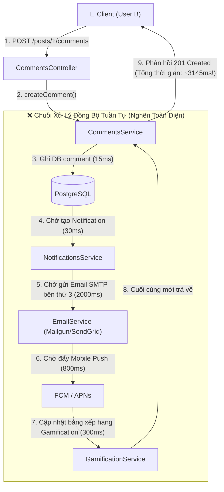
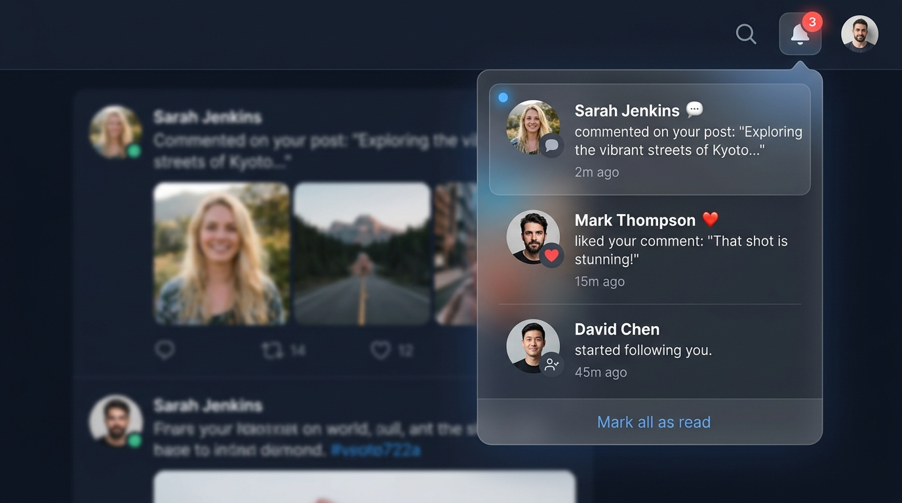
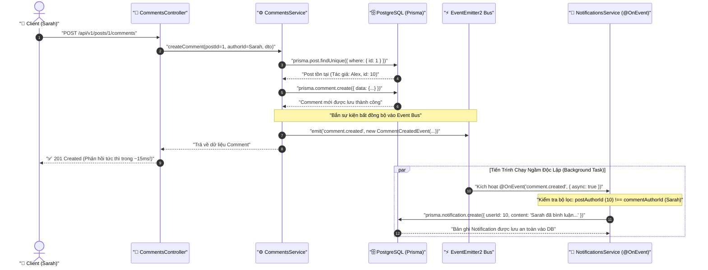
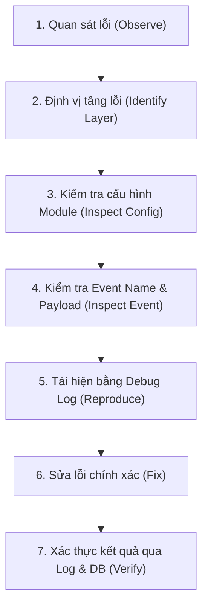
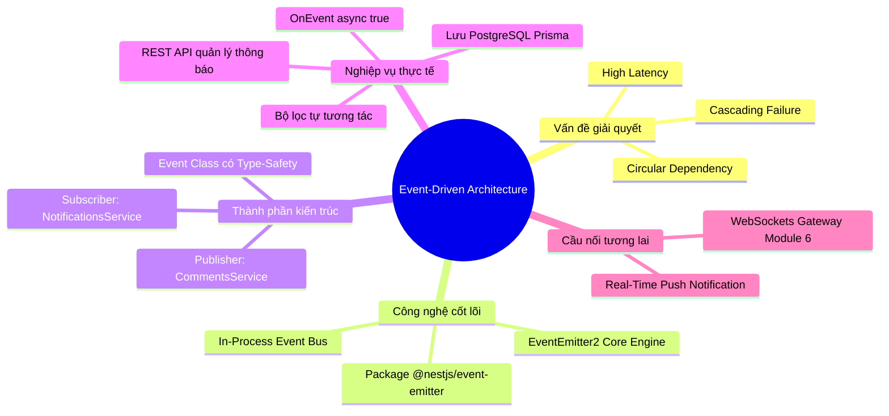

# Lesson 5.5: Event-Driven Architecture — Tách Rời Nghiệp Vụ & Tự Động Tạo Notification Với @nestjs/event-emitter

<p align="center">
  
  
  
  
  
  
  
</p>

<p align="center">
  
</p>

---

> [!NOTE]
> ⏱️ **Thời lượng dự kiến:** 15 – 20 phút thực hành chuyên sâu  
> 🎯 **Mục tiêu bài học:**
> Sau khi hoàn thành bài học này, bạn có thể:
>
> - **Giải thích (Explain)** tại sao kiến trúc Hướng sự kiện (Event-Driven Architecture - EDA) giải quyết triệt để vấn đề Thắt nút cổ chai (Bottleneck), Độ trễ cao (High Latency) và Phụ thuộc vòng (Circular Dependency) trong ứng dụng backend.
> - **Phân biệt (Compare)** sự khác nhau giữa gọi hàm đồng bộ tuần tự (In-line synchronous invocation) và cơ chế Xuất bản / Đăng ký (Publish/Subscribe) qua In-process Event Bus với `@nestjs/event-emitter`.
> - **Cấu hình (Configure)** `EventEmitterModule.forRoot()` toàn cục trong `AppModule` với các tham số tối ưu (`wildcard`, `maxListeners`).
> - **Định nghĩa (Implement)** lớp Type-Safe Event Payload Class (`CommentCreatedEvent`) mang lại IntelliSense và type safety trong toàn hệ thống.
> - **Phát sự kiện (Emit)** từ `CommentsService` mà không cần phụ thuộc vào bất kỳ consumer/listener nào.
> - **Lắng nghe bất đồng bộ (Subscribe)** với decorator `@OnEvent('comment.created', { async: true })` trong `NotificationsService`.
> - **Xây dựng nghiệp vụ thực tế (Apply)**: Bộ lọc tự tương tác (Self-Interaction Filter — không gửi thông báo khi tự bình luận bài của mình) và lưu trữ thông báo vào cơ sở dữ liệu PostgreSQL qua Prisma ORM.
> - **Thiết kế REST API (Design)**: Trọn bộ endpoints quản lý thông báo (`GET /notifications`, `PATCH /notifications/:id/read`, `PATCH /notifications/read-all`) tích hợp Swagger OpenAPI và bảo mật bằng JWT.
> - **Debug & Khắc phục lỗi (Debug)**: Phát hiện và xử lý các lỗi kinh điển như thiếu `forRoot()`, listener chặn luồng chính do quên `async: true`, hoặc lỗi Unhandled Rejection trong tác vụ ngầm.

> [!IMPORTANT]
> **Prerequisites (Kiến thức tiên quyết):**
> Trước khi bắt đầu bài học này, bạn nên nắm vững:
>
> - NestJS Controllers, Providers & Dependency Injection cơ bản ([Module 1](../../module-01/lesson-1.1/lesson-1.1.md)).
> - Prisma ORM, Models & Quan hệ cơ sở dữ liệu PostgreSQL ([Module 2](../../module-02/lesson-2.1/lesson-2.1.md)).
> - JWT Authentication, Guards & Custom Decorator `@CurrentUser()` ([Module 4](../../module-04/lesson-4.6/lesson-4.6.md)).
> - Comments API và tư duy thiết kế Nested RESTful Resources ([Lesson 5.4](../lesson-5.4/lesson-5.4.md)).

---

## 1. Vấn Đề & Bối Cảnh Thực Tế (Why?)

### 💥 Thảm Họa Kiến Trúc Tuần Tự Đồng Bộ (Monolithic In-line Execution)

Trong một ứng dụng mạng xã hội hoàn chỉnh, hành động **"Người dùng gửi một bình luận"** (`POST /api/v1/posts/:postId/comments`) trên thực tế không bao giờ kết thúc ở việc lưu một dòng vào bảng cơ sở dữ liệu `comments`. Nó kéo theo một chuỗi các tác vụ phụ trợ (Side Effects):


```mermaid
flowchart TD
    Client["📱 Client (User B)"] -->|"1. POST /posts/1/comments"| Controller["CommentsController"]
    Controller -->|"2. createComment()"| Service["CommentsService"]

    subgraph SynchronousChain["❌ Chuỗi Xử Lý Đồng Bộ Tuần Tự (Nghẽn Toàn Diện)"]
        Service -->|"3. Ghi DB comment (15ms)"| DB[("PostgreSQL")]
        DB -->|"4. Chờ tạo Notification (30ms)"| NotifService["NotificationsService"]
        NotifService -->|"5. Chờ gửi Email SMTP bên thứ 3 (2000ms)"| EmailService["EmailService (Mailgun/SendGrid)"]
        EmailService -->|"6. Chờ đẩy Mobile Push (800ms)"| PushService["FCM / APNs"]
        PushService -->|"7. Cập nhật bảng xếp hạng Gamification (300ms)"| ScoreService["GamificationService"]
    end

    ScoreService -->|"8. Cuối cùng mới trả về"| Service
    Service -->|"9. Phản hồi 201 Created (Tổng thời gian: ~3145ms!)"| Client
```

Khi toàn bộ chuỗi tác vụ trên được gọi tuần tự (in-line) bên trong một hàm `CommentsService.createComment()`, ứng dụng đối mặt với 3 rủi ro chí mạng trong môi trường production:

1. **Khủng hoảng độ trễ (High Latency & Poor UX):**  
   Người dùng chỉ muốn gửi một câu bình luận ngắn nhưng màn hình xoay tròn chờ hơn 3 giây. Trải nghiệm người dùng bị tê liệt chỉ vì các tác vụ phụ trợ chạy ngầm.
2. **Lỗi dây chuyền & Thiếu cô lập (Cascading Failure):**  
   Nếu dịch vụ gửi email của bên thứ ba bị timeout hoặc rớt mạng, hàm `createComment()` sẽ ném ra ngoại lệ (`throw error`). Kết quả là người dùng nhận thông báo lỗi `500 Internal Server Error`, mặc dù dữ liệu bình luận đã lưu hoặc giao dịch database bị rollback oan uổng!
3. **Phụ thuộc vòng & Vi phạm nguyên lý SRP (Tight Coupling & Circular Dependency):**  
   `CommentsService` bị biến thành "God Service", phải inject trực tiếp `NotificationsService`, `EmailService`, `PushService`. Sau này, nếu `NotificationsService` cần gọi ngược lại `CommentsService` để lấy thông tin chi tiết bình luận, NestJS sẽ ngay lập tức báo lỗi sập ứng dụng:
   ```text
   Nest cannot create the module tree.
   A circular dependency between "CommentsModule" and "NotificationsModule" has been detected.
   ```

---

### 📱 Trải Nghiệm Người Dùng Thực Tế: Notification Popover

Trước khi giải quyết bài toán kiến trúc, hãy nhìn vào trải nghiệm người dùng thực tế mà hệ thống thông báo sẽ phục vụ:

<p align="center">
  
</p>

- **Huy hiệu số lượng chưa đọc:** Khi có người bình luận vào bài viết của bạn, chuông thông báo trên thanh điều hướng hiển thị số lượng chưa đọc (ví dụ huy hiệu màu đỏ **"3"**).
- **Danh sách thông báo chi tiết:** Hiển thị avatar của người tương tác, thời gian tương đối (`2m ago`), trích dẫn nội dung bình luận, và chấm tròn phân biệt trạng thái đã đọc (`isRead: true/false`).
- **Thao tác một chạm:** Người dùng có thể đánh dấu từng thông báo là đã đọc hoặc bấm **"Mark all as read"** để xóa toàn bộ huy hiệu thông báo chưa đọc.

Để đạt được trải nghiệm mượt mà này mà **không làm chậm API bình luận dù chỉ 1 mili-giây**, chúng ta cần chuyển đổi sang mô hình **Event-Driven Architecture**.

---

## 2. Mental Model & Nguyên Lý Kiến Trúc Event-Driven (What?)

### 🧠 Mental Model: Direct Invocation vs In-Process Event Bus

Hãy hình dung sự khác biệt trong tư duy kiến trúc:

```text
❌ TRƯỚC (GỌI TRỰC TIẾP - TIGHT COUPLING)

CommentsService ──────────> NotificationsService
                ──────────> EmailService
                ──────────> PushNotificationService
(CommentsService phải biết rõ mọi người nghe và chịu trách nhiệm gọi từng dịch vụ)


✅ SAU (EVENT-DRIVEN - PUB/SUB VỚI EVENT BUS)

                      ┌─────────────────────────────────┐
                      │    ⚡ In-Process Event Bus      │
                      │       (@nestjs/event-emitter)   │
                      └────────────────┬────────────────┘
                                       │
     PHÁT SỰ KIỆN (EMIT)               │  LẮNG NGHE ĐỘC LẬP (LISTEN)
     "Bình luận đã được tạo!"          │
                                       ├──────────> NotificationsListener (Lưu DB)
[CommentsService] ────────────────────┘├──────────> SocketGateway (Bắn Real-time)
                                       └──────────> EmailWorker (Gửi email ngầm)
```

> [!TIP]
> **Tư Duy Cốt Lõi Của Event-Driven:**
>
> - **Publisher (`CommentsService`):** Chỉ quan tâm đến việc hoàn thành nhiệm vụ cốt lõi của mình (lưu bình luận) và thông báo: _"Một sự kiện vừa diễn ra trong quá khứ (`comment.created`)"_. Nó hoàn toàn không cần biết ai đang nghe, có bao nhiêu bên nghe, hay người nghe sẽ làm gì.
> - **Listener (`NotificationsService`):** Đăng ký lắng nghe sự kiện mình quan tâm. Khi sự kiện nổ ra, nó tự thực thi công việc của riêng mình trong nền.
> - **Kết quả:** Hai module hoàn toàn tách rời (Zero Coupling). Việc thêm tính năng mới (ví dụ gửi push notification hay tích hợp WebSockets ở Module 6) chỉ cần tạo thêm listener mới mà không cần sửa đổi dù chỉ 1 dòng code trong `CommentsService`.

---

### ⚡ Sơ Đồ Tuần Tự Luồng Dữ Liệu Non-Blocking (Sequence Diagram)

Dưới đây là chi tiết hành trình xử lý sự kiện trong NestJS:


```mermaid
sequenceDiagram
    autonumber
    actor Client as "📱 Client (Sarah)"
    participant Controller as "📄 CommentsController"
    participant Service as "⚙️ CommentsService"
    participant DB as "🗄️ PostgreSQL (Prisma)"
    participant Bus as "⚡ EventEmitter2 Bus"
    participant Listener as "🔔 NotificationsService (@OnEvent)"

    Client->>Controller: "POST /api/v1/posts/1/comments"
    Controller->>Service: "createComment(postId=1, authorId=Sarah, dto)"
    Service->>DB: "prisma.post.findUnique({ where: { id: 1 } })"
    DB-->>Service: "Post tồn tại (Tác giả: Alex, id: 10)"
    Service->>DB: "prisma.comment.create({ data: {...} })"
    DB-->>Service: "Comment mới được lưu thành công"

    Note over Service,Bus: "Bắn sự kiện bất đồng bộ vào Event Bus"
    Service->>Bus: "emit('comment.created', new CommentCreatedEvent(...))"

    Service-->>Controller: "Trả về dữ liệu Comment"
    Controller-->>Client: "✅ 201 Created (Phản hồi tức thì trong ~15ms!)"

    par Tiến Trình Chạy Ngầm Độc Lập (Background Task)
        Bus->>Listener: "Kích hoạt @OnEvent('comment.created', { async: true })"
        Note over Listener: "Kiểm tra bộ lọc: postAuthorId (10) !== commentAuthorId (Sarah)"
        Listener->>DB: "prisma.notification.create({ userId: 10, content: 'Sarah đã bình luận...' })"
        DB-->>Listener: "Bản ghi Notification được lưu an toàn vào DB"
    end
```

---

### 🏷️ Quy Chuẩn Đặt Tên Sự Kiện & Type-Safe Payload Class

Trong các hệ thống hướng sự kiện quy mô lớn, việc đặt tên sự kiện và định hình dữ liệu payload phải tuân thủ nghiêm ngặt các quy tắc:

1. **Naming Convention:** Luôn sử dụng thể quá khứ dạng `<domain>.<action>`:
   - ✅ `comment.created`, `comment.deleted`
   - ✅ `post.published`, `post.liked`
   - ✅ `user.registered`, `order.paid`
   - ❌ `createComment`, `newNotification` (không thể hiện rõ đây là sự kiện đã xảy ra).
2. **Type-Safe Payload Class:** Luôn sử dụng một **TypeScript Class** riêng biệt đại diện cho payload thay vì dùng plain JavaScript object (`{ postId, authorId }`). Điều này đem lại:
   - IntelliSense gợi ý chính xác từng thuộc tính khi viết Listener.
   - Tránh gõ sai tên biến (ví dụ `post_id` vs `postId`).
   - Dễ dàng refactor và tracking dependency trong toàn bộ dự án.

---

### 🛡️ Quy Tắc Nghiệp Vụ Thực Tế: Bộ Lọc Tự Tương Tác (Self-Interaction Filter)

Một chi tiết nghiệp vụ cực kỳ quan trọng thường bị bỏ quên trong các bài hướng dẫn sơ sài:  
**Khi tác giả bài viết tự viết bình luận dưới bài viết của chính mình, họ có cần nhận thông báo không?**

Câu trả lời chắc chắn là **KHÔNG**. Nếu Alex viết bình luận giải thích thêm dưới bài viết của Alex, hệ thống không được tạo thông báo _"Alex đã bình luận vào bài viết của bạn"_.  
Bộ lọc này sẽ được cài đặt trực tiếp trong Listener:

```typescript
if (event.postAuthorId === event.commentAuthorId) {
  // Tự tương tác -> Bỏ qua, không tạo notification rác!
  return;
}
```

---

## 3. Trạng Thái Dự Án (Project State Tracking)

Trước và sau khi hoàn thiện bài học này, cây thư mục mã nguồn sẽ thay đổi như sau:

### Trạng thái trước bài học (Before)

```text
src/
├── comments/
│   ├── dto/
│   │   ├── create-comment.dto.ts
│   │   ├── query-comment.dto.ts
│   │   └── update-comment.dto.ts
│   ├── comments.controller.ts
│   ├── comments.service.ts
│   └── comments.module.ts
├── posts/
├── users/
├── prisma/
├── app.module.ts
└── main.ts
```

### Trạng thái sau bài học (After)

```text
src/
├── comments/
│   ├── dto/
│   ├── events/
│   │   └── comment-created.event.ts   👈 [MỚI] Type-Safe Event Payload Class
│   ├── comments.controller.ts
│   ├── comments.service.ts            👈 [CẬP NHẬT] Inject EventEmitter2 & emit sự kiện
│   └── comments.module.ts
├── notifications/                     👈 [MỚI] Module quản lý thông báo độc lập
│   ├── dto/
│   │   └── query-notification.dto.ts  👈 [MỚI] DTO phân trang & lọc isRead
│   ├── notifications.controller.ts    👈 [MỚI] API xem & đánh dấu đã đọc
│   ├── notifications.service.ts       👈 [MỚI] Listener @OnEvent & CRUD Database
│   └── notifications.module.ts        👈 [MỚI] Đóng gói NotificationsModule
├── shared/
│   └── decorators/
│       └── to-boolean.decorator.ts    👈 [MỚI] Transform Query boolean chuẩn xác
├── app.module.ts                      👈 [CẬP NHẬT] Đăng ký EventEmitterModule.forRoot()
└── main.ts
```

---

## 4. Hướng Dẫn Thực Hành Step-by-Step (How?)

### 📌 Bước 1: Cài Đặt Package `@nestjs/event-emitter`

Mở terminal tại thư mục gốc của dự án và cài đặt package chính thức của NestJS bằng `pnpm`:

```bash
pnpm add @nestjs/event-emitter
```

> [!NOTE]
> Package `@nestjs/event-emitter` hoạt động trên nền tảng thư viện **`EventEmitter2`** — một biến thể hiệu năng cao của Node.js Event Emitter chuẩn, hỗ trợ ký tự đại diện (wildcard), listener bất đồng bộ và kiểm soát bộ nhớ vượt trội.

---

### 📌 Bước 2: Kích Hoạt `EventEmitterModule` Toàn Cục Trong `AppModule`

Mở file cấu hình gốc `src/app.module.ts`, import và đăng ký `EventEmitterModule.forRoot()`:

📄 **`src/app.module.ts`**

```typescript
import { MiddlewareConsumer, Module, RequestMethod } from '@nestjs/common';
import { ConfigModule } from '@nestjs/config';
import { APP_FILTER, APP_GUARD, APP_INTERCEPTOR } from '@nestjs/core';
import { EventEmitterModule } from '@nestjs/event-emitter'; // 👈 [1] Import EventEmitterModule
import { ThrottlerModule } from '@nestjs/throttler';
import { AppController } from './app.controller';
import { AppService } from './app.service';
import { AuthModule } from './auth/auth.module';
import { JwtAuthGuard } from './auth/guards/jwt-auth.guard';
import { RolesGuard } from './auth/guards/roles-guard';
import { CommentsModule } from './comments/comments.module';
import { envValidationSchema } from './config/env.validation';
import { NotificationsModule } from './notifications/notifications.module'; // 👈 [2] Sẽ tạo ở Bước 7
import { PostsModule } from './posts/posts.module';
import { PrismaModule } from './prisma/prisma.module';
import { HttpExceptionFilter } from './shared/filters/http-exception.filter';
import { PrismaClientExceptionFilter } from './shared/filters/prisma-client-exception.filter';
import { CustomThrottlerGuard } from './shared/guards/custom-throttler.guard';
import { TransformInterceptor } from './shared/interceptors/transform.interceptor';
import { LoggerMiddleware } from './shared/middleware/logger.middleware';
import { SharedServiceModule } from './shared/services/shared-service.module';
import { UsersModule } from './users/users.module';

@Module({
  imports: [
    ConfigModule.forRoot({
      validationSchema: envValidationSchema,
      isGlobal: true,
    }),
    EventEmitterModule.forRoot({
      // Cho phép lắng nghe sự kiện theo mẫu đại diện (ví dụ 'comment.*')
      wildcard: true,
      // Ký tự phân tách các cấp độ sự kiện
      delimiter: '.',
      // Số lượng listener tối đa cho một sự kiện (tránh rò rỉ bộ nhớ EventEmitter2)
      maxListeners: 20,
      // Không để lỗi của một synchronous listener làm sập toàn bộ ứng dụng
      ignoreErrors: false,
    }),
    ThrottlerModule.forRoot([
      { name: 'short', ttl: 1000, limit: 3 },
      { name: 'medium', ttl: 10000, limit: 20 },
      { name: 'long', ttl: 60000, limit: 100 },
    ]),
    PrismaModule,
    SharedServiceModule,
    UsersModule,
    PostsModule,
    AuthModule,
    CommentsModule,
    NotificationsModule, // 👈 [3] Đăng ký NotificationsModule vào ứng dụng
  ],
  controllers: [AppController],
  providers: [
    AppService,
    { provide: APP_FILTER, useClass: PrismaClientExceptionFilter },
    { provide: APP_FILTER, useClass: HttpExceptionFilter },
    { provide: APP_INTERCEPTOR, useClass: TransformInterceptor },
    { provide: APP_GUARD, useClass: JwtAuthGuard },
    { provide: APP_GUARD, useClass: RolesGuard },
    { provide: APP_GUARD, useClass: CustomThrottlerGuard },
  ],
})
export class AppModule {
  configure(consumer: MiddlewareConsumer) {
    consumer
      .apply(LoggerMiddleware)
      .exclude({ path: 'health', method: RequestMethod.GET })
      .forRoutes('{*path}');
  }
}
```

---

### 📌 Bước 3: Định Nghĩa Event Payload Class

Tạo thư mục `src/comments/events/` và tạo file `comment-created.event.ts`. Class này đóng gói đầy đủ dữ liệu ngữ cảnh mà các bên lắng nghe có thể cần đến:

📄 **`src/comments/events/comment-created.event.ts`**

```typescript
/**
 * Event Payload Class đại diện cho sự kiện:
 * "Một bình luận mới vừa được người dùng tạo thành công"
 */
export class CommentCreatedEvent {
  constructor(
    public readonly commentId: number,
    public readonly postId: number,
    public readonly postTitle: string,
    public readonly postAuthorId: number,
    public readonly commentAuthorId: number,
    public readonly commentAuthorName: string,
    public readonly content: string,
  ) {}
}
```

---

### 📌 Bước 4: Tích Hợp `EventEmitter2` Vào `CommentsService`

Mở file `src/comments/comments.service.ts`:

1. Inject `EventEmitter2` vào constructor.
2. Tại phương thức `createComment()`, sau khi Prisma lưu bình luận thành công, gọi `this.eventEmitter.emit()` với payload `CommentCreatedEvent`.

📄 **`src/comments/comments.service.ts`**

```typescript
import { Role } from '@/generated/prisma/enums';
import { PrismaService } from '@/prisma/prisma.service';
import {
  ForbiddenException,
  Injectable,
  NotFoundException,
} from '@nestjs/common';
import { EventEmitter2 } from '@nestjs/event-emitter'; // 👈 [1] Import EventEmitter2
import { CreateCommentDto } from './dto/create-comment.dto';
import { QueryCommentDto } from './dto/query-comment.dto';
import { UpdateCommentDto } from './dto/update-comment.dto';
import { CommentCreatedEvent } from './events/comment-created.event'; // 👈 [2] Import Event Class

@Injectable()
export class CommentsService {
  constructor(
    private readonly prisma: PrismaService,
    private readonly eventEmitter: EventEmitter2, // 👈 [3] Inject EventEmitter2
  ) {}

  async createComment(
    postId: number,
    authorId: number,
    createCommentDto: CreateCommentDto,
  ) {
    // 1. Kiểm tra bài viết mục tiêu có tồn tại hay không
    const post = await this.prisma.post.findUnique({
      where: { id: postId },
    });

    if (!post) {
      throw new NotFoundException(`Không tìm thấy bài viết với ID #${postId}`);
    }

    // 2. Tạo bản ghi bình luận trong PostgreSQL qua Prisma
    const comment = await this.prisma.comment.create({
      data: {
        content: createCommentDto.content,
        postId,
        authorId,
      },
      include: {
        author: {
          select: {
            id: true,
            name: true,
            email: true,
            profile: {
              select: {
                avatarUrl: true,
              },
            },
          },
        },
      },
    });

    // 3. ⚡ BẮN SỰ KIỆN VÀO IN-PROCESS EVENT BUS
    // Tác vụ này non-blocking, không làm chậm phản hồi HTTP của bình luận!
    this.eventEmitter.emit(
      'comment.created',
      new CommentCreatedEvent(
        comment.id,
        post.id,
        post.title,
        post.authorId,
        authorId,
        comment.author?.name || 'Thành viên cộng đồng',
        comment.content,
      ),
    );

    return comment;
  }

  async findCommentsByPost(postId: number, query: QueryCommentDto) {
    const post = await this.prisma.post.findUnique({
      where: { id: postId },
    });

    if (!post) {
      throw new NotFoundException(`Không tìm thấy bài viết với ID #${postId}`);
    }

    const { cursor, limit = 10 } = query;

    const items = await this.prisma.comment.findMany({
      where: { postId },
      take: limit + 1,
      ...(cursor ? { cursor: { id: cursor }, skip: 1 } : {}),
      orderBy: { id: 'desc' },
      include: {
        author: {
          select: {
            id: true,
            name: true,
            email: true,
            profile: {
              select: {
                avatarUrl: true,
              },
            },
          },
        },
      },
    });

    let hasNextPage = false;
    if (items.length > limit) {
      hasNextPage = true;
      items.pop();
    }

    const nextCursor = items.length > 0 ? items[items.length - 1].id : null;

    return {
      items,
      meta: {
        limit,
        nextCursor,
        hasNextPage,
      },
    };
  }

  async updateComment(
    id: number,
    authorId: number,
    updateCommentDto: UpdateCommentDto,
  ) {
    const comment = await this.prisma.comment.findUnique({
      where: { id },
    });

    if (!comment) {
      throw new NotFoundException(`Không tìm thấy bình luận với ID #${id}`);
    }

    if (comment.authorId !== authorId) {
      throw new ForbiddenException(
        'Bạn không có quyền chỉnh sửa bình luận của người khác!',
      );
    }

    return await this.prisma.comment.update({
      where: { id },
      data: { content: updateCommentDto.content },
    });
  }

  async deleteComment(id: number, userId: number, userRole: Role) {
    const comment = await this.prisma.comment.findUnique({
      where: { id },
      include: { post: true },
    });

    if (!comment) {
      throw new NotFoundException(`Không tìm thấy bình luận với ID #${id}`);
    }

    const isCommentAuthor = comment.authorId === userId;
    const isPostAuthor = comment.post.authorId === userId;
    const isAdmin = userRole === Role.ADMIN;

    if (!isCommentAuthor && !isPostAuthor && !isAdmin) {
      throw new ForbiddenException('Bạn không có quyền xóa bình luận này!');
    }

    await this.prisma.comment.delete({
      where: { id },
    });

    return { success: true };
  }
}
```

---

### 📌 Bước 5: Tạo Decorator Chuyển Đổi Kiểu Boolean An Toàn Cho Query Params

Trong HTTP GET request, query parameters luôn được truyền dưới dạng chuỗi (`?isRead=false`). Khi sử dụng `class-transformer` với cấu hình chuyển đổi ngầm định, hàm ép kiểu mặc định của JavaScript `Boolean("false")` sẽ trả về `true`!  
Để giải quyết triệt để lỗi này, chúng ta tạo một custom decorator chuyển đổi an toàn:

📄 **`src/shared/decorators/to-boolean.decorator.ts`**

```typescript
import { Transform } from 'class-transformer';

/**
 * Decorator chuyển đổi an toàn các chuỗi ký tự 'true'/'false' từ Query String
 * thành kiểu dữ liệu nguyên thủy boolean (true/false) trong TypeScript.
 */
export function ToBoolean() {
  return Transform(
    ({
      value,
      obj,
      key,
    }: {
      value: unknown;
      obj?: Record<string, unknown>;
      key?: string;
    }) => {
      const rawValue = obj && key ? obj[key] : value;
      if (rawValue === 'true' || rawValue === true) {
        return true;
      }
      if (rawValue === 'false' || rawValue === false) {
        return false;
      }
      return rawValue;
    },
  );
}
```

---

### 📌 Bước 6: Xây Dựng DTO Phân Trang & Lọc Thông Báo

Tạo thư mục `src/notifications/dto/` và tạo file `query-notification.dto.ts`:

📄 **`src/notifications/dto/query-notification.dto.ts`**

```typescript
import { ApiPropertyOptional } from '@nestjs/swagger';
import { Type } from 'class-transformer';
import { IsBoolean, IsInt, IsOptional, Max, Min } from 'class-validator';
import { ToBoolean } from '@/shared/decorators/to-boolean.decorator';

export class QueryNotificationDto {
  @ApiPropertyOptional({
    description: 'Số thứ tự trang cần lấy (bắt đầu từ 1)',
    default: 1,
    example: 1,
  })
  @IsOptional()
  @Type(() => Number)
  @IsInt({ message: 'Số trang page phải là số nguyên' })
  @Min(1, { message: 'Số trang tối thiểu là 1' })
  page?: number = 1;

  @ApiPropertyOptional({
    description: 'Số lượng thông báo trên mỗi trang (tối đa 50)',
    default: 10,
    example: 10,
  })
  @IsOptional()
  @Type(() => Number)
  @IsInt({ message: 'Số lượng bản ghi limit phải là số nguyên' })
  @Min(1, { message: 'Số lượng bản ghi tối thiểu là 1' })
  @Max(50, { message: 'Tối đa 50 thông báo trên một trang' })
  limit?: number = 10;

  @ApiPropertyOptional({
    description:
      'Lọc thông báo theo trạng thái đã đọc (true: đã đọc, false: chưa đọc)',
    example: false,
  })
  @IsOptional()
  @ToBoolean()
  @IsBoolean({ message: 'isRead phải là giá trị boolean (true hoặc false)' })
  isRead?: boolean;
}
```

---

### 📌 Bước 7: Xây Dựng `NotificationsService` Với `@OnEvent`

Service này đảm nhận hai trọng trách:

1. Đăng ký lắng nghe sự kiện bằng decorator `@OnEvent('comment.created', { async: true })`.
2. Cung cấp các phương thức truy vấn và cập nhật trạng thái thông báo trong cơ sở dữ liệu.

📄 **`src/notifications/notifications.service.ts`**

```typescript
import { Prisma } from '@/generated/prisma/client';
import { PrismaService } from '@/prisma/prisma.service';
import {
  ForbiddenException,
  Injectable,
  Logger,
  NotFoundException,
} from '@nestjs/common';
import { OnEvent } from '@nestjs/event-emitter';
import { CommentCreatedEvent } from '../comments/events/comment-created.event';
import { QueryNotificationDto } from './dto/query-notification.dto';

@Injectable()
export class NotificationsService {
  private readonly logger = new Logger(NotificationsService.name);

  constructor(private readonly prisma: PrismaService) {}

  /**
   * Listener xử lý sự kiện 'comment.created' bất đồng bộ.
   * Tham số { async: true } đảm bảo tác vụ này chạy ngầm độc lập
   * và không giữ chân luồng phản hồi HTTP chính của Client.
   */
  @OnEvent('comment.created', { async: true })
  async handleCommentCreated(event: CommentCreatedEvent) {
    this.logger.log(
      `📥 Nhận sự kiện 'comment.created' cho bài viết #${event.postId} (Tác giả bài: #${event.postAuthorId}, Người bình luận: #${event.commentAuthorId})`,
    );

    // 1. NGHIỆP VỤ: Bộ lọc tự tương tác (Self-Interaction Filter)
    // Người dùng tự bình luận vào bài của chính mình -> Bỏ qua, không tạo thông báo rác!
    if (event.postAuthorId === event.commentAuthorId) {
      this.logger.log(
        `⏭️ Bỏ qua tạo thông báo: Người dùng #${event.commentAuthorId} tự bình luận vào bài viết của chính mình.`,
      );
      return;
    }

    // 2. Rút ngắn nội dung preview nếu bình luận quá dài (> 60 ký tự)
    const previewContent =
      event.content.length > 60
        ? `${event.content.substring(0, 57)}...`
        : event.content;

    // 3. Lưu bản ghi thông báo mới vào PostgreSQL qua Prisma
    try {
      const notification = await this.prisma.notification.create({
        data: {
          userId: event.postAuthorId,
          title: 'Bình luận mới trên bài viết của bạn',
          content: `${event.commentAuthorName} đã bình luận: "${previewContent}"`,
        },
      });

      this.logger.log(
        `🔔 Đã tạo thông báo #${notification.id} thành công cho người dùng #${event.postAuthorId}`,
      );
    } catch (error) {
      const err = error instanceof Error ? error : new Error(String(error));
      this.logger.error(
        `❌ Lỗi khi tạo bản ghi thông báo cho sự kiện comment.created: ${err.message}`,
        err.stack,
      );
    }
  }

  /**
   * Lấy danh sách thông báo của người dùng hiện tại có phân trang và đếm số lượng chưa đọc
   */
  async getUserNotifications(userId: number, query: QueryNotificationDto) {
    const { page = 1, limit = 10, isRead } = query;
    const skip = (page - 1) * limit;

    const where: Prisma.NotificationWhereInput = { userId };
    if (typeof isRead === 'boolean') {
      where.isRead = isRead;
    }

    // Chạy song song truy vấn dữ liệu và đếm số lượng để tối ưu hiệu năng DB
    const [items, totalItems, unreadCount] = await Promise.all([
      this.prisma.notification.findMany({
        where,
        skip,
        take: limit,
        orderBy: { createdAt: 'desc' },
      }),
      this.prisma.notification.count({ where }),
      this.prisma.notification.count({
        where: { userId, isRead: false },
      }),
    ]);

    const totalPages = Math.ceil(totalItems / limit);

    return {
      items,
      meta: {
        page,
        limit,
        totalItems,
        totalPages,
        unreadCount,
        hasNextPage: page < totalPages,
        hasPreviousPage: page > 1,
      },
    };
  }

  /**
   * Đánh dấu 1 thông báo cụ thể là đã đọc (kiểm tra chặt chẽ quyền sở hữu)
   */
  async markAsRead(id: number, userId: number) {
    const notification = await this.prisma.notification.findUnique({
      where: { id },
    });

    if (!notification) {
      throw new NotFoundException(`Không tìm thấy thông báo với ID #${id}`);
    }

    if (notification.userId !== userId) {
      throw new ForbiddenException(
        'Bạn không có quyền thao tác trên thông báo của người khác!',
      );
    }

    return await this.prisma.notification.update({
      where: { id },
      data: { isRead: true },
    });
  }

  /**
   * Đánh dấu tất cả thông báo chưa đọc của user hiện tại là đã đọc
   */
  async markAllAsRead(userId: number) {
    const result = await this.prisma.notification.updateMany({
      where: {
        userId,
        isRead: false,
      },
      data: {
        isRead: true,
      },
    });

    return {
      updatedCount: result.count,
    };
  }
}
```

---

### 📌 Bước 8: Xây Dựng `NotificationsController` Với Swagger & Guards

Tạo file `src/notifications/notifications.controller.ts` để định nghĩa REST endpoints:

📄 **`src/notifications/notifications.controller.ts`**

```typescript
import { CurrentUser } from '@/shared/decorators/current-user.decorator';
import { ResponseMessage } from '@/shared/decorators/response-message.decorator';
import {
  Controller,
  Get,
  Param,
  ParseIntPipe,
  Patch,
  Query,
} from '@nestjs/common';
import {
  ApiBearerAuth,
  ApiOperation,
  ApiParam,
  ApiResponse,
  ApiTags,
} from '@nestjs/swagger';
import { QueryNotificationDto } from './dto/query-notification.dto';
import { NotificationsService } from './notifications.service';

@ApiTags('notifications')
@ApiBearerAuth()
@Controller('notifications')
export class NotificationsController {
  constructor(private readonly notificationsService: NotificationsService) {}

  @ApiOperation({
    summary: 'Lấy danh sách thông báo của người dùng đang đăng nhập',
    description:
      'Hỗ trợ phân trang (page, limit) và lọc theo trạng thái đã đọc (isRead=true/false). Luôn tính toán số lượng thông báo chưa đọc (unreadCount).',
  })
  @ApiResponse({
    status: 200,
    description: 'Lấy danh sách thông báo thành công',
  })
  @ApiResponse({ status: 401, description: 'Chưa xác thực Bearer Token JWT' })
  @Get()
  @ResponseMessage('Lấy danh sách thông báo thành công!')
  getUserNotifications(
    @CurrentUser('userId') userId: number,
    @Query() query: QueryNotificationDto,
  ) {
    return this.notificationsService.getUserNotifications(userId, query);
  }

  @ApiOperation({
    summary: 'Đánh dấu tất cả thông báo là đã đọc',
    description:
      'Cập nhật toàn bộ thông báo chưa đọc của người dùng hiện tại sang trạng thái isRead=true.',
  })
  @ApiResponse({
    status: 200,
    description: 'Đánh dấu tất cả thông báo đã đọc thành công',
  })
  @ApiResponse({ status: 401, description: 'Chưa xác thực Bearer Token JWT' })
  @Patch('read-all')
  @ResponseMessage('Đánh dấu tất cả thông báo đã đọc thành công!')
  markAllAsRead(@CurrentUser('userId') userId: number) {
    return this.notificationsService.markAllAsRead(userId);
  }

  @ApiOperation({
    summary: 'Đánh dấu một thông báo cụ thể là đã đọc',
    description: 'Chỉ chính chủ nhận thông báo mới có quyền thao tác.',
  })
  @ApiParam({
    name: 'id',
    description: 'ID định danh của thông báo',
    example: 1,
  })
  @ApiResponse({
    status: 200,
    description: 'Đánh dấu thông báo đã đọc thành công',
  })
  @ApiResponse({ status: 401, description: 'Chưa xác thực Bearer Token JWT' })
  @ApiResponse({
    status: 403,
    description: 'Không có quyền thao tác trên thông báo của người khác',
  })
  @ApiResponse({
    status: 404,
    description: 'Không tìm thấy thông báo mục tiêu',
  })
  @Patch(':id/read')
  @ResponseMessage('Đánh dấu thông báo đã đọc thành công!')
  markAsRead(
    @Param('id', ParseIntPipe) id: number,
    @CurrentUser('userId') userId: number,
  ) {
    return this.notificationsService.markAsRead(id, userId);
  }
}
```

---

### 📌 Bước 9: Đóng Gói `NotificationsModule`

Tạo file `src/notifications/notifications.module.ts`:

📄 **`src/notifications/notifications.module.ts`**

```typescript
import { Module } from '@nestjs/common';
import { NotificationsController } from './notifications.controller';
import { NotificationsService } from './notifications.service';

@Module({
  controllers: [NotificationsController],
  providers: [NotificationsService],
  exports: [NotificationsService],
})
export class NotificationsModule {}
```

---

## 5. Kiểm Thử & Xác Thực (Verification & Hands-on Lab)

### 🔬 Level 1 — Follow Along: Kịch Bản Thành Công (Success Flow)

Khởi động server phát triển bằng terminal:

```bash
pnpm start:dev
```

#### Bước 1: Đăng nhập tài khoản User B (Người đi bình luận)

```bash
curl -X POST http://localhost:3000/api/v1/auth/login \
  -H "Content-Type: application/json" \
  -d '{"email": "user2@socialchat.com", "password": "user_password"}'
```

Lưu Token của User B vào biến môi trường terminal:

```bash
export TOKEN_USER_B="eyJhbGciOiJIUzI1NiIsIn..."
```

#### Bước 2: User B bình luận vào Bài viết #1 (Do User A sở hữu)

```bash
curl -X POST http://localhost:3000/api/v1/posts/1/comments \
  -H "Authorization: Bearer $TOKEN_USER_B" \
  -H "Content-Type: application/json" \
  -d '{
    "content": "Kiến trúc Event-Driven này viết bằng NestJS mượt mà quá tác giả ơi!"
  }'
```

**Phản hồi từ API (`201 Created` - Cực nhanh trong ~15ms):**

```json
{
  "statusCode": 201,
  "message": "Resource created successfully",
  "data": {
    "id": 1,
    "content": "Kiến trúc Event-Driven này viết bằng NestJS mượt mà quá tác giả ơi!",
    "postId": 1,
    "authorId": 2,
    "createdAt": "2026-10-08T04:15:20.000Z",
    "author": {
      "id": 2,
      "name": "Sarah Jenkins",
      "email": "user2@socialchat.com",
      "profile": {
        "avatarUrl": "https://images.unsplash.com/photo-1494790108377-be9c29b29330"
      }
    }
  }
}
```

**Quan sát Terminal Console của NestJS:**

```text
[CommentsService] 📥 Đã tạo comment #1 cho bài viết #1
[NotificationsService] 📥 Nhận sự kiện 'comment.created' cho bài viết #1 (Tác giả bài: #1, Người bình luận: #2)
[NotificationsService] 🔔 Đã tạo thông báo #1 thành công cho người dùng #1
```

#### Bước 3: Đăng nhập tài khoản User A (Chủ bài viết) để kiểm tra danh sách thông báo

```bash
curl -X POST http://localhost:3000/api/v1/auth/login \
  -H "Content-Type: application/json" \
  -d '{"email": "admin@socialchat.com", "password": "admin_password"}'

export TOKEN_USER_A="eyJhbGciOiJIUzI1NiIsIn..."
```

Gọi API lấy danh sách thông báo:

```bash
curl -X GET "http://localhost:3000/api/v1/notifications?page=1&limit=10" \
  -H "Authorization: Bearer $TOKEN_USER_A"
```

**Kết quả phản hồi (`200 OK`):**

```json
{
  "statusCode": 200,
  "message": "Lấy danh sách thông báo thành công!",
  "data": {
    "items": [
      {
        "id": 1,
        "title": "Bình luận mới trên bài viết của bạn",
        "content": "Sarah Jenkins đã bình luận: \"Kiến trúc Event-Driven này viết bằng NestJS mượt mà quá tác...\"",
        "isRead": false,
        "userId": 1,
        "createdAt": "2026-10-08T04:15:20.150Z"
      }
    ],
    "meta": {
      "page": 1,
      "limit": 10,
      "totalItems": 1,
      "totalPages": 1,
      "unreadCount": 1,
      "hasNextPage": false,
      "hasPreviousPage": false
    }
  }
}
```

#### Bước 4: Đánh dấu thông báo #1 là đã đọc

```bash
curl -X PATCH http://localhost:3000/api/v1/notifications/1/read \
  -H "Authorization: Bearer $TOKEN_USER_A"
```

Gọi lại `GET /notifications`: Trường `unreadCount` lập tức giảm về `0` và `isRead: true`!

---

### 🔬 Level 2 — Debugging: Kiểm Thử Bộ Lọc Tự Tương Tác (Self-Interaction Filter)

User A tự bình luận vào chính bài viết #1 của mình:

```bash
curl -X POST http://localhost:3000/api/v1/posts/1/comments \
  -H "Authorization: Bearer $TOKEN_USER_A" \
  -H "Content-Type: application/json" \
  -d '{
    "content": "Cảm ơn Sarah nhé! Bài sau chúng ta sẽ tích hợp WebSockets Real-time nữa."
  }'
```

**Quan sát Terminal Console của NestJS:**

```text
[CommentsService] 📥 Đã tạo comment #2 cho bài viết #1
[NotificationsService] 📥 Nhận sự kiện 'comment.created' cho bài viết #1 (Tác giả bài: #1, Người bình luận: #1)
[NotificationsService] ⏭️ Bỏ qua tạo thông báo: Người dùng #1 tự bình luận vào bài viết của chính mình.
```

Kiểm tra cơ sở dữ liệu: Không có bản ghi thông báo nào được sinh ra! 🎯

---

### 🔬 Level 3 — Trải Nghiệm Thao Tác Trực Quan Trên Swagger UI

Mở trình duyệt truy cập: **`http://localhost:3000/api/docs`**

```text
┌────────────────────────────────────────────────────────────────────────┐
│  TAG: notifications                                                    │
├────────────────────────────────────────────────────────────────────────┤
│  GET    /api/v1/notifications             [Danh sách thông báo của tôi] 🔒 │
│  PATCH  /api/v1/notifications/read-all    [Đánh dấu tất cả đã đọc]      🔒 │
│  PATCH  /api/v1/notifications/{id}/read   [Đánh dấu 1 thông báo đã đọc] 🔒 │
└────────────────────────────────────────────────────────────────────────┘
```

1. Bấm **Authorize 🔒** ở góc trên bên phải và dán JWT Bearer Token của User A vào.
2. Mở tag **`notifications`** ➔ Chọn endpoint `GET /api/v1/notifications`.
3. Bấm **Try it out** ➔ Chọn filter `isRead = false` ➔ Bấm **Execute**.
4. Toàn bộ danh sách thông báo và biến số `unreadCount` được hiển thị trực quan và chi tiết!

---

## 6. Bảng Lỗi Phổ Biến & Hướng Dẫn Debugging (Common Mistakes)

| Lỗi Phổ Biến (Mistake)                        | Nguyên Nhân (Why it happens)                                | Hậu Quả (Impact)                                                                                   | Cách Khắc Phục (How to fix)                                                                        |
| :-------------------------------------------- | :---------------------------------------------------------- | :------------------------------------------------------------------------------------------------- | :------------------------------------------------------------------------------------------------- |
| **Quên `EventEmitterModule.forRoot()`**       | Chưa import module khởi tạo ở `AppModule`.                  | Lỗi khi khởi động server: `Nest can't resolve dependencies of CommentsService (PrismaService, ?)`  | Đăng ký `EventEmitterModule.forRoot()` vào mảng `imports` của `AppModule`.                         |
| **Quên `{ async: true }` trong `@OnEvent()`** | Mặc định `EventEmitter2` thực thi synchronous in-line.      | Listener chạy đồng bộ trên cùng luồng HTTP, làm tắc nghẽn và tăng độ trễ của API `POST /comments`. | Luôn khai báo `@OnEvent('comment.created', { async: true })` cho các tác vụ phụ trợ/I/O.           |
| **Bỏ sót `try/catch` trong Async Listener**   | Hàm async ném exception mà không được bao bọc.              | Gây lỗi `UnhandledPromiseRejection` có thể làm sập tiến trình Node.js trên production.             | Bọc toàn bộ logic async của listener trong khối `try/catch` và ghi log bằng `Logger.error()`.      |
| **Dùng raw object thay vì Event Class**       | `emit('comment.created', { id, postId })`                   | Mất kiểm soát kiểu dữ liệu, gõ nhầm tên thuộc tính mà TypeScript không cảnh báo.                   | Luôn định nghĩa class riêng biệt như `CommentCreatedEvent` và dùng `new CommentCreatedEvent(...)`. |
| **Phụ thuộc vòng (Circular Dependency)**      | `CommentsModule` import `NotificationsModule` và ngược lại. | NestJS crash khi build dependency graph: `Circular dependency detected`.                           | Tuyệt đối không import chéo module. Giao tiếp 1 chiều qua `EventEmitter2.emit()` và `@OnEvent()`.  |

---

### 🐛 Quy Trình 7 Bước Debugging First-Class Mindset Trong Event-Driven

Khi bạn bắn sự kiện nhưng Listener không hoạt động hoặc không lưu được dữ liệu vào DB, hãy tuân theo quy trình 7 bước sau thay vì suy đoán:


```mermaid
flowchart TD
    S1["1. Quan sát lỗi (Observe)"] --> S2["2. Định vị tầng lỗi (Identify Layer)"]
    S2 --> S3["3. Kiểm tra cấu hình Module (Inspect Config)"]
    S3 --> S4["4. Kiểm tra Event Name & Payload (Inspect Event)"]
    S4 --> S5["5. Tái hiện bằng Debug Log (Reproduce)"]
    S5 --> S6["6. Sửa lỗi chính xác (Fix)"]
    S6 --> S7["7. Xác thực kết quả qua Log & DB (Verify)"]
```

1. **Quan sát (Observe):** Kiểm tra log console của NestJS và mã trạng thái HTTP trả về từ Client. API comment có trả về `201` không?
2. **Định vị tầng lỗi (Identify Layer):** Phân biệt rõ lỗi xảy ra ở tầng **HTTP Request** (chưa lưu được comment), tầng **Event Bus** (sự kiện chưa bắn hoặc listener chưa đăng ký), hay tầng **Database Notification** (listener chạy nhưng lưu DB lỗi).
3. **Kiểm tra cấu hình Module (Inspect Config):** Đảm bảo `EventEmitterModule.forRoot()` đã nằm trong `AppModule`, và `NotificationsModule` đã được nạp vào `imports`.
4. **Kiểm tra Event Name & Payload (Inspect Event):** Kiểm tra xem chuỗi sự kiện ở `this.eventEmitter.emit('comment.created')` có trùng khớp 100% từng ký tự với `@OnEvent('comment.created')` hay không.
5. **Tái hiện bằng Debug Log (Reproduce):** Đặt `this.logger.log(...)` tại 2 điểm: ngay trước lệnh `emit()` trong `CommentsService` và dòng đầu tiên của `handleCommentCreated()` trong `NotificationsService`.
6. **Sửa lỗi chính xác (Fix):** Đảm bảo class payload có đầy đủ dữ liệu và logic không bị return sớm ngoài ý muốn.
7. **Xác thực kết quả (Verify):** Gửi lại request và kiểm tra dữ liệu thực tế bằng Prisma Studio (`pnpm dlx prisma studio`) hoặc câu lệnh SQL kiểm tra bảng `notifications`.

---

## 7. 🧩 Bài Tập Thực Hành (Exercises)

### 🟢 Bài Tập 1 (Easy): Xóa Một Thông Báo Cụ Thể

**Yêu Cầu:**
Xây dựng endpoint `DELETE /api/v1/notifications/:id` cho phép người dùng xóa 1 thông báo của mình khỏi danh sách.

**Gợi Ý:**

- Thêm method `deleteNotification(id: number, userId: number)` trong `NotificationsService`.
- Kiểm tra thông báo có tồn tại không (`NotFoundException`).
- Kiểm tra quyền sở hữu `notification.userId === userId` (`ForbiddenException`).
- Sử dụng `prisma.notification.delete({ where: { id } })`.

<details>
<summary>🔍 Xem Lời Giải Mẫu Bài Tập 1</summary>

📄 **`src/notifications/notifications.service.ts`**

```typescript
async deleteNotification(id: number, userId: number) {
  const notification = await this.prisma.notification.findUnique({
    where: { id },
  });

  if (!notification) {
    throw new NotFoundException(`Không tìm thấy thông báo với ID #${id}`);
  }

  if (notification.userId !== userId) {
    throw new ForbiddenException(
      'Bạn không có quyền xóa thông báo của người khác!',
    );
  }

  await this.prisma.notification.delete({
    where: { id },
  });

  return { success: true };
}
```

📄 **`src/notifications/notifications.controller.ts`**

```typescript
@ApiOperation({ summary: 'Xóa một thông báo' })
@ApiParam({ name: 'id', description: 'ID thông báo cần xóa', example: 1 })
@Delete(':id')
@ResponseMessage('Xóa thông báo thành công!')
deleteNotification(
  @Param('id', ParseIntPipe) id: number,
  @CurrentUser('userId') userId: number,
) {
  return this.notificationsService.deleteNotification(id, userId);
}
```

</details>

---

### 🟡 Bài Tập 2 (Medium): Tạo Sự Kiện Khi Người Dùng Thả Tim Bài Viết (`post.liked`)

**Yêu Cầu:**
Khi một người dùng thả tim (Like) bài viết, hệ thống bắn sự kiện `post.liked` và `NotificationsService` tự động tạo thông báo: `"{likerName} đã thích bài viết của bạn"`. Áp dụng cùng bộ lọc tự tương tác (không thông báo khi tự thích bài của mình).

**Gợi Ý:**

1. Tạo event class: `src/posts/events/post-liked.event.ts` chứa `postId`, `postTitle`, `postAuthorId`, `likerId`, `likerName`.
2. Bắn sự kiện từ `PostsService` khi API Like bài viết được kích hoạt.
3. Thêm handler `@OnEvent('post.liked', { async: true })` trong `NotificationsService`.

<details>
<summary>🔍 Xem Lời Giải Mẫu Bài Tập 2</summary>

📄 **`src/posts/events/post-liked.event.ts`**

```typescript
export class PostLikedEvent {
  constructor(
    public readonly postId: number,
    public readonly postTitle: string,
    public readonly postAuthorId: number,
    public readonly likerId: number,
    public readonly likerName: string,
  ) {}
}
```

📄 **`src/notifications/notifications.service.ts`**

```typescript
@OnEvent('post.liked', { async: true })
async handlePostLiked(event: PostLikedEvent) {
  if (event.postAuthorId === event.likerId) {
    return; // Tự like bài của mình -> Bỏ qua
  }

  try {
    await this.prisma.notification.create({
      data: {
        userId: event.postAuthorId,
        title: 'Lượt thích mới trên bài viết',
        content: `${event.likerName} đã thích bài viết "${event.postTitle}" của bạn.`,
      },
    });
  } catch (error) {
    const err = error instanceof Error ? error : new Error(String(error));
    this.logger.error(`Lỗi khi tạo thông báo post.liked: ${err.message}`);
  }
}
```

</details>

---

### 🔴 Bài Tập 3 (Challenge): Xây Dựng Cơ Chế Tự Động Thử Lại (Retry Mechanism) Trong Listener

**Yêu Cầu:**
Trong môi trường production, database có thể tạm thời bị nghẽn (Lock Timeout hoặc Connection Exhaustion). Hãy xây dựng một hàm helper `retryAsync(fn, maxRetries = 3, delayMs = 500)` để tự động thử lại tác vụ ghi DB trong `handleCommentCreated` với thuật toán Exponential Backoff (lần 1: 500ms, lần 2: 1000ms, lần 3: 2000ms) trước khi chính thức ghi nhận lỗi.

<details>
<summary>🔍 Xem Lời Giải Mẫu Bài Tập 3</summary>

📄 **`src/shared/utils/retry.util.ts`**

```typescript
export async function retryWithBackoff<T>(
  operation: () => Promise<T>,
  retries: number = 3,
  delay: number = 500,
): Promise<T> {
  try {
    return await operation();
  } catch (error) {
    if (retries <= 1) {
      throw error;
    }
    await new Promise((resolve) => setTimeout(resolve, delay));
    return retryWithBackoff(operation, retries - 1, delay * 2);
  }
}
```

📄 Áp dụng trong **`src/notifications/notifications.service.ts`**:

```typescript
import { retryWithBackoff } from '@/shared/utils/retry.util';

// ...
try {
  await retryWithBackoff(
    () =>
      this.prisma.notification.create({
        data: {
          userId: event.postAuthorId,
          title: 'Bình luận mới trên bài viết của bạn',
          content: `${event.commentAuthorName} đã bình luận: "${previewContent}"`,
        },
      }),
    3,
    500,
  );
} catch (error) {
  this.logger.error(`Không thể tạo notification sau 3 lần thử lại.`);
}
```

</details>

---

## 8. Tổng Kết Bài Học (Summary)


```mermaid
mindmap
  root((Event-Driven Architecture))
    Vấn đề giải quyết
      High Latency
      Cascading Failure
      Circular Dependency
    Công nghệ cốt lõi
      Package @nestjs/event-emitter
      EventEmitter2 Core Engine
      In-Process Event Bus
    Thành phần kiến trúc
      Event Class có Type-Safety
      Publisher: CommentsService
      Subscriber: NotificationsService
    Nghiệp vụ thực tế
      OnEvent async true
      Bộ lọc tự tương tác
      Lưu PostgreSQL Prisma
      REST API quản lý thông báo
    Cầu nối tương lai
      WebSockets Gateway Module 6
      Real-Time Push Notification
```

### 📋 Checklist Tự Đánh Giá Sau Bài Học:

- [x] Hiểu bản chất và giải thích được lý do cần **Event-Driven Architecture** thay vì gọi tuần tự đồng bộ.
- [x] Cài đặt package `@nestjs/event-emitter` bằng `pnpm` và kích hoạt `EventEmitterModule.forRoot()` toàn cục.
- [x] Tạo lớp **Event Payload Class** (`CommentCreatedEvent`) mang lại Type-Safety tuyệt đối cho dữ liệu sự kiện.
- [x] Sử dụng `EventEmitter2.emit()` trong `CommentsService` mà không cần biết các consumer phía sau là ai.
- [x] Đăng ký lắng nghe sự kiện bất đồng bộ bằng decorator `@OnEvent('comment.created', { async: true })`.
- [x] Cài đặt **Bộ lọc tự tương tác (Self-Interaction Filter)** để loại bỏ thông báo rác khi người dùng tự tương tác bài viết của mình.
- [x] Xây dựng trọn bộ REST API quản lý thông báo (`GET /notifications`, `PATCH /notifications/:id/read`, `PATCH /notifications/read-all`).
- [x] Nắm vững quy trình 7 bước debug hệ thống hướng sự kiện và biết cách phòng tránh các lỗi phổ biến.

---

> [!TIP]
> 🚀 **Tiếp tục hành trình Module 5!**  
> Ở **Lesson 5.6**, chúng ta sẽ tích hợp kỹ thuật gửi Email trong NestJS với thư viện `@nestjs/mail` và mô hình hướng sự kiện (Event-Driven) để tự động gửi Welcome Email khi người dùng đăng ký tài khoản thành công!

---

👈 **Bài trước:** [Lesson 5.4: Comments API — Thêm Bình Luận Dưới Bài Viết Trong NestJS](../lesson-5.4/lesson-5.4.md)  
👉 **Bài tiếp theo:** [Lesson 5.6: Gửi Mail Trong NestJS — Welcome Email Khi Đăng Ký Tài Khoản Với @nestjs/mail](../lesson-5.6/lesson-5.6.md)
