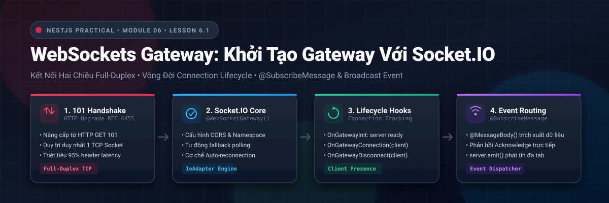
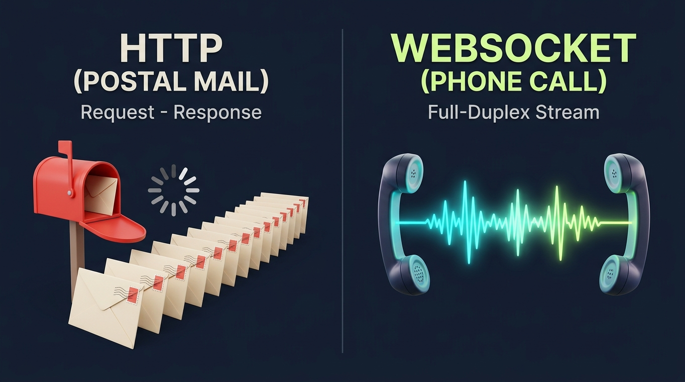
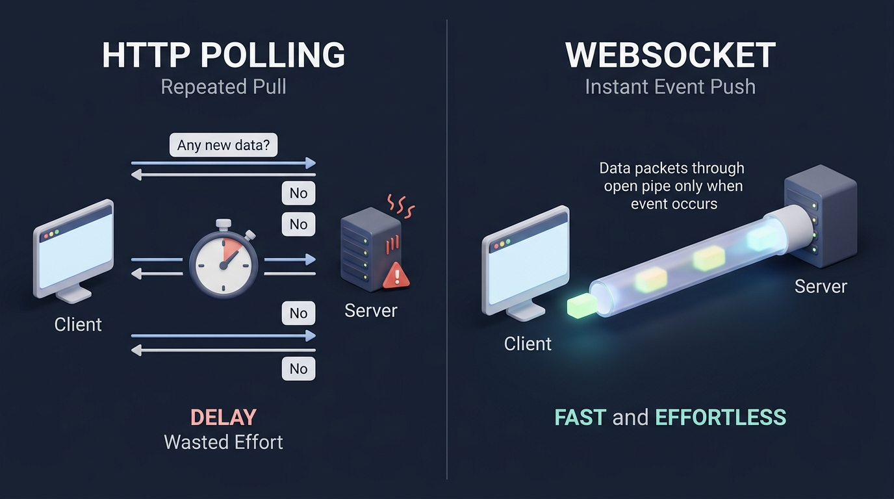
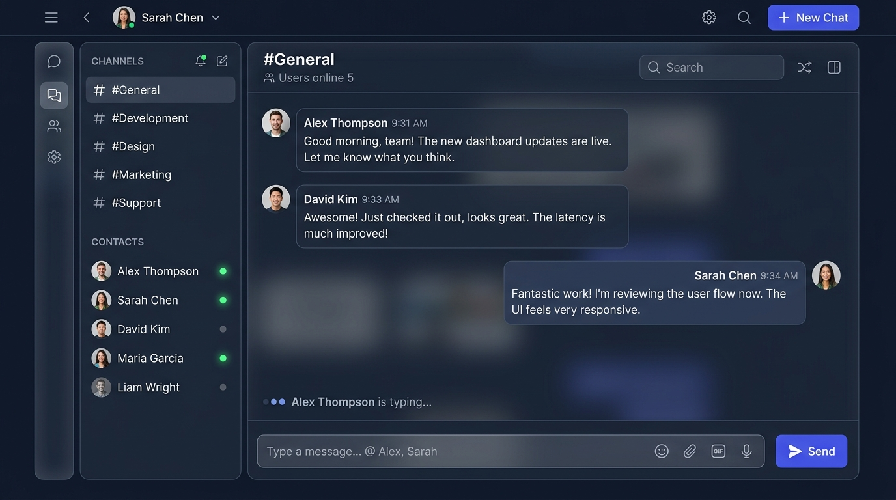
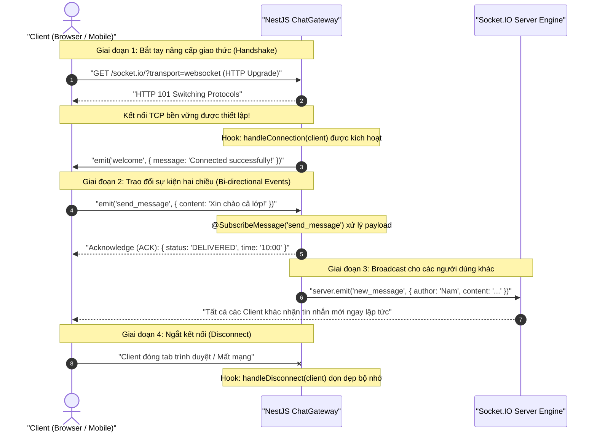

# Lesson 6.1: WebSockets Gateway — Khởi Tạo WebSocket Gateway Với @WebSocketGateway() (Socket.IO)

<p align="center">
  
  
  
  
  
</p>

<p align="center">
  
</p>

---

> [!NOTE]
> ⏱️ **Thời lượng dự kiến:** 12 – 15 phút  
> 🎯 **Mục tiêu bài học:**
>
> 1. Thấu hiểu bản chất sự khác biệt kiến trúc giữa giao thức truyền thống **HTTP Request/Response** và kênh truyền hai chiều bền vững **WebSockets (Full-Duplex)**.
> 2. Phân biệt rõ vai trò của **Controller** (xử lý HTTP Request/Response đơn công) và **Gateway** (quản lý kết nối Socket.IO song công, phát và nhận sự kiện).
> 3. Nắm vững trọn vẹn **Vòng đời kết nối WebSocket (Lifecycle Hooks)**: `OnGatewayInit`, `OnGatewayConnection`, `OnGatewayDisconnect`.
> 4. Tự tay cấu hình và triển khai `ChatGateway` hoàn chỉnh trong NestJS bằng cách sử dụng `@WebSocketGateway()`, `@WebSocketServer()`, `@SubscribeMessage()`, `@MessageBody()`, `@ConnectedSocket()`.
> 5. Thực hành kịch bản kiểm thử giao tiếp Real-time đa người dùng (Broadcast & Acknowledgement) qua Client HTML/JS và Postman Socket.IO.

---

## 1. Đặt Vấn Đề: Giới Hạn Của HTTP & Kỷ Nguyên Real-Time

### 1.1. Ẩn Dụ Thực Tế: Gửi Thư Bưu Điện (HTTP) vs Gọi Điện Thoại (WebSocket)

Để hiểu vì sao các ứng dụng hiện đại như Facebook Messenger, Telegram hay Binance chuyển sang **WebSocket**, hãy cùng xem phép ẩn dụ đời thực:

| Tiêu Chí                  | 📬 Mô Hình HTTP (Gửi Thư Bưu Điện)                                                                                                                                              | 📞 Mô Hình WebSocket (Cuộc Gọi Trực Tiếp)                                                              |
| :------------------------ | :------------------------------------------------------------------------------------------------------------------------------------------------------------------------------ | :----------------------------------------------------------------------------------------------------- |
| **Cách thức hoạt động**   | Mỗi lần muốn nói chuyện, bạn phải viết thư, dán tem (**Header ~1KB**), gửi đi và ngồi chờ thư hồi âm.                                                                           | Bấm số gọi một lần (**Handshake 101**). Sau đó giữ máy liên tục để trò chuyện qua lại.                 |
| **Bên chủ động**          | **Chỉ có bạn (Client):** Giống như nộp đơn hành chính — Server chỉ thụ lý và phản hồi đúng theo từng lượt hỏi của bạn, không bao giờ tự động báo tin nếu bạn không gửi thư hỏi. | **Cả hai bên:** Bất kỳ ai có tin mới đều có thể lên tiếng ngay lập tức (**Push data**).                |
| **Khi làm ứng dụng Chat** | Cứ mỗi 2 giây phải gửi thư hỏi: _"Có tin mới không?"_ (**Polling**) → 99% bưu tá báo _"Không có"_ → Cạn kiệt sức lực (CPU/RAM).                                                 | Đường dây mở sẵn: Người bên kia vừa gõ phím gửi tin là điện thoại bạn rung chuông tức thì (**< 5ms**). |

<p align="center">
  
</p>

---

### 1.2. Giải Pháp WebSocket: Kênh Dẫn Dữ Liệu Song Công Bền Vững (Full-Duplex)

Ra đời năm 2011 theo chuẩn **RFC 6455**, WebSocket loại bỏ hoàn toàn cơ chế "hỏi - đáp" ngắt quãng của HTTP và thay thế bằng một **đường ống dữ liệu liên tục**:

<p align="center">
  
</p>

Ba giá trị cốt lõi làm nên sức mạnh vượt trội của WebSocket:

- 🤝 **Bắt tay duy nhất 1 lần (Handshake Upgrade):** WebSocket bắt đầu bằng một HTTP request với header `Upgrade: websocket`. Nếu Server đồng thuận, nó phản hồi mã `101 Switching Protocols`. Từ thời điểm này, kênh giao tiếp được chuyển sang sử dụng **WebSocket protocol trên kết nối TCP hiện tại**.
- ⚡ **Luồng dữ liệu hai chiều bền vững (Persistent Connection):** Kết nối TCP được duy trì xuyên suốt phiên làm việc. Cả Client và Server đều có thể chủ động đẩy (Push) dữ liệu cho nhau bất kỳ lúc nào mà không cần tạo thêm HTTP request mới. Nhờ đó, Server có thể Push dữ liệu tức thì xuống Client thay vì Client phải liên tục Pull.
- 🪶 **Khung tin siêu nhẹ (Minimal Frame Overhead):** Khác với HTTP luôn kèm theo 500 – 1500 bytes headers cồng kềnh (Cookie, User-Agent, Auth Token...) ở mỗi lượt gửi, gói tin WebSocket (Frame) chỉ tiêu tốn từ **2 đến 10 bytes** overhead cho phần header nhị phân.

---

### 1.3. Bảng So Sánh Chi Tiết: HTTP REST vs Polling vs WebSocket

| Tiêu Chí Kỹ Thuật         | 🛑 HTTP REST API                               | ⚠️ HTTP Short/Long Polling                       | 🚀 WebSockets (Socket.IO)                          |
| :------------------------ | :--------------------------------------------- | :----------------------------------------------- | :------------------------------------------------- |
| **Mô hình truyền dẫn**    | Đơn công (Half-Duplex), 1 chiều                | Giả lập thời gian thực qua chuỗi request lặp lại | **Song công toàn phần (Full-Duplex)** 2 chiều      |
| **Bên đẩy dữ liệu**       | Chỉ Client (Client Pull)                       | Chỉ Client (Client Pull liên tục)                | **Cả Client và Server đều Push trực tiếp**         |
| **Chi phí Header**        | ~1 KB cho mỗi lần gửi                          | Lãng phí hàng triệu KB headers vô nghĩa          | **Chỉ từ 2 – 10 bytes / gói tin**                  |
| **Độ trễ (Latency)**      | 100ms – 500ms                                  | Phụ thuộc vào chu kỳ lặp (polling interval)      | **Tức thì (< 5ms)** sau khi đã handshake           |
| **Tải tài nguyên Server** | Thấp khi ít user; đóng kết nối ngay            | Cực kỳ nặng nề, dễ làm nghẽn connection pool     | Rất nhẹ; duy trì qua Event Loop không chặn luồng   |
| **Ứng dụng tiêu biểu**    | Đăng ký, Đăng nhập, CRUD bài viết, Upload file | Chỉ dùng dự phòng khi mạng chặn WebSockets       | **Chat app, Live Notification, Chứng khoán, Game** |

<p align="center">
  
</p>

---

### 1.4. Trải Nghiệm Sản Phẩm Thực Tế (UI Experience)

Dưới đây là giao diện phòng Chat Real-Time chuẩn mực mà chúng ta sẽ xây dựng nền móng:

<p align="center">
  
</p>

Ba tính năng cốt lõi tạo nên trải nghiệm mượt mà này:

1. 🟢 **Trạng thái Online tức thì:** Ngay khi User mở ứng dụng, sự kiện `connect` phát tín hiệu bật đèn xanh mà không cần reload trang.
2. 💬 **Bong bóng tin nhắn nhảy thời gian thực:** Nhận tin nhắn từ bạn bè với độ trễ < 5ms nhờ `server.emit('new_message')`.
3. ✍️ **Chỉ báo đang nhập tin nhắn:** Dòng chữ `Alex Thompson is typing...` hiển thị tức thì khi đối phương vừa chạm vào bàn phím.

---

## 2. Kiến Trúc WebSocket Gateway Trong NestJS

### 2.1. Gateway Là Gì? So Sánh Controller vs Gateway

Nếu như **Controller** là "cửa ngõ" của thế giới HTTP REST API, thì **Gateway** chính là "trung tâm điều phối" của thế giới sự kiện Real-Time:

| Tiêu Chí                 | 🏢 HTTP Controller                           | 🌐 WebSocket Gateway                                                                                                                                                 |
| :----------------------- | :------------------------------------------- | :------------------------------------------------------------------------------------------------------------------------------------------------------------------- |
| **Decorator định nghĩa** | `@Controller('posts')`                       | `@WebSocketGateway({ namespace: '/chat' })`                                                                                                                          |
| **Giao thức nền tảng**   | HTTP / HTTPS (Request - Response trên TCP)   | WebSocket (ws://, wss:// - Song công trên TCP)                                                                                                                       |
| **Cơ chế bắt dữ liệu**   | `@Get()`, `@Post()`, `@Put()`, `@Delete()`   | `@SubscribeMessage('event_name')`                                                                                                                                    |
| **Cơ chế phát dữ liệu**  | Trả về `return data` cho một client duy nhất | **Linh hoạt:** Gửi 1-1 cho chính client (`client.emit()` hoặc `return ACK`), gửi cho người khác (`client.broadcast.emit()`), hoặc gửi toàn bộ (`this.server.emit()`) |
| **Vòng đời kết nối**     | Đóng ngay sau khi gửi xong Response          | **Kéo dài liên tục** cho đến khi Client tắt máy hoặc mất mạng                                                                                                        |

---

### 2.2. Socket.IO vs `ws`: Vì Sao NestJS Ưu Tiên Socket.IO?

NestJS hỗ trợ 2 adapters: `ws` (chuẩn RFC thuần túy) và `Socket.IO`. Bài học này sử dụng **Socket.IO** vì 4 lợi thế vượt trội trong thực tế doanh nghiệp:

- 🔄 **Tự Động Kết Nối Lại (Auto-reconnection):** Khi người dùng mất mạng 3G trong giây lát, Socket.IO tự động thử kết nối lại ngay khi có sóng mà không cần viết thêm mã code.
- 🛡️ **Fallback Linh Hoạt:** Nếu tường lửa công ty chặn cổng WebSockets, client tự động chuyển mượt mà về HTTP Long-Polling để đảm bảo app không bị gián đoạn.
- 🚪 **Hỗ Trợ Room & Namespace Sẵn Có:** Phân chia người dùng vào các phòng chat (`socket.join('room-123')`) cực kỳ đơn giản chỉ với một dòng lệnh.
- 💓 **Tích Hợp Heartbeat Ping-Pong:** Tự động phát hiện các kết nối "chết" (zombie connection) để giải phóng RAM cho server.

> [!IMPORTANT]
> **Socket.IO Không Phải Là WebSocket Thuần Túy (Pure WebSocket):**  
> Socket.IO là giải pháp giao tiếp thời gian thực bậc cao được xây dựng _trên nền_ WebSocket và Engine.IO protocol. Nó có cấu trúc đóng gói tin riêng, cơ chế Heartbeat ping/pong ngầm tự động, và khả năng fallback. Vì vậy, một client dùng WebSocket native của trình duyệt (`new WebSocket('ws://...')`) sẽ **không thể kết nối trực tiếp** vào máy chủ Socket.IO nếu không dùng đúng client thư viện tương ứng.

---

### 2.3. Sơ Đồ Trình Tự Bắt Tay & Giao Tiếp Sự Kiện (Sequence Flow)



---

### 2.4. Ba Lifecycle Hooks Quan Trọng Của WebSocket Gateway

WebSocket Gateway cung cấp 3 interfaces quản lý trọn vẹn vòng đời kết nối:

| Hook Interface            | Phương Thức Triển Khai             | Thời Điểm Kích Hoạt                                    | Ứng Dụng Thực Tế                                    |
| :------------------------ | :--------------------------------- | :----------------------------------------------------- | :-------------------------------------------------- |
| **`OnGatewayInit`**       | `afterInit(server: Server)`        | Chạy **1 lần duy nhất** khi máy chủ Socket.IO sẵn sàng | Cấu hình Redis Adapter, log thông số server         |
| **`OnGatewayConnection`** | `handleConnection(client: Socket)` | Mỗi khi có một Client mới kết nối thành công           | Xác thực JWT Token, lưu Socket ID, tăng biến online |
| **`OnGatewayDisconnect`** | `handleDisconnect(client: Socket)` | Mỗi khi một Client tắt tab hoặc mất mạng               | Cập nhật trạng thái `Offline`, dọn dẹp bộ nhớ       |

---

## 3. Hướng Dẫn Thực Hành Step-by-Step

> [!IMPORTANT]
> Toàn bộ các gói thư viện và code dưới đây được thiết kế đồng bộ với hệ sinh thái NestJS hiện đại. Không cần chỉnh sửa logic nghiệp vụ của các module cũ.

### Bước 1: Cài Đặt Thư Viện WebSockets & Socket.IO Bằng `pnpm`

Mở Terminal và thực thi lệnh cài đặt các gói cần thiết (lưu ý chỉ định phiên bản `@^11.0.0` để đồng bộ hoàn toàn với phiên bản NestJS 11 của toàn bộ dự án, tránh bị npm tự động cài bản NestJS v12 gây xung đột):

```bash
pnpm add @nestjs/websockets@^11.0.0 @nestjs/platform-socket.io@^11.0.0 socket.io
```

- `@nestjs/websockets@^11.0.0`: Module cốt lõi của NestJS cung cấp các decorators: `@WebSocketGateway`, `@WebSocketServer`, `@SubscribeMessage`, `@MessageBody`, `@ConnectedSocket`.
- `@nestjs/platform-socket.io@^11.0.0`: Adapter cầu nối chuyên biệt giữa kiến trúc NestJS và Socket.IO engine.
- `socket.io`: Thư viện máy chủ Socket.IO chính thức (từ bản v3/v4 đã tích hợp sẵn TypeScript definitions chính chủ, **không cần** cài thêm `@types/socket.io`).

---

### Bước 2: Tạo DTO Định Dạng Tin Nhắn Chat

Để đảm bảo dữ liệu gửi qua WebSocket có cấu trúc chặt chẽ và an toàn, ta định nghĩa DTO:

📄 **`src/chat/dto/chat-message.dto.ts`**

```typescript
import { IsNotEmpty, IsOptional, IsString, MaxLength } from 'class-validator';

export class CreateChatMessageDto {
  @IsString()
  @IsNotEmpty({ message: 'Nội dung tin nhắn không được để trống' })
  @MaxLength(1000, { message: 'Tin nhắn không được vượt quá 1000 ký tự' })
  content: string;

  @IsString()
  @IsOptional()
  roomId?: string;
}
```

---

### Bước 3: Triển Khai `ChatGateway` Hoàn Chỉnh

Hãy tạo file `chat.gateway.ts`. Gateway này sẽ triển khai đủ 3 Lifecycle Hooks, quản lý các client đang kết nối và hỗ trợ gửi nhận tin nhắn:

📄 **`src/chat/chat.gateway.ts`**

```typescript
import {
  WebSocketGateway,
  WebSocketServer,
  SubscribeMessage,
  MessageBody,
  ConnectedSocket,
  OnGatewayInit,
  OnGatewayConnection,
  OnGatewayDisconnect,
} from '@nestjs/websockets';
import { Logger } from '@nestjs/common';
import { Server, Socket } from 'socket.io';
import { CreateChatMessageDto } from './dto/chat-message.dto';
import { Public } from '../shared/decorators/public.decorator';

/**
 * Cấu hình Gateway:
 * - @Public(): Cho phép truy cập công khai ở bài học này (tránh bị Global JwtAuthGuard từ Lesson 4.4 chặn trước khi tích hợp WebSocket Auth ở Lesson 6.2)
 * - cors: Cho phép tất cả các nguồn truy cập (có thể giới hạn domain frontend ở production)
 * - namespace: Tách biệt kênh '/chat' với các gateway khác trong hệ thống
 * - Port: Mặc định chia sẻ chung HTTP port của NestJS (Port 3000)
 */
@Public()
@WebSocketGateway({
  cors: {
    origin: '*',
  },
  namespace: '/chat',
})
export class ChatGateway
  implements OnGatewayInit, OnGatewayConnection, OnGatewayDisconnect
{
  private readonly logger = new Logger(ChatGateway.name);

  // Tham chiếu đến toàn bộ Socket.IO Server instance để phát broadcast
  @WebSocketServer()
  server: Server;

  // Theo dõi số lượng kết nối đang online
  private activeConnections = 0;

  /**
   * 1. Hook khởi tạo Server Engine
   */
  afterInit(server: Server) {
    this.logger.log(
      '🚀 WebSocket Gateway đã được khởi tạo thành công trên namespace: /chat',
    );
  }

  /**
   * 2. Hook khi có Client mới kết nối
   */
  handleConnection(client: Socket) {
    this.activeConnections++;
    this.logger.log(
      `🔌 Client kết nối: ID = ${client.id} | Tổng online: ${this.activeConnections}`,
    );

    // Gửi thông báo chào mừng riêng cho chính Client vừa kết nối
    client.emit('welcome', {
      message: 'Chào mừng bạn đã kết nối vào Chat Gateway!',
      socketId: client.id,
      timestamp: new Date().toISOString(),
    });

    // Thông báo cho tất cả người dùng khác biết có thành viên mới online
    client.broadcast.emit('user_joined', {
      socketId: client.id,
      onlineCount: this.activeConnections,
    });
  }

  /**
   * 3. Hook khi có Client ngắt kết nối
   */
  handleDisconnect(client: Socket) {
    this.activeConnections = Math.max(0, this.activeConnections - 1);
    this.logger.warn(
      `❌ Client ngắt kết nối: ID = ${client.id} | Còn lại online: ${this.activeConnections}`,
    );

    // Phát tin báo người dùng vừa thoát
    this.server.emit('user_left', {
      socketId: client.id,
      onlineCount: this.activeConnections,
    });
  }

  /**
   * 4. Lắng nghe sự kiện gửi tin nhắn: 'send_message'
   */
  @SubscribeMessage('send_message')
  handleMessage(
    @ConnectedSocket() client: Socket,
    @MessageBody() payload: CreateChatMessageDto,
  ) {
    this.logger.log(
      `📩 Nhận tin nhắn từ [${client.id}]: ${JSON.stringify(payload)}`,
    );

    const messageResponse = {
      id: `msg_${Date.now()}`,
      senderId: client.id,
      content: payload.content,
      roomId: payload.roomId || 'global',
      createdAt: new Date().toISOString(),
    };

    // Cách 1: Phát tin nhắn tới TẤT CẢ mọi người (bao gồm cả người gửi)
    this.server.emit('new_message', messageResponse);

    // Trả về Acknowledgment (ACK) xác nhận Client đã gửi thành công
    return {
      status: 'OK',
      deliveredAt: new Date().toISOString(),
      messageId: messageResponse.id,
    };
  }

  /**
   * 5. Lắng nghe sự kiện kiểm tra độ trễ mạng: 'ping'
   */
  @SubscribeMessage('ping')
  handlePing(@ConnectedSocket() client: Socket): string {
    return 'pong';
  }
}
```

> [!TIP]
> **Giải Mã Các Decorators & Pattern Truyền Dữ Liệu Cốt Lõi:**
>
> - `@WebSocketServer()`: Tiêm instance `Server` của Socket.IO. Dùng khi muốn phát broadcast tới **toàn bộ phòng** (`this.server.to('room1').emit(...)`) hoặc **toàn bộ server** (`this.server.emit(...)`).
> - `@SubscribeMessage('event_name')`: Đăng ký phương thức xử lý mỗi khi Client phát sự kiện `'event_name'`.
> - `@MessageBody()`: Trích xuất phần dữ liệu (payload) gửi kèm trong sự kiện.
> - `@ConnectedSocket()`: Lấy instance `Socket` của client vừa gửi yêu cầu (để lấy `client.id`, IP, hoặc gửi tin riêng).
> - **Cơ chế Acknowledgment (ACK):** Khi hàm `@SubscribeMessage` trả về giá trị (`return { status: 'OK' }` hoặc `return 'pong'`), NestJS sẽ gửi giá trị này trực tiếp về **Callback function** của Client. Nếu Client gọi `socket.emit('event', data, (ack) => { ... })`, tham số `ack` chính là giá trị được `return`.
> - **Custom Ping-Pong vs Engine.IO Heartbeat:** Hàm `handlePing` ở đây là sự kiện tùy biến ở tầng ứng dụng để client chủ động đo Round-Trip Latency (độ trễ mạng), hoàn toàn độc lập với cơ chế Heartbeat Ping/Pong ngầm định mà Socket.IO tự thực thi để duy trì kết nối.

---

### Bước 4: Đăng Ký Provider Vào `ChatModule` & `AppModule`

WebSocket Gateway thực chất là một **Provider** trong NestJS Dependency Injection. Do đó, ta khai báo nó trong `providers` của `ChatModule`:

📄 **`src/chat/chat.module.ts`**

```typescript
import { Module } from '@nestjs/common';
import { ChatGateway } from './chat.gateway';

@Module({
  providers: [ChatGateway],
  exports: [ChatGateway],
})
export class ChatModule {}
```

Sau đó, thêm `ChatModule` vào `imports` của `AppModule`:

📄 **`src/app.module.ts`**

```typescript
import { Module } from '@nestjs/common';
import { ChatModule } from './chat/chat.module';
// ... các modules khác như AuthModule, PostsModule, CommentsModule ...

@Module({
  imports: [
    // ...
    ChatModule,
  ],
})
export class AppModule {}
```

---

### Bước 5: Tạo File Client HTML Kiểm Thử Tức Thì (Hands-on Client)

> [!NOTE]
> **`setGlobalPrefix('api')` Có Ảnh Hưởng Đến WebSocket Gateway Không?**  
> Trong `src/main.ts`, dự án đã thiết lập `app.setGlobalPrefix('api')`. Tuy nhiên, tiền tố toàn cục này **chỉ áp dụng cho các route HTTP REST Controllers**, hoàn toàn **không ảnh hưởng** đến WebSocket Gateway. Do đó, địa chỉ kết nối của Client vẫn là `http://localhost:3000/chat` (với namespace `/chat`) chứ không phải `/api/chat`.

Để thử nghiệm mà không cần dựng cả một dự án React/Next.js phức tạp, bạn có thể tạo một file HTML đơn giản ở thư mục gốc để mở trực tiếp trên trình duyệt:

📄 **`test-chat-client.html`**

```html
<!DOCTYPE html>
<html lang="vi">
  <head>
    <meta charset="UTF-8" />
    <title>NestJS WebSocket Test Client</title>
    <!-- Nhúng thư viện Socket.IO Client CDN -->
    <script src="https://cdn.socket.io/4.7.5/socket.io.min.js"></script>
    <style>
      body {
        font-family: 'Segoe UI', Tahoma, Geneva, Verdana, sans-serif;
        background: #0f172a;
        color: #f8fafc;
        padding: 20px;
      }
      .chat-box {
        width: 600px;
        margin: 0 auto;
        background: #1e293b;
        border-radius: 12px;
        padding: 20px;
        box-shadow: 0 8px 24px rgba(0, 0, 0, 0.4);
      }
      #logs {
        height: 320px;
        overflow-y: auto;
        background: #0b0f19;
        border-radius: 8px;
        padding: 12px;
        font-family: monospace;
        font-size: 13px;
        margin-bottom: 15px;
        border: 1px solid #334155;
      }
      .msg-item {
        margin-bottom: 8px;
        padding: 6px 10px;
        border-radius: 6px;
      }
      .msg-welcome {
        background: #064e3b;
        color: #34d399;
      }
      .msg-new {
        background: #1e1b4b;
        color: #a5b4fc;
      }
      .msg-system {
        background: #451a03;
        color: #fdba74;
      }
      .input-row {
        display: flex;
        gap: 10px;
      }
      input {
        flex: 1;
        padding: 10px;
        border-radius: 6px;
        border: 1px solid #475569;
        background: #0f172a;
        color: white;
      }
      button {
        padding: 10px 20px;
        background: #6366f1;
        color: white;
        border: none;
        border-radius: 6px;
        cursor: pointer;
        font-weight: bold;
      }
      button:hover {
        background: #4f46e5;
      }
      .status-badge {
        display: inline-block;
        padding: 4px 8px;
        border-radius: 4px;
        font-size: 12px;
        font-weight: bold;
        margin-bottom: 12px;
      }
      .connected {
        background: #10b981;
        color: white;
      }
      .disconnected {
        background: #ef4444;
        color: white;
      }
    </style>
  </head>
  <body>
    <div class="chat-box">
      <h2>💬 NestJS Real-Time Chat Client</h2>
      <div id="status" class="status-badge disconnected">Đang kết nối...</div>
      <div id="logs"></div>
      <div class="input-row">
        <input type="text" id="msgInput" placeholder="Nhập tin nhắn..." />
        <button onclick="sendMessage()">Gửi</button>
        <button onclick="sendPing()" style="background: #0ea5e9;">Ping</button>
      </div>
    </div>

    <script>
      // Kết nối tới WebSocket Gateway của NestJS (Port 3000, namespace '/chat')
      const socket = io('http://localhost:3000/chat', {
        transports: ['websocket'],
      });

      const statusDiv = document.getElementById('status');
      const logsDiv = document.getElementById('logs');
      const msgInput = document.getElementById('msgInput');

      function log(text, className = '') {
        const p = document.createElement('div');
        p.className = `msg-item ${className}`;
        p.textContent = `[${new Date().toLocaleTimeString()}] ${text}`;
        logsDiv.appendChild(p);
        logsDiv.scrollTop = logsDiv.scrollHeight;
      }

      socket.on('connect', () => {
        statusDiv.textContent = `🟢 Đã kết nối | Socket ID: ${socket.id}`;
        statusDiv.className = 'status-badge connected';
        log('Đã bắt tay thành công với NestJS ChatGateway!', 'msg-welcome');
      });

      socket.on('disconnect', () => {
        statusDiv.textContent = '🔴 Mất kết nối';
        statusDiv.className = 'status-badge disconnected';
        log('Mất kết nối với Server', 'msg-system');
      });

      // Lắng nghe sự kiện chào mừng
      socket.on('welcome', (data) => {
        log(
          `Server gửi: ${data.message} (ID: ${data.socketId})`,
          'msg-welcome',
        );
      });

      // Lắng nghe tin nhắn mới từ mọi người
      socket.on('new_message', (data) => {
        log(`${data.senderId}: ${data.content}`, 'msg-new');
      });

      // Lắng nghe thông báo có người tham gia
      socket.on('user_joined', (data) => {
        log(
          `Người dùng mới tham gia! (Hiện có ${data.onlineCount} người online)`,
          'msg-system',
        );
      });

      // Lắng nghe thông báo có người rời phòng
      socket.on('user_left', (data) => {
        log(
          `Một người dùng đã rời phòng. (Còn lại: ${data.onlineCount} người)`,
          'msg-system',
        );
      });

      function sendMessage() {
        const content = msgInput.value.trim();
        if (!content) return;

        // Bắn sự kiện 'send_message' kèm callback nhận Acknowledgment (ACK)
        socket.emit('send_message', { content: content }, (response) => {
          log(
            `ACK từ server: Status = ${response.status}, ID = ${response.messageId}`,
            'msg-welcome',
          );
        });

        msgInput.value = '';
      }

      function sendPing() {
        const start = Date.now();
        socket.emit('ping', {}, (response) => {
          const latency = Date.now() - start;
          log(`Pong nhận được! Độ trễ (Latency): ${latency}ms`, 'msg-welcome');
        });
      }

      // Cho phép nhấn Enter để gửi
      msgInput.addEventListener('keypress', (e) => {
        if (e.key === 'Enter') sendMessage();
      });
    </script>
  </body>
</html>
```

---

## 4. Kịch Bản Kiểm Tra & Thử Nghiệm (Hands-on Lab)

Khởi động ứng dụng NestJS của bạn:

```bash
pnpm start:dev
```

Quan sát Terminal xuất hiện log khởi tạo:

```text
[Nest] 88210  - 14/09/2026, 17:30:00   LOG [ChatGateway] 🚀 WebSocket Gateway đã được khởi tạo thành công trên namespace: /chat
```

---

### 🟢 Kịch Bản 1: Kiểm Tra Bắt Tay Thành Công & Nhận Phản Hồi Hai Chiều (Ping-Pong)

#### Mục tiêu:

Chứng minh Client kết nối thành công, nhận ngay sự kiện chào mừng và đo độ trễ mạng thực tế.

#### Các bước thực hiện:

1. Mở file `test-chat-client.html` bằng trình duyệt Chrome hoặc Edge.
2. Bấm nút **Ping** màu xanh lam trên giao diện.

#### Kết quả kỳ vọng:

- Huy hiệu trạng thái chuyển sang: `🟢 Đã kết nối | Socket ID: 9xZbK...`
- Khung Log hiển thị:
  ```text
  [17:30:05] Đã bắt tay thành công với NestJS ChatGateway!
  [17:30:05] Server gửi: Chào mừng bạn đã kết nối vào Chat Gateway! (ID: 9xZbK...)
  [17:30:08] Pong nhận được! Độ trễ (Latency): 3ms
  ```
- Terminal của NestJS in ra:
  ```text
  LOG [ChatGateway] 🔌 Client kết nối: ID = 9xZbKA2gB7fQ... | Tổng online: 1
  ```

---

### 🟢 Kịch Bản 2: Broadcast Tin Nhắn Đa Người Dùng (Multi-Client)

#### Mục tiêu:

Mô phỏng trải nghiệm chat nhóm giữa 2 người dùng khác nhau trong thời gian thực.

#### Các bước thực hiện:

1. Mở 2 cửa sổ trình duyệt song song (hoặc 1 tab ẩn danh + 1 tab bình thường) cùng trỏ vào `test-chat-client.html`.
   - **Cửa sổ A** đại diện cho User A (Socket ID: `AAAA...`).
   - **Cửa sổ B** đại diện cho User B (Socket ID: `BBBB...`).
2. Trên Cửa sổ B, bạn sẽ thấy xuất hiện ngay dòng log: `Người dùng mới tham gia! (Hiện có 2 người online)`.
3. Tại Cửa sổ A, nhập tin nhắn: `"Chào cả nhà, NestJS WebSockets đỉnh thật!"` và ấn **Gửi**.

#### Kết quả kỳ vọng:

- Cả hai cửa sổ lập tức hiển thị tin nhắn đồng thời mà **không cần bấm F5 / Reload**:
  ```text
  [17:32:10] AAAA...: Chào cả nhà, NestJS WebSockets đỉnh thật!
  ```
- Cửa sổ A nhận thêm phản hồi xác nhận (Acknowledgment) từ server:
  ```text
  [17:32:10] ACK từ server: Status = OK, ID = msg_1789382583978
  ```

---

### 🔴 Kịch Bản 3: Mất Kết Nối & Tự Động Phục Hồi (Auto-Reconnection)

#### Mục tiêu:

Kiểm tra khả năng chịu lỗi và dọn dẹp tài nguyên (Garbage Collection & Connection State) của hệ thống.

#### Các bước thực hiện:

1. Đóng một trong hai tab trình duyệt (hoặc vào tab Network của DevTools chọn chế độ `Offline`).
2. Quan sát log trên Terminal của NestJS:
   ```text
   WARN [ChatGateway] ❌ Client ngắt kết nối: ID = BBBB... | Còn lại online: 1
   ```
3. Trên tab còn lại của User A, xuất hiện thông báo:
   ```text
   [17:33:00] Một người dùng đã rời phòng. (Còn lại: 1 người)
   ```
4. Bật lại chế độ `Online` trên DevTools:
   - Socket.IO client sẽ tự động gửi gói bắt tay mới mà lập trình viên không cần viết lại mã kết nối.
   - Trạng thái tự động nhảy lại `🟢 Đã kết nối`.

---

## 5. Tổng Kết Bài Học & Checklist Ghi Nhớ

```mermaid
mindmap
  root("WebSockets & Gateway")
    "Khái Niệm Cốt Lõi"
      "Giao thức Full-Duplex"
      "Bắt tay HTTP 101 Upgrade"
      "Overhead cực thấp 2 bytes"
    "NestJS Gateway"
      "@WebSocketGateway()"
      "@WebSocketServer() - Instance Server"
      "@SubscribeMessage() - Bắt sự kiện"
      "@MessageBody() & @ConnectedSocket()"
    "Vòng Đời (Lifecycle)"
      "OnGatewayInit - afterInit"
      "OnGatewayConnection - handleConnection"
      "OnGatewayDisconnect - handleDisconnect"
    "Pattern Truyền Tin"
      "client.emit() - Gửi 1-1"
      "client.broadcast.emit() - Gửi cho phần còn lại"
      "server.emit() - Gửi toàn bộ (Broadcast)"
```

### ✅ Checklist Ghi Nhớ Bài Học:

- [x] Đã hiểu rõ tại sao **HTTP Polling** không thể đáp ứng cho ứng dụng Real-time quy mô lớn và sự vượt trội của **WebSocket Full-Duplex**.
- [x] Phân biệt được sự khác nhau căn bản giữa **Controller** (HTTP Request/Response) và **Gateway** (Persistent Socket Events).
- [x] Nắm vững và thực hành thành công 3 Lifecycle Hooks: `afterInit()`, `handleConnection()`, `handleDisconnect()`.
- [x] Sử dụng thành thạo bộ Decorators: `@WebSocketGateway()`, `@WebSocketServer()`, `@SubscribeMessage()`, `@MessageBody()`, `@ConnectedSocket()`.
- [x] Biết cách kết hợp Acknowledgment (ACK callback) để xác nhận dữ liệu đã được lưu trữ thành công trên máy chủ.

---

> [!WARNING]
> **Vấn Đề Bảo Mật Ở Bài Học Này:**
> Hiện tại, bất kỳ ai có link `http://localhost:3000/chat` đều có thể kết nối vào Gateway mà không cần danh tính. Trong hệ thống thực tế, nếu không xác thực, kẻ tấn công có thể spam hàng triệu kết nối làm sập server (DoS) hoặc mạo danh tin nhắn của người khác!

👉 **Bài tiếp theo:** [Lesson 6.2: Xác Thực Kết Nối — WebSocket Auth Handshake Với JWT](../lesson-6.2/lesson-6.2.md)
