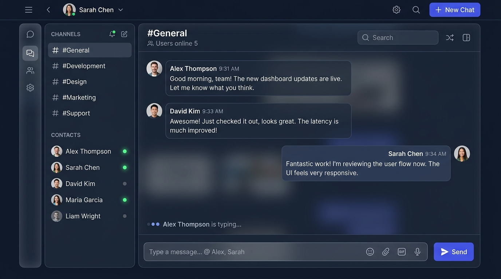
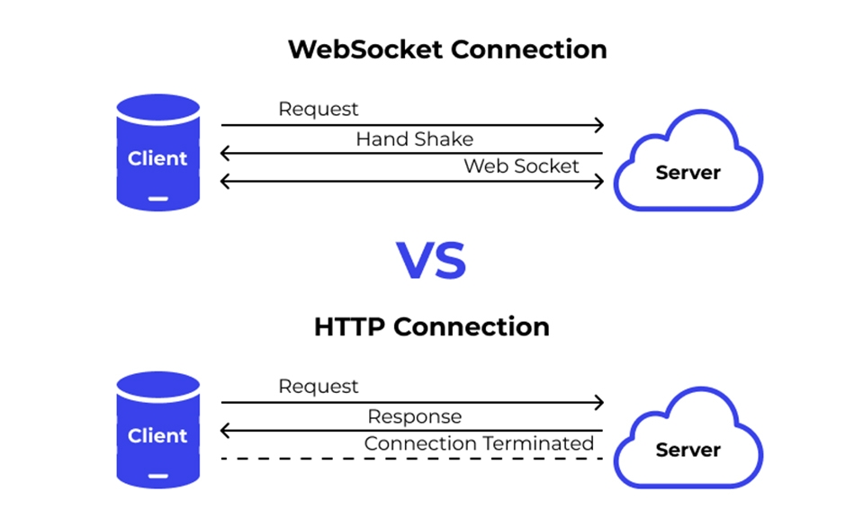
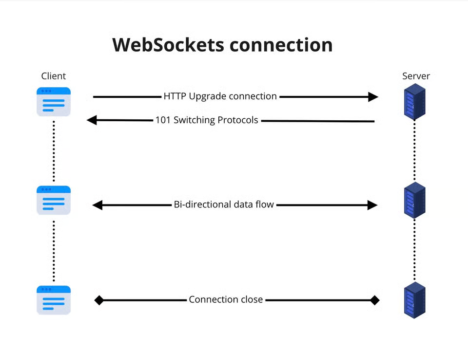
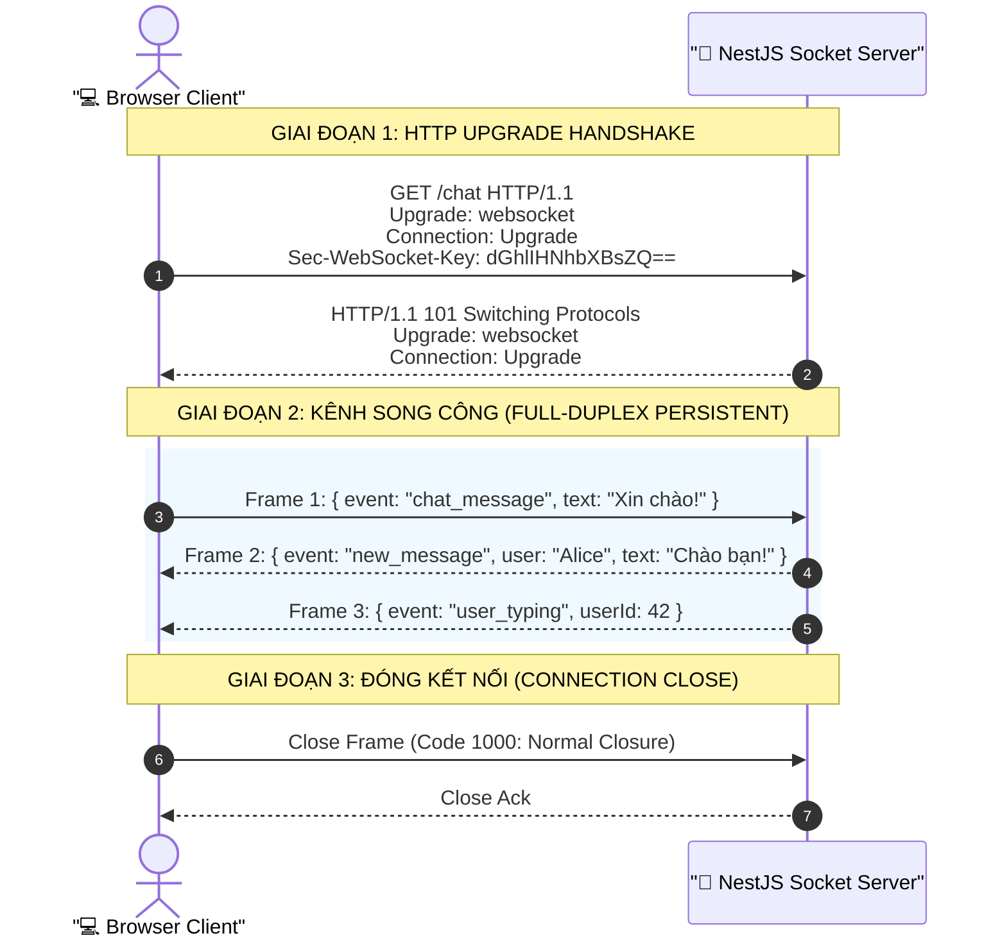

# Lesson 6.1: WebSockets Gateway — Khởi Tạo Kết Nối Real-Time Hai Chiều Với @WebSocketGateway() (Socket.io)

<p align="center">
  
  
  
  
  
</p>

<p align="center">
  
</p>

---

> [!NOTE]
> ⏱️ **Thời lượng:** 15 – 20 phút thực hành súc tích  
> 🎯 **Mục tiêu bài học:**
>
> - **Explain:** Giải thích cơ chế bắt tay HTTP Upgrade (101 Switching Protocols) và kênh truyền song công (Full-Duplex) của WebSocket.
> - **Compare:** Phân biệt nhanh tư duy giao tiếp giữa HTTP Request-Response ngắn hạn và WebSocket Persistent Connection.
> - **Setup:** Cài đặt bộ thư viện `@nestjs/websockets`, `@nestjs/platform-socket.io` và `socket.io` bằng `pnpm`.
> - **Implement:** Xây dựng `ChatGateway` hoàn chỉnh với decorator `@WebSocketGateway()`, quản lý 3 Lifecycle Hooks (`OnGatewayInit`, `OnGatewayConnection`, `OnGatewayDisconnect`).
> - **Handle Events:** Lắng nghe và xử lý sự kiện với `@SubscribeMessage()`, `@MessageBody()`, `@ConnectedSocket()` và cơ chế Acknowledgment.
> - **Broadcast:** Phát tán thông điệp tức thì đến toàn bộ người dùng kết nối bằng `@WebSocketServer()`.
> - **Verify & Debug:** Kiểm thử truyền nhận dữ liệu hai chiều bằng Web Client test script và xử lý dứt điểm các lỗi CORS phổ biến.

> [!IMPORTANT]
> **Prerequisites:**
>
> - NestJS Controllers, Providers & Dependency Injection ([Module 1](../../module-01/lesson-1.9/lesson-1.9.md)).
> - Kiến thức cơ bản về giao thức mạng HTTP & TypeScript.

---

## 1. Vấn Đề Thực Tế: Tại Sao HTTP Không Đủ Cho Ứng Dụng Chat? (Why?)

Trong ứng dụng mạng xã hội **Social Chat App**, chúng ta cần màn hình trò chuyện tức thì giữa người dùng với nhau:

<p align="center">
  
</p>

### ⚠️ Giới Hạn Của HTTP Truyền Thống

Mô hình HTTP là **Đơn công (Half-Duplex, Request-Response)**:

- Client luôn phải là bên chủ động hỏi trước: _"Server ơi, có tin nhắn mới không?"_.
- Server hoàn toàn bị động, **không thể tự ý gửi dữ liệu** xuống client nếu client chưa hỏi.

```text
❌ HTTP Short Polling:
Client ──[ Hỏi: Có tin mới? ]──> Server (Không có)
Client ──[ 1s sau: Có tin mới? ]──> Server (Không có)
Client ──[ 1s sau: Có tin mới? ]──> Server (Không có)
💥 Hậu quả: Tiêu tốn hàng nghìn gói tin HTTP Header (mỗi gói ~800 bytes) chỉ để nhận về dữ liệu rỗng!
```

<p align="center">
  
</p>

- **HTTP Connection:** Mỗi request mở kết nối TCP -> gửi nhận dữ liệu -> ngắt kết nối (`Connection Terminated`). Overhead cực lớn.
- **WebSocket Connection:** Mở kết nối một lần duy nhất qua bước Handshake -> duy trì liên tục (`Persistent Socket`) -> cả hai bên tự do bắn dữ liệu hai chiều với overhead chỉ từ 2 đến 10 bytes!

---

## 2. Bản Chất Giao Thức WebSocket & Quy Trình Handshake (What?)

### 🔄 Quá Trình Bắt Tay Nâng Cấp (HTTP Upgrade Handshake)

WebSocket không phải là một giao thức hoàn toàn độc lập ngay từ đầu. Nó bắt đầu như một HTTP Request thông thường, sau đó yêu cầu server nâng cấp giao thức:

<p align="center">
  
</p>


```mermaid
sequenceDiagram
    autonumber
    actor Client as "💻 Browser Client"
    participant Server as "🚀 NestJS Socket Server"

    Note over Client,Server: GIAI ĐOẠN 1: HTTP UPGRADE HANDSHAKE
    Client->>Server: GET /chat HTTP/1.1<br/>Upgrade: websocket<br/>Connection: Upgrade<br/>Sec-WebSocket-Key: dGhlIHNhbXBsZQ==
    Server-->>Client: HTTP/1.1 101 Switching Protocols<br/>Upgrade: websocket<br/>Connection: Upgrade

    Note over Client,Server: GIAI ĐOẠN 2: KÊNH SONG CÔNG (FULL-DUPLEX PERSISTENT)
    rect rgb(240, 249, 255)
        Client->>Server: Frame 1: { event: "chat_message", text: "Xin chào!" }
        Server-->>Client: Frame 2: { event: "new_message", user: "Alice", text: "Chào bạn!" }
        Server-->>Client: Frame 3: { event: "user_typing", userId: 42 }
    end

    Note over Client,Server: GIAI ĐOẠN 3: ĐÓNG KẾT NỐI (CONNECTION CLOSE)
    Client->>Server: Close Frame (Code 1000: Normal Closure)
    Server-->>Client: Close Ack
```

> [!TIP]
> **Điểm mấu chốt:**
>
> 1. Mã phản hồi **`101 Switching Protocols`** xác nhận server đồng ý chuyển từ HTTP sang WebSocket.
> 2. Sau mã 101, cổng TCP được giữ mở liên tục. Cả hai phía có thể gửi tin bất cứ lúc nào với độ trễ tính bằng mili-giây.

---

## 3. Kiến Trúc Gateway Trong NestJS

Trong NestJS, thành phần chịu trách nhiệm tiếp nhận và định tuyến các gói tin WebSocket được gọi là **Gateway**.

```text
HTTP Controller                vs                WebSocket Gateway
─────────────────────────────────                ─────────────────────────────────
@Controller('posts')                             @WebSocketGateway({ namespace: '/chat', cors: true })
@Get(':id')                                      @SubscribeMessage('send_message')
@Param('id')                                     @MessageBody()
Request / Response ngắn hạn                      Persistent Socket hai chiều
```

- **Platform-Agnostic:** NestJS trừu tượng hóa WebSocket qua hai adapter chính: **`socket.io`** (mặc định phổ biến) và **`ws`** (siêu nhẹ).
- **Provider đích thực:** Gateway là một `@Injectable()` provider. Bạn hoàn toàn có thể inject Service, Repository hay PrismaService vào Gateway qua constructor.
- **Port:** Mặc định Gateway chạy chung cổng với HTTP server (ví dụ port 3000), không cần mở thêm port riêng.

### 🌐 Phân Vùng Đa Kênh Với Namespace (Multiplexing)

Khi xây dựng ứng dụng lớn có nhiều tính năng real-time (Chat, Thông báo, Tọa độ xe, Quản trị hệ thống), việc dồn toàn bộ sự kiện vào một kênh gốc (`/`) sẽ gây ra tình trạng hỗn loạn và khó phân quyền.

Socket.IO cung cấp cơ chế **Namespace (Không gian tên)** để ghép kênh (Multiplexing) trên cùng 1 kết nối TCP:

```text
                               ┌─── Namespace: /chat ──────────> ChatGateway (Tin nhắn, Typing)
TCP Connection (Port 3000) ────┼─── Namespace: /notifications ──> NotificationsGateway (Bình luận, Thả tim)
                               └─── Namespace: /admin ──────────> AdminGateway (System Monitor, Server Logs)
```

---

## 4. Thực Hành Từng Bước (How — Step-by-Step)

### Trạng Thái Dự Án (Project State)

```text
src/
├── app.module.ts
├── comments/
├── notifications/
└── chat/                      <-- THÊM MỚI TRONG BÀI NÀY
    ├── chat.gateway.ts
    └── chat.module.ts
```

---

### Bước 1: Cài Đặt Thư Viện Cần Thiết

Sử dụng `pnpm` để cài đặt gói WebSockets của NestJS và Socket.io:

```bash
pnpm add @nestjs/websockets@11.2.7 @nestjs/platform-socket.io@11.2.7 socket.io
```

---

### Bước 2: Tạo `ChatGateway` Với Lifecycle & Event Handlers

Tạo file `src/chat/chat.gateway.ts` để tiếp nhận kết nối, xử lý sự kiện và broadcast tin nhắn:

📄 **`src/chat/chat.gateway.ts`**

```typescript
import {
  WebSocketGateway,
  WebSocketServer,
  SubscribeMessage,
  MessageBody,
  ConnectedSocket,
  OnGatewayInit,
  OnGatewayConnection,
  OnGatewayDisconnect,
} from '@nestjs/websockets';
import { Logger } from '@nestjs/common';
import { Namespace, Socket } from 'socket.io';
import { Public } from '@/shared/decorators/public.decorator';

@WebSocketGateway({
  namespace: '/chat', // Phân vùng không gian tên riêng biệt cho tính năng Chat
  cors: {
    origin: '*', // Cho phép kết nối từ mọi client (tránh lỗi CORS)
  },
})
@Public()
export class ChatGateway
  implements OnGatewayInit, OnGatewayConnection, OnGatewayDisconnect
{
  private readonly logger = new Logger(ChatGateway.name);

  // 1. Khi Gateway có namespace, @WebSocketServer() sẽ inject đối tượng Namespace của Socket.io
  @WebSocketServer()
  server: Namespace;

  // Lifecycle Hook 1: Khi Gateway vừa được khởi tạo thành công
  afterInit(server: Namespace) {
    this.logger.log(
      `🚀 WebSocket Chat Gateway ${server.name} đã sẵn sàng hoạt động!`,
    );
  }

  // Lifecycle Hook 2: Khi có một Client mới vừa kết nối tới namespace /chat
  handleConnection(client: Socket) {
    this.logger.log(`🟢 Client kết nối vào ${this.server.name}: ${client.id}`);
  }

  // Lifecycle Hook 3: Khi một Client ngắt kết nối
  handleDisconnect(client: Socket) {
    this.logger.warn(
      `🔴 Client ngắt kết nối khỏi ${this.server.name}: ${client.id}`,
    );
  }

  // Event 1: Kiểm tra kết nối nhanh (Ping - Pong)
  @SubscribeMessage('ping')
  handlePing(@ConnectedSocket() client: Socket): string {
    this.logger.debug(`Ping nhận được từ [${client.id}]`);
    return 'pong'; // Trả về phản hồi acknowledgment trực tiếp
  }

  // Event 2: Tiếp nhận tin nhắn trò chuyện và broadcast tới toàn bộ phòng
  @SubscribeMessage('chat_message')
  handleChatMessage(
    @MessageBody() payload: { sender: string; content: string },
    @ConnectedSocket() client: Socket,
  ) {
    this.logger.log(`💬 Tin nhắn từ [${payload.sender}]: ${payload.content}`);

    const broadcastData = {
      sender: payload.sender,
      content: payload.content,
      senderSocketId: client.id,
      timestamp: new Date().toISOString(),
    };

    // Broadcast tới tất cả client đang kết nối
    this.server.emit('new_message', broadcastData);

    // Trả về xác nhận cho riêng người gửi
    return {
      status: 'success',
      deliveredAt: broadcastData.timestamp,
    };
  }
}
```

---

### Bước 3: Đóng Gói `ChatModule`

Tạo file `src/chat/chat.module.ts` để đăng ký `ChatGateway` làm provider:

📄 **`src/chat/chat.module.ts`**

```typescript
import { Module } from '@nestjs/common';
import { ChatGateway } from './chat.gateway';

@Module({
  providers: [ChatGateway],
  exports: [ChatGateway],
})
export class ChatModule {}
```

---

### Bước 4: Đăng Ký `ChatModule` Vào `AppModule`

Mở file `src/app.module.ts`, thêm `ChatModule` vào danh sách `imports`:

📄 **`src/app.module.ts`**

```typescript
import { Module } from '@nestjs/common';
// ... các imports khác
import { ChatModule } from './chat/chat.module';

@Module({
  imports: [
    // ... các module hiện có
    ChatModule,
  ],
  // ...
})
export class AppModule {}
```

Chạy server ở chế độ dev để kiểm tra quá trình khởi động:

```bash
pnpm start:dev
```

Màn hình terminal sẽ xuất hiện dòng log màu xanh:

```text
[Nest] LOG [ChatGateway] 🚀 WebSocket Chat Gateway đã sẵn sàng hoạt động!
```

---

## 5. Kiểm Thử Trực Quan (Verify)

Để kiểm chứng tính năng real-time tức thì, chúng ta tạo một file HTML client siêu nhẹ.

Tạo file `test-client.html` ở thư mục gốc để mở trực tiếp trên trình duyệt:

📄 **`test-client.html`**

```html
<!DOCTYPE html>
<html lang="vi">
  <head>
    <meta charset="UTF-8" />
    <title>Test Real-time Chat Gateway</title>
    <!-- Load Socket.io Client từ CDN -->
    <script src="https://cdn.socket.io/4.7.5/socket.io.min.js"></script>
    <style>
      body {
        font-family: sans-serif;
        max-width: 600px;
        margin: 40px auto;
      }
      #box {
        border: 1px solid #ccc;
        height: 260px;
        overflow-y: scroll;
        padding: 12px;
        margin-bottom: 12px;
      }
      .msg {
        margin-bottom: 6px;
        padding: 4px 8px;
        border-radius: 4px;
        background: #f1f5f9;
      }
      input,
      button {
        padding: 8px 12px;
        font-size: 14px;
      }
    </style>
  </head>
  <body>
    <h3>⚡ NestJS WebSocket Chat Test</h3>
    <div id="status">Trạng thái: ⏳ Đang kết nối...</div>
    <div id="box"></div>
    <input id="txt" placeholder="Nhập tin nhắn..." style="width: 70%;" />
    <button onclick="send()">Gửi</button>

    <script>
      // 1. Kết nối tới NestJS Gateway với namespace /chat (port 3000)
      const socket = io('http://localhost:3000/chat');
      const box = document.getElementById('box');
      const status = document.getElementById('status');

      socket.on('connect', () => {
        status.innerHTML = `Trạng thái: 🟢 <b>Đã kết nối!</b> (Socket ID: ${socket.id})`;
      });

      socket.on('disconnect', () => {
        status.innerHTML = 'Trạng thái: 🔴 <b>Đã ngắt kết nối!</b>';
      });

      // 2. Lắng nghe tin nhắn broadcast từ server
      socket.on('new_message', (data) => {
        const el = document.createElement('div');
        el.className = 'msg';
        el.innerHTML = `<b>${data.sender}:</b> ${data.content} <small style="color:gray;">(${data.timestamp})</small>`;
        box.appendChild(el);
        box.scrollTop = box.scrollHeight;
      });

      // 3. Gửi tin nhắn lên server
      function send() {
        const input = document.getElementById('txt');
        if (!input.value) return;

        socket.emit(
          'chat_message',
          { sender: 'Học viên A', content: input.value },
          (ack) => {
            console.log('✅ Server xác nhận đã nhận tin:', ack);
          },
        );
        input.value = '';
      }
    </script>
  </body>
</html>
```

### ✅ Kịch Bản Kiểm Thử Thành Công:

1. Mở file `test-client.html` trên 2 tab trình duyệt cạnh nhau (Tab 1 và Tab 2).
2. Nhập tin nhắn ở Tab 1 -> Bấm **Gửi**.
3. **Kết quả:** Ngay lập tức cả 2 tab đều hiện tin nhắn mà không cần tải lại trang (Zero Reload)!

---

## 6. Xử Lý Lỗi Phổ Biến & Debugging (Debug)

### 🔴 1. Lỗi CORS Blocking

- **Hiện tượng:** Trình duyệt báo đỏ `Access to XMLHttpRequest at 'http://localhost:3000/socket.io/...' from origin 'null' has been blocked by CORS policy`.
- **Nguyên nhân:** Chưa cấu hình CORS trong decorator `@WebSocketGateway()`.
- **Cách khắc phục:** Luôn khai báo `cors: { origin: '*' }` (hoặc domain frontend tương ứng):
  ```typescript
  @WebSocketGateway({ cors: { origin: '*' } })
  ```

### 🔴 2. Gateway Không Chạy & Không Hiện Log

- **Hiện tượng:** Mở server nhưng không thấy log `afterInit`, client gọi tới báo `Connection Refused`.
- **Nguyên nhân:** Quên đăng ký `ChatGateway` vào mảng `providers` của `ChatModule`, hoặc chưa import `ChatModule` vào `AppModule`.
- **Cách khắc phục:** Gateways trong NestJS không tự động nạp nếu không được khai báo trong DI container của một module đang hoạt động.

### 🔴 3. Sai Tên Sự Kiện (Event Name Mismatch)

- **Hiện tượng:** Client bắn tin nhắn nhưng server im lặng, không có log xử lý.
- **Nguyên nhân:** Tên event trong `@SubscribeMessage('chat_message')` không khớp với tên event client gửi `socket.emit('chatMessage')`.
- **Cách khắc phục:** Chuẩn hóa tên event (khuyến nghị dùng snake_case hoặc dot-notation, ví dụ: `chat:message`, `chat:typing`).

### 🔴 4. Sai Hoặc Thiếu Namespace Phía Client (Namespace Mismatch)

- **Hiện tượng:** Server đã bật và hiển thị log `afterInit`, nhưng khi client kết nối thì `handleConnection` không bao giờ được gọi.
- **Nguyên nhân:** Gateway cấu hình `namespace: '/chat'` nhưng Client lại kết nối vào root URL mặc định `io('http://localhost:3000')`.
- **Cách khắc phục:** Đảm bảo client chỉ định chính xác namespace tương ứng:
  ```javascript
  const socket = io('http://localhost:3000/chat');
  ```

---

## 7. Bài Tập Thực Hành (Challenge)

> ### 🧩 Thử Thách: Tính Năng "Đang Gõ Phím..." (User Typing Indicator)
>
> **Yêu cầu:**
>
> 1. Thêm event handler `@SubscribeMessage('typing')` trong `ChatGateway`.
> 2. Khi nhận event, dùng `client.broadcast.emit('user_typing', { userId: client.id })` để thông báo cho **tất cả người dùng khác TRỪ người đang gõ**.
> 3. Kiểm tra xem Tab 1 gõ phím thì Tab 2 có nhận được thông báo không!

---

## 8. Tóm Tắt Cốt Lõi (Summary)

```text
1. WebSocket    ──> Kênh song công Full-Duplex trên 1 kết nối TCP duy nhất, độ trễ cực thấp.
2. Handshake    ──> Bắt đầu bằng HTTP Upgrade, chuyển giao thức với mã phản hồi 101.
3. Gateway      ──> Class với @WebSocketGateway(), đóng vai trò định tuyến sự kiện Socket.io.
4. Namespace    ──> Ghép kênh (Multiplexing) trên 1 kết nối TCP, phân tách độc lập (/chat, /notifications).
5. Decorators   ──> @SubscribeMessage() (nghe), @MessageBody() (lấy data), @WebSocketServer() (broadcast).
```

👉 **Bài tiếp theo (Lesson 6.2):** Xác thực người dùng và giải mã JWT Token an toàn ngay từ giai đoạn bắt tay Socket Handshake!
