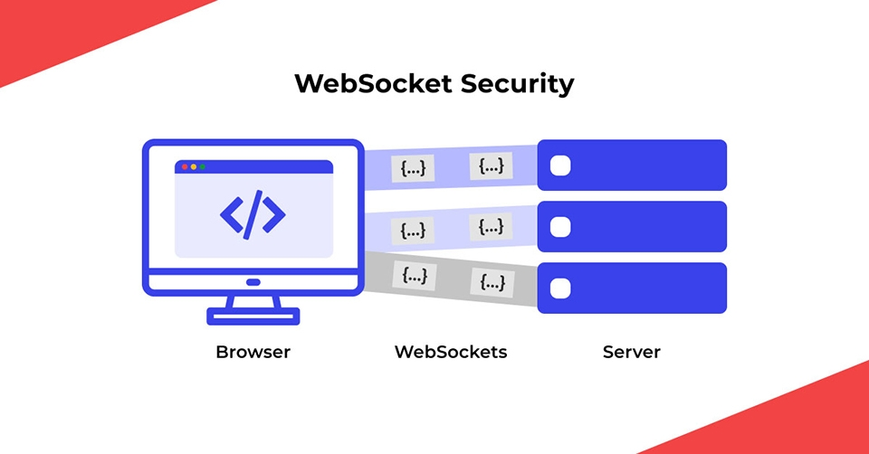
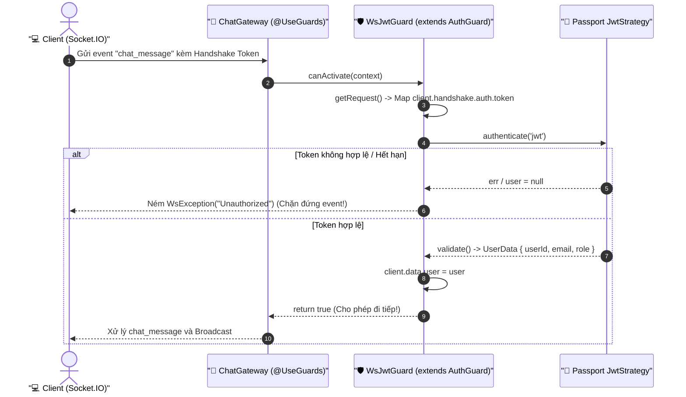

# Lesson 6.2: Socket Auth — Chuẩn Hóa Xác Thực WebSockets Với WsJwtGuard (Passport.js)

<p align="center">
  
  
  
  
  
</p>

<p align="center">
  
</p>

---

> [!NOTE]
> ⏱️ **Thời lượng:** 15 – 20 phút thực hành chuyên sâu  
> 🎯 **Mục tiêu bài học:**
>
> - **Identify Anti-Pattern:** Nhận diện 2 sai lầm kinh điển khi tự viết xác thực thủ công trong `handleConnection()` (Trùng lặp code và bỏ rơi Passport.js).
> - **NestJS Architecture:** Hiểu cơ chế hoạt động của WebSocket Guards theo tài liệu chính thức của NestJS (`docs.nestjs.com/websockets/guards`).
> - **Implement `WsJwtGuard`:** Kế thừa trực tiếp `AuthGuard('jwt')` của Passport, override `getRequest()` để map dữ liệu socket handshake và ném `WsException` chuẩn quy ước.
> - **Zero Code Duplication:** Tái sử dụng trọn vẹn `JwtStrategy` đã viết ở Module 4 mà không cần viết lại bất kỳ dòng code verify token nào.
> - **Refactor `ChatGateway`:** Làm sạch Gateway bằng decorator `@UseGuards(WsJwtGuard)`, kết hợp `@CurrentWsUser()` lấy danh tính an toàn từ `client.data.user`.
> - **Verify & Debug:** Kiểm thử cơ chế bảo vệ với Web Client test script và xử lý lỗi `WsException` trả về cho client.

> [!IMPORTANT]
> **Prerequisites:**
>
> - Đã khởi tạo `ChatGateway` với Namespace `/chat` ([Lesson 6.1](../lesson-6.1/lesson-6.1.md)).
> - Đã nắm vững `Passport.js`, `JwtStrategy` và `AuthGuard('jwt')` ([Lesson 4.4](../../module-04/lesson-4.4/lesson-4.4.md)).

---

## 1. Vấn Đề Kiến Trúc: Tại Sao Xác Thực Thủ Công Là Một "Bad Practice"? (Why?)

Trong nhiều hướng dẫn sơ cấp, lập trình viên thường viết code verify JWT trực tiếp bên trong hàm `handleConnection(client)` của Gateway:

```typescript
// ❌ CÁCH LÀM THỦ CÔNG (BAD PRACTICE):
async handleConnection(client: Socket) {
  const token = client.handshake.auth?.token;
  const payload = await this.jwtService.verifyAsync(token); // Tự verify bằng tay
  client.data.user = payload;
}
```

Cách tiếp cận này dẫn tới **3 vấn đề kiến trúc nghiêm trọng**:

1. **Trùng lặp code trầm trọng (Code Duplication):**  
   Khi dự án phát triển thêm `NotificationsGateway`, `OrdersGateway`, `AdminGateway`, bạn sẽ phải sao chép toàn bộ cụm logic `extractToken`, `jwtService.verifyAsync`, `try-catch` vào từng file gateway.
2. **Bỏ rơi Passport.js (Bypass Architecture):**  
   Ở Module 4, hệ thống đã chuẩn hóa xác thực với `PassportModule` và `JwtStrategy` (tự động kiểm tra thời hạn, chữ ký bí mật, trích xuất `payload` vào `UserData`). Việc gọi `JwtService` thủ công phá vỡ tính nhất quán của toàn bộ codebase.
3. **Vi phạm nguyên lý Single Responsibility (SRP):**  
   Nhiệm vụ của Gateway là điều phối sự kiện thời gian thực (Real-time Event Dispatcher), không phải là nơi gánh vác logic kiểm tra phân quyền truy cập.

<p align="center">
  
</p>

👉 **Giải pháp chuẩn mực của NestJS:** Sử dụng **Guards** chuyên biệt cho WebSockets (`WsJwtGuard`) kết hợp Passport.js.

---

## 2. Bản Chất WebSocket Guard Trong NestJS (What?)

Theo [tài liệu chính thức của NestJS](https://docs.nestjs.com/websockets/guards):

> _"Không có sự khác biệt căn bản nào giữa WebSocket Guards và HTTP Guards thông thường. Khác biệt duy nhất là thay vì ném `HttpException`, Guard phải ném **`WsException`**. Nếu Guard trả về `false`, NestJS sẽ tự động ném ra `WsException('Forbidden resource')`."_

```text
HTTP Pipeline                                     WebSocket Pipeline
─────────────                                     ──────────────────
ExecutionContext (HTTP)                           ExecutionContext (WS)
       ↓                                                 ↓
Request: req.headers.authorization                Socket: client.handshake.auth.token
       ↓                                                 ↓
AuthGuard('jwt')                                  WsJwtGuard (extends AuthGuard('jwt'))
       ↓                                                 ↓
Ném HttpException (401 Unauthorized)              Ném WsException ('Unauthorized')
```

### 🧠 Chiến Lược: Kế Thừa `AuthGuard('jwt')` Cho WebSockets

Thay vì viết Guard từ con số 0, chúng ta chỉ cần **kế thừa lớp `AuthGuard('jwt')`** của Passport và override 2 phương thức:

1. **`getRequest(context)`:** Lấy `client` từ `context.switchToWs().getClient<Socket>()`, sau đó đóng gói token từ `client.handshake.auth?.token` thành đối tượng `{ headers: { authorization: 'Bearer ...' } }` mà Passport mong đợi.
2. **`handleRequest(err, user, info, context)`:** Nếu có lỗi hoặc không có `user`, ném **`WsException`**; nếu hợp lệ, gán `client.data.user = user`.



---

## 3. Thực Hành Từng Bước (How — Step-by-Step)

### Trạng Thái Dự Án (Project State)

```text
src/
├── auth/
│   ├── guards/
│   │   ├── jwt-auth.guard.ts  (Dành cho HTTP)
│   │   └── ws-jwt.guard.ts    <-- THÊM MỚI: Tái sử dụng Passport cho WebSockets
│   └── auth.module.ts         (Exports WsJwtGuard)
└── chat/
    ├── decorators/
    │   └── current-ws-user.decorator.ts
    ├── chat.module.ts         (Imports AuthModule)
    └── chat.gateway.ts        <-- Gọn gàng với @UseGuards(WsJwtGuard)
```

---

### Bước 1: Xây Dựng `WsJwtGuard` Kế Thừa Passport `AuthGuard('jwt')`

Tạo file `src/auth/guards/ws-jwt.guard.ts`:

📄 **`src/auth/guards/ws-jwt.guard.ts`**

```typescript
import { ExecutionContext, Injectable } from '@nestjs/common';
import { AuthGuard } from '@nestjs/passport';
import { WsException } from '@nestjs/websockets';
import { Socket } from 'socket.io';
import type { UserData } from '@/auth/interfaces/jwt.interface';

export interface AuthenticatedSocket extends Socket {
  data: {
    user?: UserData;
    [key: string]: unknown;
  };
}

@Injectable()
export class WsJwtGuard extends AuthGuard('jwt') {
  // 1. Chuyển đổi WebSocket Context thành Request Object mà Passport hiểu được
  getRequest(context: ExecutionContext) {
    const client = context.switchToWs().getClient<Socket>();
    const auth = client.handshake?.auth as Record<string, unknown> | undefined;
    const authHeader = client.handshake?.headers?.authorization;

    const rawToken =
      (typeof auth?.token === 'string' ? auth.token : undefined) ??
      (typeof authHeader === 'string' ? authHeader : undefined);

    const token =
      rawToken && !rawToken.startsWith('Bearer ')
        ? `Bearer ${rawToken}`
        : rawToken;

    return {
      headers: {
        authorization: token,
      },
    };
  }

  // 2. Xử lý kết quả từ Passport: Ném WsException thay vì HttpException
  handleRequest<TUser = UserData>(
    err: unknown,
    user: TUser | false | null | undefined,
    info: unknown,
    context: ExecutionContext,
  ): TUser {
    if (err || !user) {
      const errorMessage =
        info instanceof Error
          ? info.message
          : 'Unauthorized: Bạn cần đăng nhập để thực hiện hành động này!';

      throw new WsException(errorMessage);
    }

    // 3. Gắn thông tin User vào client.data để các handlers khác tái sử dụng
    const client = context.switchToWs().getClient<AuthenticatedSocket>();
    client.data.user = user as unknown as UserData;

    return user;
  }
}
```

> [!TIP]
> **Điểm sáng giá của `WsJwtGuard`:**
>
> - Toàn bộ việc kiểm tra thời hạn token (`exp`), giải mã chữ ký bí mật (`secretOrKey`) và truy vấn thông tin người dùng đều được thực hiện tự động bởi **`JwtStrategy`** đã cấu hình ở Module 4.
> - Bạn không phải inject `JwtService` hay viết lại hàm giải mã thủ công.

---

### Bước 2: Export `WsJwtGuard` Trong `AuthModule`

Mở file `src/auth/auth.module.ts`, đăng ký `WsJwtGuard` vào mảng `providers` và `exports`:

📄 **`src/auth/auth.module.ts`**

```typescript
import { Module } from '@nestjs/common';
// ... các imports khác
import { WsJwtGuard } from './guards/ws-jwt.guard';

@Module({
  // ...
  providers: [
    AuthService,
    JwtStrategy,
    JwtAuthGuard,
    WsJwtGuard, // Thêm mới
    GoogleStrategy,
    GoogleAuthGuard,
  ],
  exports: [JwtModule, PassportModule, WsJwtGuard], // Export để các module khác sử dụng
})
export class AuthModule {}
```

---

### Bước 3: Tạo Custom Decorator `@CurrentWsUser()`

Tạo file `src/chat/decorators/current-ws-user.decorator.ts` để trích xuất dữ liệu người dùng gọn gàng:

📄 **`src/chat/decorators/current-ws-user.decorator.ts`**

```typescript
import { createParamDecorator, ExecutionContext } from '@nestjs/common';
import type { AuthenticatedSocket } from '@/auth/guards/ws-jwt.guard';
import type { UserData } from '@/auth/interfaces/jwt.interface';

export const CurrentWsUser = createParamDecorator(
  (data: keyof UserData | undefined, context: ExecutionContext) => {
    const client = context.switchToWs().getClient<AuthenticatedSocket>();
    const user = client.data?.user;

    if (!user) {
      return null;
    }

    return data ? user[data] : user;
  },
);
```

---

### Bước 4: Refactor `ChatGateway` Gọn Gàng & Thanh Lịch

Mở `src/chat/chat.gateway.ts`. Hãy xem sự khác biệt khi dùng Guard:

- Không còn `jwtService.verifyAsync()` thủ công.
- Không còn `try-catch` lồng ghép phức tạp.
- Chỉ cần gắn `@UseGuards(WsJwtGuard)`!

📄 **`src/chat/chat.gateway.ts`**

```typescript
import { Logger, UseGuards } from '@nestjs/common';
import {
  WebSocketGateway,
  WebSocketServer,
  SubscribeMessage,
  MessageBody,
  ConnectedSocket,
  OnGatewayInit,
  OnGatewayConnection,
  OnGatewayDisconnect,
} from '@nestjs/websockets';
import { Namespace, Socket } from 'socket.io';
import { WsJwtGuard } from '@/auth/guards/ws-jwt.guard';
import { CurrentWsUser } from './decorators/current-ws-user.decorator';
import type { UserData } from '@/auth/interfaces/jwt.interface';

@UseGuards(WsJwtGuard) // 🛡️ Bảo vệ toàn bộ sự kiện trong Gateway
@WebSocketGateway({
  namespace: '/chat',
  cors: {
    origin: '*',
  },
})
export class ChatGateway
  implements OnGatewayInit, OnGatewayConnection, OnGatewayDisconnect
{
  private readonly logger = new Logger(ChatGateway.name);

  @WebSocketServer()
  server: Namespace;

  afterInit(server: Namespace) {
    this.logger.log(
      `🚀 WebSocket Chat Gateway [${server.name}] đã sẵn sàng hoạt động!`,
    );
  }

  handleConnection(client: Socket) {
    this.logger.log(`🟢 Client kết nối vào ${this.server.name}: ${client.id}`);
  }

  handleDisconnect(client: Socket) {
    this.logger.warn(
      `🔴 Client ngắt kết nối khỏi ${this.server.name}: ${client.id}`,
    );
  }

  // Event 1: Ping mở công khai (hoặc kiểm tra kết nối)
  @SubscribeMessage('ping')
  handlePing(@ConnectedSocket() client: Socket): string {
    return 'pong';
  }

  // Event 2: Chat tin nhắn - ĐÃ ĐƯỢC BẢO VỆ BỞI WsJwtGuard
  @SubscribeMessage('chat_message')
  handleChatMessage(
    @MessageBody() payload: { content: string },
    @ConnectedSocket() client: Socket,
    @CurrentWsUser() user: UserData, // Lấy an toàn từ Passport User
  ) {
    this.logger.log(
      `💬 Tin nhắn từ [${user.email}] (ID: ${user.userId}): ${payload.content}`,
    );

    const broadcastData = {
      senderId: user.userId,
      senderEmail: user.email,
      content: payload.content,
      senderSocketId: client.id,
      timestamp: new Date().toISOString(),
    };

    // Broadcast tới tất cả client trong namespace /chat
    this.server.emit('new_message', broadcastData);

    return {
      status: 'success',
      deliveredAt: broadcastData.timestamp,
    };
  }
}
```

---

### Bước 5: Cập Nhật `ChatModule`

Mở file `src/chat/chat.module.ts`, import `AuthModule` để cung cấp `WsJwtGuard`:

📄 **`src/chat/chat.module.ts`**

```typescript
import { Module } from '@nestjs/common';
import { ChatGateway } from './chat.gateway';
import { AuthModule } from '@/auth/auth.module';

@Module({
  imports: [AuthModule],
  providers: [ChatGateway],
  exports: [ChatGateway],
})
export class ChatModule {}
```

---

## 4. Kiểm Thử Trực Quan (Verify)

Mở file `test-client.html` và thêm khả năng gửi kèm Token trong đối tượng `auth`:

📄 **`test-client.html`**

```html
<!DOCTYPE html>
<html lang="vi">
  <head>
    <meta charset="UTF-8" />
    <title>Test Real-time Chat Gateway (WsJwtGuard)</title>
    <script src="https://cdn.socket.io/4.7.5/socket.io.min.js"></script>
    <style>
      body {
        font-family: sans-serif;
        max-width: 600px;
        margin: 40px auto;
      }
      #box {
        border: 1px solid #ccc;
        height: 250px;
        overflow-y: scroll;
        padding: 12px;
        margin-bottom: 12px;
      }
      .msg {
        margin-bottom: 6px;
        padding: 6px 10px;
        border-radius: 4px;
        background: #f1f5f9;
      }
      .err {
        background: #fee2e2;
        color: #991b1b;
      }
      input,
      button {
        padding: 8px 12px;
        font-size: 14px;
        margin-bottom: 8px;
      }
    </style>
  </head>
  <body>
    <h3>🛡️ NestJS WebSocket Chat Test (WsJwtGuard)</h3>

    <div>
      <input
        id="tokenInput"
        placeholder="Dán Access Token (Bearer eyJ...)"
        style="width: 75%;"
      />
      <button onclick="connectSocket()">Kết Nối</button>
    </div>

    <div id="status">Trạng thái: ⚪ Chưa kết nối</div>
    <div id="box"></div>

    <input id="msgInput" placeholder="Nhập tin nhắn..." style="width: 75%;" />
    <button onclick="send()">Gửi Tin Nhắn</button>

    <script>
      let socket = null;
      const box = document.getElementById('box');
      const status = document.getElementById('status');

      function connectSocket() {
        if (socket) socket.disconnect();

        const token = document.getElementById('tokenInput').value.trim();
        status.innerHTML = 'Trạng thái: ⏳ Đang kết nối...';

        // Gửi token qua trường auth của Socket.IO
        socket = io('http://localhost:3000/chat', {
          auth: {
            token: token,
          },
        });

        socket.on('connect', () => {
          status.innerHTML = `Trạng thái: 🟢 <b>Đã kết nối!</b> (Socket ID: ${socket.id})`;
        });

        socket.on('disconnect', () => {
          status.innerHTML = 'Trạng thái: 🔴 <b>Đã ngắt kết nối!</b>';
        });

        // Bắt lỗi WsException từ server trả về
        socket.on('exception', (data) => {
          box.innerHTML += `<div class="msg err">⚠️ Lỗi Guard: ${JSON.stringify(data.message || data)}</div>`;
          box.scrollTop = box.scrollHeight;
        });

        socket.on('new_message', (data) => {
          box.innerHTML += `<div class="msg"><b>${data.senderEmail}:</b> ${data.content} <small style="color:gray;">(${data.timestamp})</small></div>`;
          box.scrollTop = box.scrollHeight;
        });
      }

      function send() {
        const input = document.getElementById('msgInput');
        if (!input.value || !socket) return;

        socket.emit('chat_message', { content: input.value }, (ack) => {
          console.log('✅ Phản hồi server:', ack);
        });
        input.value = '';
      }
    </script>
  </body>
</html>
```

### 🧪 Kịch Bản Kiểm Thử:

1. **Gửi tin nhắn với Token Hợp Lệ:**
   - Lấy Token từ API `POST /api/v1/auth/login`.
   - Dán Token -> Bấm **Kết Nối** -> Nhập tin nhắn và **Gửi**.
   - **Kết quả:** `chat_message` được xử lý mượt mà, email người gửi tự động lấy từ Payload Token.
2. **Gửi tin nhắn Không Kèm Token hoặc Token Giả Mạo:**
   - Không nhập Token (hoặc nhập chuỗi `fake-token`) -> Bấm **Kết Nối** -> Bấm **Gửi**.
   - **Kết quả:** Server ném `WsException`. Phía client bắt sự kiện `exception` và hiển thị cảnh báo đỏ:  
     `⚠️ Lỗi Guard: Unauthorized: Bạn cần đăng nhập để thực hiện hành động này!`. Tin nhắn bị chặn hoàn toàn!

---

## 5. Xử Lý Lỗi & Tư Duy Debug Thực Chiến (Debug)

### 🔴 1. Xung Đột Với Global `JwtAuthGuard` (HTTP vs WS)

- **Hiện tượng:** Terminal báo lỗi khi client gửi gói tin WebSocket: Passport cố gắng đọc `req.headers` và ném lỗi 500 hoặc 401.
- **Nguyên nhân:** Global `JwtAuthGuard` trong `AppModule` chỉ hiểu HTTP context.
- **Cách khắc phục:** Luôn kiểm tra `context.getType() !== 'http'` trong `JwtAuthGuard` để bỏ qua các request không phải HTTP:
  ```typescript
  if (isPublic || context.getType() !== 'http') {
    return true;
  }
  ```

### 🔴 2. Client Lắng Nghe Sai Event Lỗi

- **Hiện tượng:** Server ném `WsException` nhưng phía client không nhận được gì.
- **Nguyên nhân:** Mặc định trong NestJS, khi Guard hoặc Handler ném `WsException`, Socket.IO adapter bắn sự kiện có tên là **`exception`** (không phải `error`):
  ```javascript
  socket.on('exception', (data) => console.error(data));
  ```

---

## 6. Bài Tập Thực Hành (Challenge)

> ### 🧩 Thử Thách: Xây Dựng `WsRolesGuard` Phân Quyền Admin
>
> **Yêu cầu:**
>
> 1. Tạo file `src/auth/guards/ws-roles.guard.ts` kế thừa ý tưởng từ `RolesGuard` ở Lesson 4.7.
> 2. Sử dụng `Reflector` để đọc metadata `@Roles(Role.ADMIN)`.
> 3. Lấy `user` từ `context.switchToWs().getClient<Socket>().data.user`.
> 4. Nếu user không có quyền Admin, ném `new WsException('Forbidden: Bạn không có quyền Admin!')`.
> 5. Gắn thử lên event `@SubscribeMessage('delete_chat_history')`!

---

## 7. Tóm Tắt Cốt Lõi (Summary)

```text
1. WsJwtGuard       ──> Kế thừa AuthGuard('jwt'), tái sử dụng 100% Passport JwtStrategy.
2. getRequest()     ──> Chuyển đổi socket.handshake.auth.token thành HTTP header format.
3. WsException      ──> Quy chuẩn ngoại lệ bắt buộc của NestJS WebSocket Pipeline.
4. Zero Duplication ──> Mọi Gateway đều được bảo vệ chỉ với một decorator @UseGuards(WsJwtGuard).
```

👉 **Bài tiếp theo (Lesson 6.3):** Xây dựng phòng chat theo nhóm (Chat Rooms) với cơ chế Join Room, Leave Room và lưu trữ tin nhắn vào PostgreSQL qua Prisma ORM!
